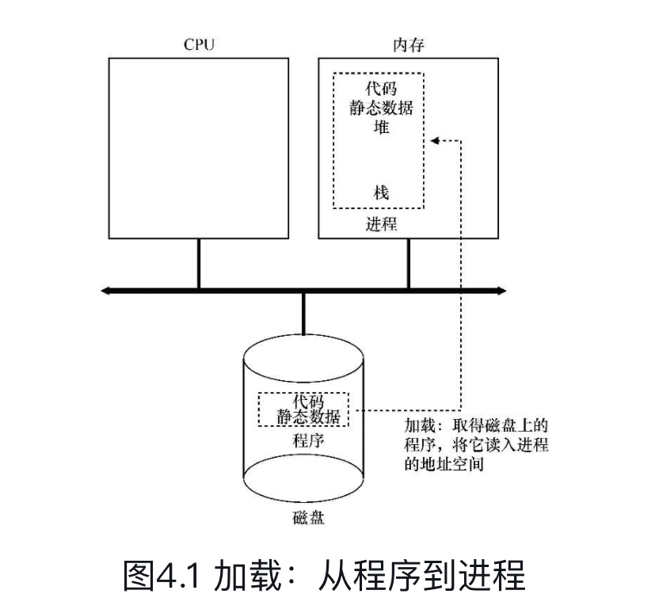
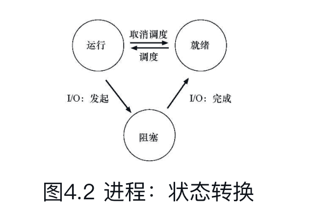
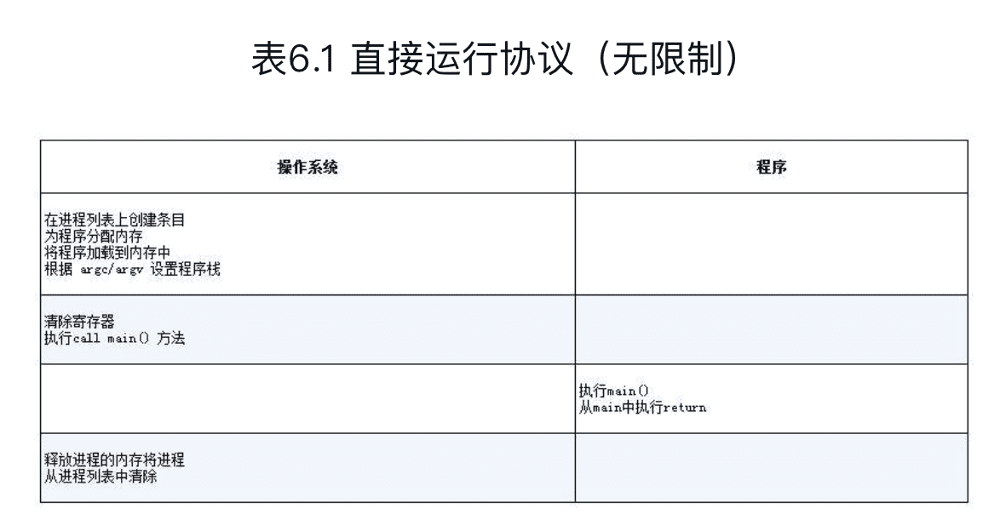

《操作系统导论》笔记
--------------

英文版：[《Operating Systems: Three Easy Pieces》](http://pages.cs.wisc.edu/~remzi/OSTEP/)

## 前言

三个部分：虚拟化(virtualization)，并发(concurrency)，持久化(persistence)

关键问题（crux of the problem）

**抽象**是计算机科学各个方面的基础。

在真实系统上运行真实代码是了解操作系统的最佳方式

> 叶芝：“教育不是注满一桶水，而是点燃一把火。”

### 2 操作系统介绍

正在运行的程序就是：**执行指令**。

处理器从内存中**获取（fetch）**一条指令，对其进行**解码（decode）**（弄清楚这是哪条指令），然后**执行（execute）**它（做它应该做的事情，如**两个数相加、访问内存、检查条件、跳转到函数**等）。完成后，处理器继续执行一条指令...，直到程序最终完成。

> 假设的简单模型：指令似乎按照有序和顺序的方式逐条执行。

操作系统（OperatingSystem，OS）：一类软件，负责让程序运行变得容易（甚至允许你同时运行多个程序），允许程序共享内存，让程序能够与设备交互，以及其他类似的有趣的工作。

> **关键（crux）问题**：操作系统如何将资源虚拟化？

**虚拟化（virtualization）**：操作系统将物理（physical）资源（如处理器、内存或磁盘）转换为更通用、更强大且更易于使用的虚拟形式。因此有时将操作系统称为**虚拟机（virtual machine）**。

**系统调用（system call）**：操作系统提供一些接口（API），让用户使用操作系统的功能。有时，也说操作系统为应用程序提供了一个**标准库（standardlibrary）**。

操作系统有时被称为**资源管理器（resource manager）**。每个CPU、内存和磁盘都是系统的资源（resource）。

#### 2.1 虚拟化CPU

```c
#include <stdio.h>
#include <stdlib.h>
#include <sys/time.h>
#include <assert.h>
#include "common.h"

int
main(int argc, char *argv[])
{
  if (argc != 2) {
    fpringf(stderr, "usage: cpu <string>\n");
    exit(1);
  }
  char *str = argv[1];
  while(1) {
    Spin(1);
    printf("%s\n", str);
  }
  return 0;
}
```

虚拟化CPU（virtualizingthe CPU）：将单个CPU（或其中一小部分）转换为看似无限数量的CPU，从而让许多程序看似同时运行。

接口（API）

操作系统的策略（policy）

机制（mechanism）

#### 2.2 虚拟化内存

内存就是一个字节数组。要读取（read）内存，必须指定一个地址（address），才能访问存储在那里的数据。要写入（write）或更新（update）内存，还必须指定要写入给定地址的数据。

程序将所有数据结构保存在内存中，并通过各种指令来访问它们。

程序的每个指令也都在内存中，因此每次读取指令都会访问内存。

调用`malloc()`来分配一些内存（mem.c）：

```c
#include <unistd.h>
#include <stdio.h>
#include <stdio.h>
#include "common.h"

int main(int argc, char *argv[])
{
	int *p = malloc(sizeof(int));
  assert(p != NULL);
  printf("(%d)memory address of p: of p: %08x\n", getpid(), )
}
```


#### 2.3 并发（concurrency）

```c
// threads.c

#include <stdio.h>
#include <stdlib.h>
#include "common.h"

volatile int counter = 0;
int loops;

void *worker(void *arg) {
  int i;
  for (i = 0; i < loops; i++) {
    counter++;
  }
  return NULL;
}

int main(int argc, char *argv[])
{
  if (argc != 2) {
    fprintf(stderr, "usage: threads <value>\n");
    exit(1);
  }
  loops = atoi(argv[1]);
  pthread_t p1, p2;
  printf("Initial value: %d\n", counter);
  
  Pthread_join(p1, NULL);
  Pthread_join(p2, NULL);
  printf("Final value : %d\n", counter);
  return 0;
}
```


一条将计数器的值从内存加载到寄存器，一条将其递增，另一条将其保存回内存。因为这3条指令并不是以原子方式（atomically）执行（所有的指令一次性执行）的，所以奇怪的事情可能会发生。

#### 2.4 持久性（persistence）

操作系统中管理磁盘的软件通常称为**文件系统**（file system）。

不像操作系统为CPU和内存提供的抽象，操作系统不会为每个应用程序创建专用的虚拟磁盘。相反，它假设用户经常需要共享（share）文件中的信息。

```c
// io.c

#include <stdio.h>
#include <unistd.h>
#include <assert.h>
#include <fcntl.h>
#include <sys/types.h>

int main(int argc, char *argv[])
{
  int fd = open("/tmp/file", O_WRONLY | O_CREAT | O_TRUNC, S_IRWXU);
  assert(fd > -1);
  int rc = write(fd, "hello world\n", 13);
  assert(rc == 13);
  close(fd);
  return 0;
}
```


出于性能方面的原因，大多数文件系统首先会延迟这些写操作一段时间，希望将其批量分组为较大的组。

#### 2.5 设计目标

操作系统做了什么：它取得CPU、内存或磁盘等物理资源（resources），并对它们进行虚拟化（virtualize）。它处理与并发（concurrency）有关的麻烦且棘手的问题。它持久地（persistently）存储文件，从而使它们长期安全。

最小化操作系统的开销（minimize the overhead），这些开销会以多种形式出现：额外时间（更多指令）和额外空间（内存或磁盘上）。

保护是操作系统基本原理之一的核心，这就是**隔离（isolation）**。让进程彼此隔离是保护的关键，因此决定了OS必须执行的大部分任务。

## 一、虚拟化


### 4 抽象概念：进程

**进程**就是运行中的程序。程序本身是没有生命周期的，它只是存在磁盘上面的一些指令（也可能是一些静态数据）。

> 关键问题：如何提供有许多CPU的假象？

操作系统通过虚拟化（virtualizing）CPU来提供这种假象。通过让一个进程只运行一个时间片，然后切换到其他进程，操作系统提供了存在多个虚拟CPU的假象。这就是**时分共享（time sharing）**CPU技术，允许用户如愿运行多个并发进程。

时分共享（time sharing）是操作系统共享资源所使用的最基本的技术之一。通过允许资源由一个实体使用一小段时间，然后由另一个实体使用一小段时间，如此下去，所谓的资源（例如，CPU或网络链接）可以被许多人共享。时分共享的自然对应技术是**空分共享**，资源在空间上被划分给希望使用它的人。

**策略**（policy）是在操作系统内做出某种决定的算法。

> 给定一组可能的程序要在CPU上运行，操作系统应该运行哪个程序？

操作系统中的**调度策略**（scheduling policy）会做出这样的决定，可能利用**历史信息**（例如，哪个程序在最后一分钟运行得更多？）、**工作负载知识**（例如，运行什么类型的程序？）以及**性能指标**（例如，系统是否针对交互式性能或吞吐量进行优化？）来做出决定。


#### 4.1 抽象：进程

操作系统为正在运行的程序提供的抽象，就是所谓的**进程**（process）。

**机器状态**（machine state）：程序在运行时可以读取或更新的内容。

进程的机器状态一个组成部分是它的内存。进程可以访问的内存（称为**地址空间**，address space）是该进程的一部分。

进程的机器状态的另一部分是**寄存器**。有些非常特殊的寄存器，如**程序计数器**（Program Counter，PC）（有时称为**指令指针**，Instruction Pointer或IP）告诉我们程序当前正在执行哪个指令；类似地，**栈指针**（stack pointer）和相关的**帧指针**（frame pointer）用于管理函数参数栈、局部变量和返回地址。

#### 4.2 进程API

- **Create**
- **Destory**
- **Wait**
- **Miscellaneous Control**
- **Status**

#### 4.3 进程创建：更多细节

操作系统运行程序必须做的第一件事是**将代码和所有静态数据（例如初始化变量）加载（load）到内存中，加载到进程的地址空间中。**



#### 4.4 进程状态

- **Running**（运行）
- **Ready**（就绪）
- **Blocked**（阻塞）




保持CPU繁忙来提高资源利用率。


#### 4.5 数据结构

操作系统是一个程序，和其他程序一样，它有一些关键的数据结构来跟踪各种相关的信息。

进程列表（process list）

当一个进程停止时，它的寄存器将被保存到这个内存位置。通过恢复这些寄存器（将它们的值放回实际的物理寄存器中），操作系统可以恢复运行该进程。这种技术叫做**上下文切换**（context switch）。

进程控制块（Process Control Block，PCB）

### 5 进程API

UNIX系统中的进程创建，通过一对系统调用：`fork()`和`exec()`。通过第三个系统调用`wait()`，来等待其创建的子进程执行完成。

#### 5.1 fork()


进程描述符（process identifier，PID）

#### 5.2 wait()


#### 5.3 exec()

这个系统调用可以让子进程执行与父进程不同的程序。

exec()会从可执行程序中加载代码和静态数据，并用它覆写自己的代码段（以及静态数据），堆、栈及其他内存空间也会被重新初始化。然后操作系统就执行该程序，将参数通过argv传递给该进程。

对exec()的成功调用永远不会返回。

#### 5.4 为什么这样设计API

这种分离fork()及exec()的做法在构建UNIXshell的时候非常有用，因为这给了shell在fork之后exec之前运行代码的机会，这些代码可以在运行新程序前改变环境，从而让一系列有趣的功能很容易实现。


### 6 机制：受限直接执行

虚拟化机制的挑战：

- 第一个是性能：如何在不增加系统开销的情况下实现虚拟化？
- 第二个是控制权：如何有效地运行进程，同时保留对CPU的控制？

也就是：

> 关键问题：如何高效、可控地虚拟化CPU？

#### 6.1 基本技巧：受限直接执行

受限的直接执行（limited direct execution）



#### 6.2 问题1：受限制的操作

> 关键问题：如何执行受限制的操作
>
> 一个进程必须能够执行I/O和其他一些受限制的操作，但又不能让进程完全控制系统。操作系统和硬件如何协作实现这一点？

硬件通过提供不同的执行模式来协助操作系统。在**用户模式（user mode）**下，应用程序不能完全访问硬件资源。在**内核模式（kernel mode）**下，操作系统可以访问机器的全部资源。还提供了陷入（trap）内核和从陷阱返回（return-from-trap）到用户模式程序的特别说明，以及一些指令，让操作系统告诉硬件陷阱表（trap table）在内存中的位置。

要执行系统调用，程序必须执行特殊的陷阱（trap）指令。该指令同时跳入内核并将特权级别提升到内核模式。

执行陷阱时，硬件需要小心，因为它必须确保存储足够的调用者寄存器，以便在操作系统发出从陷阱返回指令时能够正确返回。例如，在x86上，处理器会将程序计数器、标志和其他一些寄存器推送到每个进程的内核栈（kernel stack）上。从返回陷阱将从栈弹出这些值，并恢复执行用户模式程序。


#### 6.3 问题2：在进程之间切换

> 关键问题：如何重获CPU的控制权
>
> 操作系统如何重新获得CPU的控制权（regain control），以便它可以在进程之间切换？

时钟中断（timer interrupt）

中断处理程序（interrupt handler）

上下文切换在概念上很简单：操作系统要做的就是为当前正在执行的进程保存一些寄存器的值（例如，到它的内核栈），并为即将执行的进程恢复一些寄存器的值（从它的内核栈）。

为了保存当前正在运行的进程的上下文，操作系统会执行一些底层汇编代码，来保存通用寄存器、程序计数器，以及当前正在运行的进程的内核栈指针，然后恢复寄存器、程序计数器，并切换内核栈，供即将运行的进程使用。


### 7 进程调度：介绍

调度策略（sheduling policy，有时称为discipline）

#### 7.1 工作负载假设


#### 7.2 调度指标


#### 7.3 先进先出（FIFO）


#### 7.4 最短任务优先（SJF）


#### 7.5 最短完成时间优先（STCF）

最短完成时间优先（Shortest Time-to-CompletionFirst，STCF）


#### 7.6 新度量指标：响应时间


#### 7.7 轮转

轮转（Round-Robin，RR）调度

时间切片（time-slicing）

因此，系统设计者需要权衡时间片的长度，使其足够长，以便摊销（amortize）上下文切换成本，而又不会使系统不及时响应。

#### 7.8 结合I/O


## 二、并发


## 三、持久性


