《操作系统导论》笔记
--------------

英文版：[《Operating Systems: Three Easy Pieces》](http://pages.cs.wisc.edu/~remzi/OSTEP/)

https://book.douban.com/subject/33463930/

## 前言

三个部分：虚拟化(virtualization)，并发(concurrency)，持久化(persistence)。

每个主要概念在若干章节中加以阐释，其中大部分章节都提出了一个特定的问题，然后展示了解决它的方法。

本书目的之一：**厘清操作系统的发展脉络**。因为有助于学生更清楚地理解**过去是什么、现在是什么、将来会是什么**。


==关键问题==（crux of the problem）

通过显示**一段时间内的行为来解释系统的工作原理**。这些==时间线（timeline）==是理解的本质。如果你知道会发生什么，例如，当进程出现页故障时，你就可以真正了解虚拟内存的运行方式。如果你理解日志文件系统将块写入磁盘时发生的情况，就已经迈出了掌握存储系统的第一步。


每个章节先呈现操作系统提供的抽象，然后介绍提供抽象所需的**机制、策略和其他支持**。==抽象（abstraction）==是计算机科学各个方面的基础。

在真实系统上运行真实代码是了解操作系统的最佳方式。

> 叶芝：“教育不是注满一桶水，而是点燃一把火。”
>
> 教育的真正要点是让你对某些事情感兴趣，可以独立学习更多关于这个主题的东西，而不仅仅是你需要消化什么才能在某些课程上取得好成绩。

### 2 操作系统介绍

正在运行的程序就是：**执行指令**。

处理器从内存中**==获取（fetch）==**一条指令，对其进行**==解码（decode）==**（弄清楚这是哪条指令），然后**==执行（execute）==**它（做它应该做的事情，如**==两个数相加、访问内存、检查条件、跳转到函数==**等）。完成后，处理器继续执行一条指令...，直到程序最终完成。

> 假设的简单模型：指令似乎按照有序和顺序的方式逐条执行。

操作系统（OperatingSystem，OS）：一类软件，负责让程序运行变得容易（甚至允许你同时运行多个程序），允许程序共享内存，让程序能够与设备交互，以及其他类似的有趣的工作。

> **关键（crux）问题**：操作系统如何将资源虚拟化？
>
> 操作系统通过哪些机制和策略来实现虚拟化？操作系统如何有效地实现虚拟化？需要哪些硬件支持？
>
> 资源虚拟化目的很明显：让系统更易于使用。

**虚拟化（virtualization）**：操作系统将物理（physical）资源（如处理器、内存或磁盘）转换为更通用、更强大且更易于使用的虚拟形式。因此有时将操作系统称为**虚拟机（virtual machine）**。

**==系统调用（system call）==**：操作系统提供一些接口（API），让用户使用操作系统的功能。有时，也说操作系统为应用程序提供了一个**==标准库（standardlibrary）==**。

虚拟化让许多程序运行（从而**共享CPU**），让许多程序可以同时访问自己的指令和数据（从而**共享内存**），让许多程序访问设备（从而**共享磁盘**等），所以操作系统有时被称为**资源管理器（resource manager）**。每个CPU、内存和磁盘都是系统的资源（resource）。

#### 2.1 虚拟化CPU

```c
#include <stdio.h>
#include <stdlib.h>
#include <sys/time.h>
#include <assert.h>
#include "common.h"

int
main(int argc, char *argv[])
{
  if (argc != 2) {
    fpringf(stderr, "usage: cpu <string>\n");
    exit(1);
  }
  char *str = argv[1];
  while(1) {
    Spin(1);
    printf("%s\n", str);
  }
  return 0;
}
```

虚拟化CPU（virtualizingthe CPU）：将单个CPU（或其中一小部分）转换为看似无限数量的CPU，从而让许多程序看似同时运行。

接口（API）

操作系统的策略（policy）

机制（mechanism）

#### 2.2 虚拟化内存

内存就是一个字节数组。要读取（read）内存，必须指定一个地址（address），才能访问存储在那里的数据。要写入（write）或更新（update）内存，还必须指定要写入给定地址的数据。

程序将所有数据结构保存在内存中，并通过各种指令来访问它们。

程序的每个指令也都在内存中，因此每次读取指令都会访问内存。

调用`malloc()`来分配一些内存（mem.c）：

```c
#include <unistd.h>
#include <stdio.h>
#include <stdio.h>
#include "common.h"

int main(int argc, char *argv[])
{
	int *p = malloc(sizeof(int));
  assert(p != NULL);
  printf("(%d)memory address of p: of p: %08x\n", getpid(), )
}
```


#### 2.3 并发（concurrency）

并发（concurrency）这个术语指代一系列问题在同时（并发地）处理很多事情时出现且必须解决。

并发问题首先出现在操作系统本身中，现在不再局限于操作系统本身。

```c
// threads.c

#include <stdio.h>
#include <stdlib.h>
#include "common.h"

volatile int counter = 0;
int loops;

void *worker(void *arg) {
  int i;
  for (i = 0; i < loops; i++) {
    counter++;
  }
  return NULL;
}

int main(int argc, char *argv[])
{
  if (argc != 2) {
    fprintf(stderr, "usage: threads <value>\n");
    exit(1);
  }
  loops = atoi(argv[1]);
  pthread_t p1, p2;
  printf("Initial value: %d\n", counter);
  
  Pthread_join(p1, NULL);
  Pthread_join(p2, NULL);
  printf("Final value : %d\n", counter);
  return 0;
}
```


> 关键问题：如何构建正确的并发程序
>
> 如果同一个内存空间中有很多并发执行的线程，如何构建一个正确工作的程序？操作系统需要什么原语？硬件应该提供哪些机制？我们如何利用它们来解决并发问题？

一条将计数器的值从内存加载到寄存器，一条将其递增，另一条将其保存回内存。因为这3条指令并不是以原子方式（atomically）执行（所有的指令一次性执行）的，所以奇怪的事情可能会发生。

#### 2.4 持久性（persistence）

操作系统中管理磁盘的软件通常称为**文件系统**（file system）。

不像操作系统为CPU和内存提供的抽象，操作系统不会为每个应用程序创建专用的虚拟磁盘。相反，它假设用户经常需要共享（share）文件中的信息。

```c
// io.c

#include <stdio.h>
#include <unistd.h>
#include <assert.h>
#include <fcntl.h>
#include <sys/types.h>

int main(int argc, char *argv[])
{
  int fd = open("/tmp/file", O_WRONLY | O_CREAT | O_TRUNC, S_IRWXU);
  assert(fd > -1);
  int rc = write(fd, "hello world\n", 13);
  assert(rc == 13);
  close(fd);
  return 0;
}
```

> **关键问题：如何持久地存储数据**
>
> 文件系统是操作系统的一部分，负责管理持久的数据。持久性需要哪些技术才能正确地实现？需要哪些机制和策略才能高性能地实现？面对硬件和软件故障，可靠性如何实现？

出于性能方面的原因，大多数文件系统首先会延迟这些写操作一段时间，希望将其批量分组为较大的组。

#### 2.5 设计目标

操作系统做了什么：它取得CPU、内存或磁盘等物理资源（resources），并对它们进行虚拟化（virtualize）。它处理与并发（concurrency）有关的麻烦且棘手的问题。它持久地（persistently）存储文件，从而使它们长期安全。

抽象对我们在计算机科学中做的每件事都很有帮助。抽象使得编写一个大型程序成为可能，将其划分为小而且容易理解的部分，用C这样的高级语言编写这样的程序不用考虑汇编，用汇编写代码不用考虑逻辑门，用逻辑门来构建处理器不用太多考虑晶体管。

设计和实现操作系统的一个目标，是提供高性能（performance），也就是**最小化操作系统的开销**（minimize the overhead），这些开销会以多种形式出现：**额外时间（更多指令）和额外空间（内存或磁盘上）**。

另一个目标**在应用程序之间以及在OS和应用程序之间提供==保护（protection）==**，就是要确保一个程序的恶意或偶然的不良行为不会损害其他程序，也不希望应用程序能够损害操作系统本身（因为这会影响系统上运行的所有程序）。

保护是操作系统基本原理之一的核心，这就是**==隔离（isolation）==**。让进程彼此隔离是保护的关键，因此决定了OS必须执行的大部分任务。

可靠性（reliability）

能源效率（energy-efficiency）

安全性（security）

移动性（mobility）

#### 2.6 简单历史

## 一、虚拟化


### 4 抽象概念：进程

**进程**就是运行中的程序。程序本身是没有生命周期的，它只是存在磁盘上面的一些指令（也可能是一些静态数据）。

> 关键问题：如何提供有许多CPU的假象？

操作系统通过虚拟化（virtualizing）CPU来提供这种假象。通过让一个进程只运行一个时间片，然后切换到其他进程，操作系统提供了存在多个虚拟CPU的假象。这就是**时分共享（time sharing）**CPU技术，允许用户如愿运行多个并发进程。

时分共享（time sharing）是操作系统共享资源所使用的最基本的技术之一。通过允许资源由一个实体使用一小段时间，然后由另一个实体使用一小段时间，如此下去，所谓的资源（例如，CPU或网络链接）可以被许多人共享。时分共享的自然对应技术是**空分共享**，资源在空间上被划分给希望使用它的人。

**策略**（policy）是在操作系统内做出某种决定的算法。

> 给定一组可能的程序要在CPU上运行，操作系统应该运行哪个程序？

操作系统中的**调度策略**（scheduling policy）会做出这样的决定，可能利用**历史信息**（例如，哪个程序在最后一分钟运行得更多？）、**工作负载知识**（例如，运行什么类型的程序？）以及**性能指标**（例如，系统是否针对交互式性能或吞吐量进行优化？）来做出决定。


#### 4.1 抽象：进程

操作系统为正在运行的程序提供的抽象，就是所谓的**进程**（process）。

**机器状态**（machine state）：程序在运行时可以读取或更新的内容。

进程的机器状态一个组成部分是它的内存。进程可以访问的内存（称为**地址空间**，address space）是该进程的一部分。

进程的机器状态的另一部分是**寄存器**。有些非常特殊的寄存器，如**程序计数器**（Program Counter，PC）（有时称为**指令指针**，Instruction Pointer或IP）告诉我们程序当前正在执行哪个指令；类似地，**栈指针**（stack pointer）和相关的**帧指针**（frame pointer）用于管理函数参数栈、局部变量和返回地址。

#### 4.2 进程API

- **Create**
- **Destory**
- **Wait**
- **Miscellaneous Control**
- **Status**

#### 4.3 进程创建：更多细节

操作系统运行程序必须做的第一件事是**将代码和所有静态数据（例如初始化变量）加载（load）到内存中，加载到进程的地址空间中。**

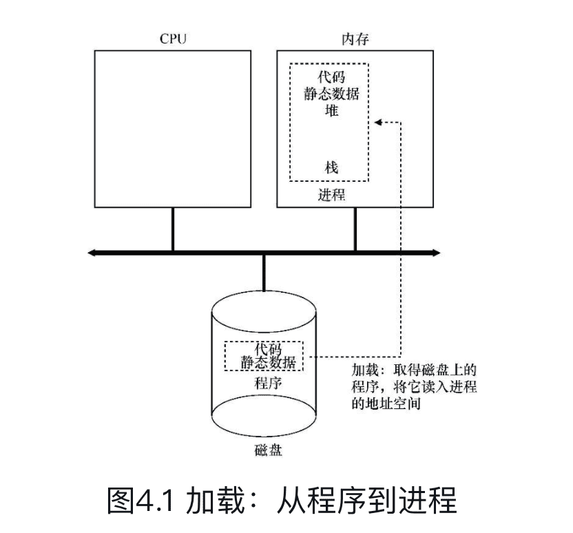

#### 4.4 进程状态

- **Running**（运行）
- **Ready**（就绪）
- **Blocked**（阻塞）

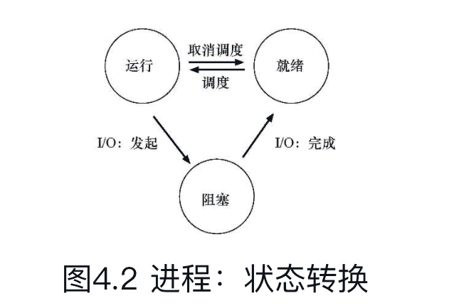


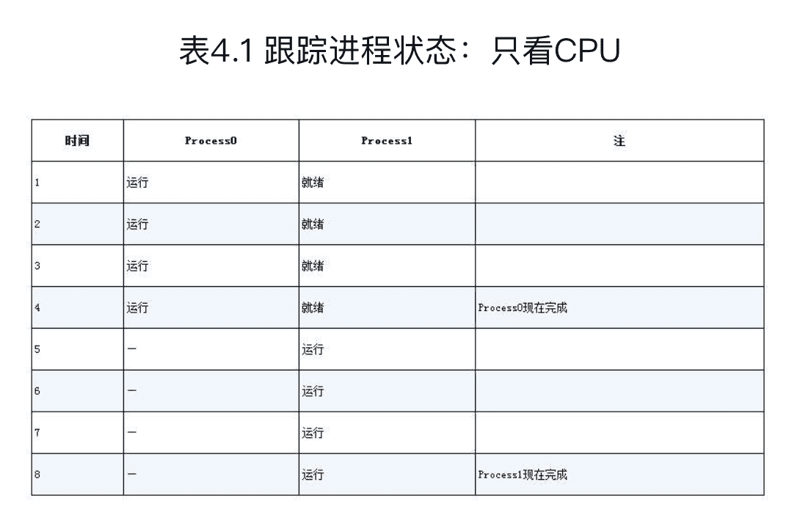


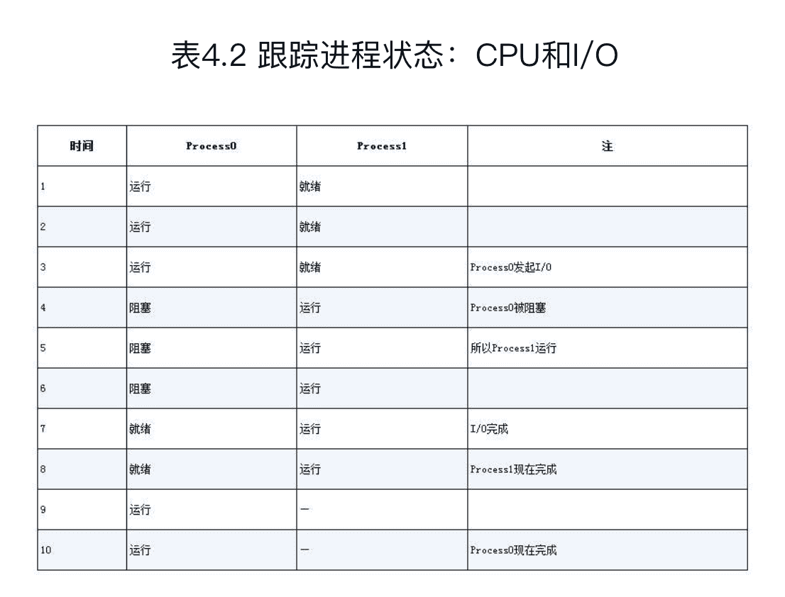

保持CPU繁忙来提高资源利用率。


#### 4.5 数据结构

操作系统是一个程序，和其他程序一样，它有一些关键的数据结构来跟踪各种相关的信息。

进程列表（process list）

当一个进程停止时，它的寄存器将被保存到这个内存位置。通过恢复这些寄存器（将它们的值放回实际的物理寄存器中），操作系统可以恢复运行该进程。这种技术叫做**上下文切换**（context switch）。

进程控制块（Process Control Block，PCB）

### 5 进程API

UNIX系统中的进程创建，通过一对系统调用：`fork()`和`exec()`。通过第三个系统调用`wait()`，来等待其创建的子进程执行完成。

#### 5.1 fork()


进程描述符（process identifier，PID）

#### 5.2 wait()


#### 5.3 exec()

这个系统调用可以让子进程执行与父进程不同的程序。

exec()会从可执行程序中加载代码和静态数据，并用它覆写自己的代码段（以及静态数据），堆、栈及其他内存空间也会被重新初始化。然后操作系统就执行该程序，将参数通过argv传递给该进程。

对exec()的成功调用永远不会返回。

#### 5.4 为什么这样设计API

这种分离fork()及exec()的做法在构建UNIXshell的时候非常有用，因为这给了shell在fork之后exec之前运行代码的机会，这些代码可以在运行新程序前改变环境，从而让一系列有趣的功能很容易实现。


### 6 机制：受限直接执行

虚拟化机制的挑战：

- 第一个是性能：如何在不增加系统开销的情况下实现虚拟化？
- 第二个是控制权：如何有效地运行进程，同时保留对CPU的控制？

也就是：

> 关键问题：如何高效、可控地虚拟化CPU？

#### 6.1 基本技巧：受限直接执行

受限的直接执行（limited direct execution）

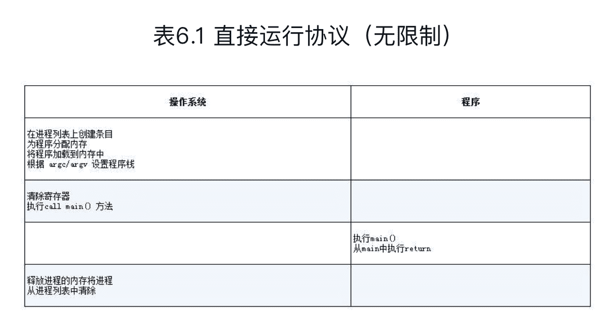

#### 6.2 问题1：受限制的操作

> 关键问题：如何执行受限制的操作
>
> 一个进程必须能够执行I/O和其他一些受限制的操作，但又不能让进程完全控制系统。操作系统和硬件如何协作实现这一点？

硬件通过提供不同的执行模式来协助操作系统。在**用户模式（user mode）**下，应用程序不能完全访问硬件资源。在**内核模式（kernel mode）**下，操作系统可以访问机器的全部资源。还提供了陷入（trap）内核和从陷阱返回（return-from-trap）到用户模式程序的特别说明，以及一些指令，让操作系统告诉硬件陷阱表（trap table）在内存中的位置。

要执行系统调用，程序必须执行特殊的陷阱（trap）指令。该指令同时跳入内核并将特权级别提升到内核模式。

执行陷阱时，硬件需要小心，因为它必须确保存储足够的调用者寄存器，以便在操作系统发出从陷阱返回指令时能够正确返回。例如，在x86上，处理器会将程序计数器、标志和其他一些寄存器推送到每个进程的内核栈（kernel stack）上。从返回陷阱将从栈弹出这些值，并恢复执行用户模式程序。

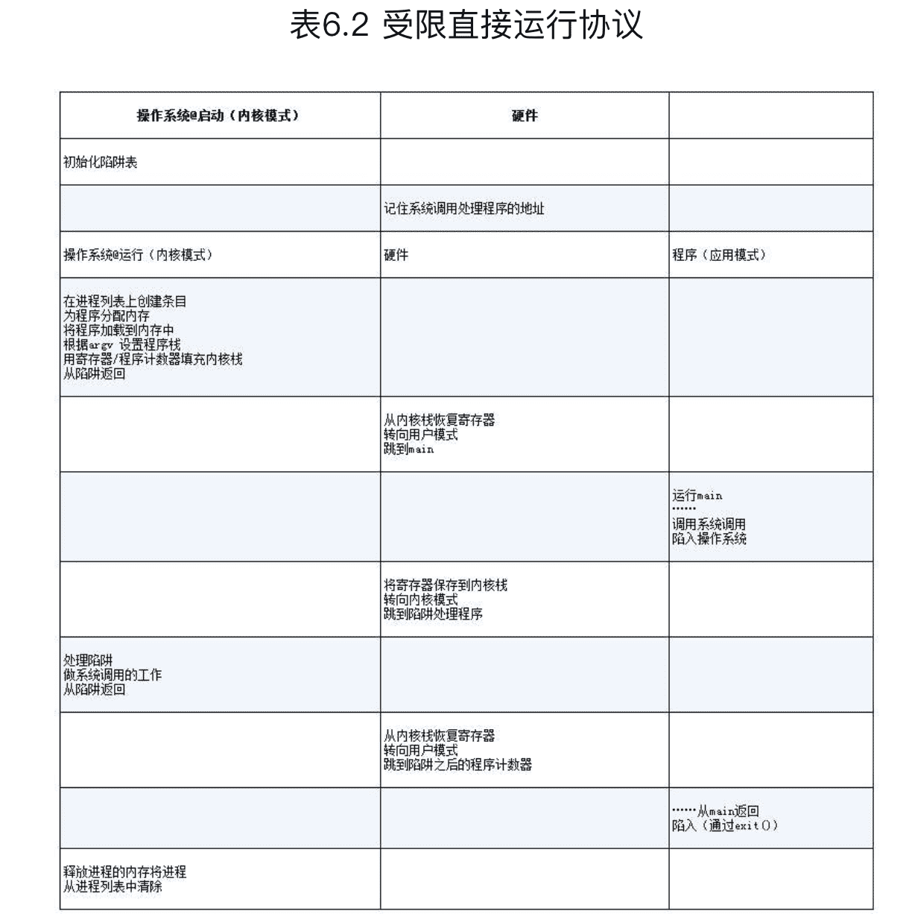


#### 6.3 问题2：在进程之间切换

> 关键问题：如何重获CPU的控制权
>
> 操作系统如何重新获得CPU的控制权（regain control），以便它可以在进程之间切换？

时钟中断（timer interrupt）

中断处理程序（interrupt handler）

上下文切换在概念上很简单：操作系统要做的就是为当前正在执行的进程保存一些寄存器的值（例如，到它的内核栈），并为即将执行的进程恢复一些寄存器的值（从它的内核栈）。

为了保存当前正在运行的进程的上下文，操作系统会执行一些底层汇编代码，来保存通用寄存器、程序计数器，以及当前正在运行的进程的内核栈指针，然后恢复寄存器、程序计数器，并切换内核栈，供即将运行的进程使用。

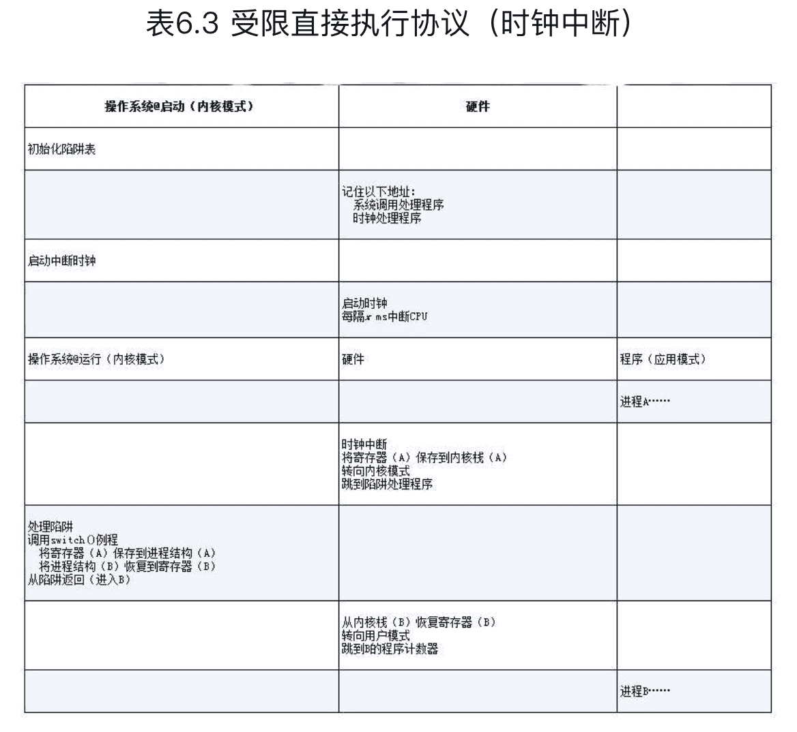

### 7 进程调度：介绍

调度策略（sheduling policy，有时称为discipline）

#### 7.1 工作负载假设


#### 7.2 调度指标


#### 7.3 先进先出（FIFO）


#### 7.4 最短任务优先（SJF）


#### 7.5 最短完成时间优先（STCF）

最短完成时间优先（Shortest Time-to-CompletionFirst，STCF）


#### 7.6 新度量指标：响应时间


#### 7.7 轮转

轮转（Round-Robin，RR）调度

时间切片（time-slicing）

因此，系统设计者需要权衡时间片的长度，使其足够长，以便摊销（amortize）上下文切换成本，而又不会使系统不及时响应。

#### 7.8 结合I/O


### 8 调度：多级反馈队列

多级反馈队列（Multi-levelFeedback Queue，MLFQ）

多级反馈队列是用历史经验预测未来的一个典型的例子，操作系统中有很多地方采用了这种技术（同样存在于计算机科学领域的很多其他地方，比如硬件的分支预测及缓存算法）。

> 关键问题：没有完备的知识如何调度？
>
> 没有工作长度的先验（priori）知识，如何设计一个能同时减少响应时间和周转时间的调度程序？

#### 8.1 MLFQ：基本规则

MLFQ中有许多独立的队列（queue），每个队列有不同的优先级（priority level）。任何时刻，一个工作只能存在于一个队列中。MLFQ总是优先执行较高优先级的工作（即在较高级队列中的工作）。

MLFQ的两条基本规则：

- 规则1：如果A的优先级 > B的优先级，运行A（不运行B）。
- 规则2：如果A的优先级 = B的优先级，轮转运行A和B。

#### 8.2 尝试1：如何改变优先级

既有运行时间很短、频繁放弃CPU的交互型工作，也有需要很多CPU时间、响应时间却不重要的长时间计算密集型工作。

- 规则3：工作进入系统时，放在最高优先级（最上层队列）。
- 规则4a：工作用完整个时间片后，降低其优先级（移入下一个队列）。
- 规则4b：如果工作在其时间片以内主动释放CPU，则优先级不变。

#### 8.3 尝试2：提升优先级

规则5：经过一段时间S，就将系统中所有工作重新加入最高优先级队列。

#### 8.4 尝试3：更好的计时方式

规则4：一旦工作用完了其在某一层中的时间配额（无论中间主动放弃了多少次CPU），就降低其优先级（移入低一级队列）。

#### 8.5 MLFQ调优及其他问题


### 9 调度：比例份额

比例份额（proportional-share）调度程序，有时也称为公平份额（fair-share）调度程序。

比例份额算法基于一个简单的想法：调度程序的最终目标，是确保每个工作获得一定比例的CPU时间，而不是优化周转时间和响应时间。

彩票调度（lottery scheduling），基本思想很简单：每隔一段时间，都会举行一次彩票抽奖，以确定接下来应该运行哪个进程。越是应该频繁运行的进程，越是应该拥有更多地赢得彩票的机会。

> 关键问题：如何按比例分配CPU
>
> 如何设计调度程序来按比例分配CPU？其关键的机制是什么？效率如何？

#### 9.1 基本概念：彩票数表示份额

彩票调度背后是一个非常基本的概念：彩票数（ticket）代表了进程（或用户或其他）占有某个资源的份额。

彩票调度最精彩的地方在于利用了随机性（randomness）。当你需要做出决定时，采用随机的方式常常是既可靠又简单的选择。

#### 9.2 彩票机制


### 10 多处理器调度（高级）

> 关键问题：如何在多处理器上调度工作

#### 10.1 背景：多处理器架构

区别多处理器和单CPU的核心在于对硬件缓存（cache）的使用（见图10.1），以及多处理器之间共享数据的方式。

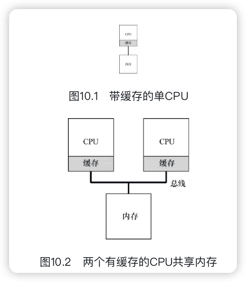

#### 10.2 别忘了同步

#### 10.3 最后一个问题：缓存亲和度

#### 10.4 单队列调度


#### 10.5 多队列调度

> 关键问题：如何应对负载不均
>
> 多队列多处理器调度程序应该如何处理负载不均问题，从而更好地实现预期的调度目标？


#### 10.6 Linux多处理器调度


### 11 CPU虚拟总结


### 12 内存虚拟化


### 13 抽象：地址空间

#### 早期系统

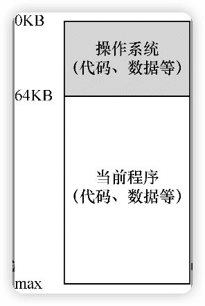

操作系统曾经是一组函数（实际上是一个库），在内存中（在本例中，从物理地址0开始），然后有一个正在运行的程序（进程），目前在物理内存中（在本例中，从物理地址64KB开始），并使用剩余的内存。这里几乎没有抽象，用户对操作系统的要求也不多。

#### 多道程序和时分共享

3个进程：共享内存

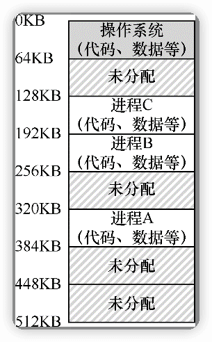

#### 地址空间

地址空间（address space），是物理内存抽象，是运行的程序看到的系统中的内存。

**一个进程的地址空间包含运行的程序的所有内存状态**。比如：程序的代码（code，指令）必须在内存中，因此它们在地址空间里。当程序在运行的时候，利用栈（stack）来保存当前的函数调用信息，分配空间给局部变量，传递参数和函数返回值。最后，堆（heap）用于管理动态分配的、用户管理的内存，就像你从C语言中调用malloc()或面向对象语言（如C ++或Java）中调用new 获得内存。当然，还有其他的东西（例如，静态初始化的变量），但现在假设只有这3个部分：**代码、栈和堆**。

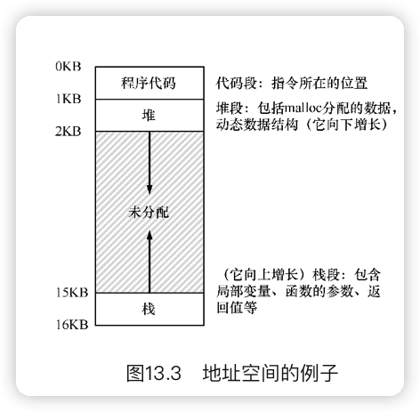

> 关键问题：如何虚拟化内存
>
> 操作系统如何在单一的物理内存上为多个运行的进程（所有进程共享内存）构建一个私有的、可能很大的地址空间的抽象？

#### 目标

透明（transparency）

效率（efficiency）

保护（protection）


虚拟内存系统负责为程序提供一个巨大的、稀疏的、私有的地址空间的假象，其中保存了程序的所有指令和数据。操作系统在专门硬件的帮助下，通过每一个虚拟内存的索引，将其转换为物理地址，物理内存根据获得的物理地址去获取所需的信息。


### 14 插叙：内存操作API

> 关键问题：如何分配和管理内存
>
> 在UNIX/C程序中，理解如何分配和管理内存是构建健壮和可靠软件的重要基础。通常使用哪些接口？哪些错误需要避免？

#### 14.1 内存类型


#### 14.2 malloc()调用


#### 14.3 free()调用


#### 14.4 常见错误


#### 14.5 底层操作系统支持


#### 14.6 其他调用


### 15 机制：地址转换

受限直接访问（Limited DirectExecution，LDE）

让程序运行的大部分指令直接访问硬件，只在一些关键点（如进程发起系统调用或发生时钟中断）由操作系统介入来确保“在正确的时间，正确的地点，做正确的事”。

> 关键问题：如何高效、灵活地虚拟化内存

基于硬件的地址转换（hardware-basedaddress translation），简称为地址转换（address translation）

利用地址转换，硬件对每次内存访问进行处理（即指令获取、数据读取或写入），将指令中的虚拟（virtual）地址转换为数据实际存储的物理（physical）地址。


### 16 分段

> 关键问题：怎样支持大地址空间

#### 16.1 分段：泛化的基址/界限


#### 16.2 我们引用哪个段


#### 16.3 栈怎么办


#### 16.4 支持共享


#### 16.5 细粒度与粗粒度的分段


#### 16.6 操作系统支持


### 17 空闲空间管理


### 18 分页：介绍


为了记录地址空间的每个虚拟页放在物理内存中的位置，操作系统通常为每个进程保存一个数据结构，称为**页表（page table）**。页表的主要作用是为地址空间的每个虚拟页面保存地址转换（address translation），从而让我们知道每个页在物理内存中的位置。


#### 18.2 页表存在哪里


#### 18.3 页表中究竟有什么


#### 18.4 分页：也很慢


#### 18.5 内存追踪


### 19 分页：快速地址转换（TLB）

#### 19.1 TLB的基本算法


#### 19.2 示例：访问数组


#### 19.3 谁来处理TLB未命中


#### 19.4 TLB的内容


#### 19.5 上下文切换时对TLB的处理


#### 19.6 TLB替换策略


#### 19.7 实际系统的TLB表项


### 20 分页：较小的表

> 关键问题：如何让页表更小？
>
> 简单的基于数组的页表（通常称为线性页表）太大，在典型系统上占用太多内存。如何让页表更小？关键的思路是什么？由于这些新的数据结构，会出现什么效率影响？

#### 20.1 简单的解决方案：更大的页


#### 20.2 混合方法：分页和分段


#### 20.3 多级页表


#### 20.4 反向页表


#### 20.5 将页表交换到磁盘


### 21 超越物理内存：机制

#### 21.1 交换空间

在硬盘上开辟一部分空间用于物理页的移入和移出。在操作系统中，一般这样的空间称为交换空间（swap space）。

#### 21.2 存在位


#### 21.3 页错误


#### 21.4 内存满了怎么办


#### 21.5 页错误处理流程


#### 21.6 交换何时真正发生


### 22 超越物理内存：策略

> 关键问题：如何决定踢出哪个页

#### 22.1 缓存管理


#### 22.2 最优替换策略


#### 22.3 简单策略：FIFO


#### 22.4 另一个简单策略：随机


#### 22.5 利用历史数据：LRU


#### 22.6 工作负载示例


#### 22.7 实现基于历史信息的算法


#### 22.8 近似LRU


#### 22.9 考虑脏页


#### 22.10 其他虚拟内存策略

#### 22.11 抖动


### 23 VAX/VMS虚拟内存系统


#### 内存管理硬件


#### 一个真实的地址空间


#### 页替换


#### 其他漂亮的虚拟内存技巧


### 24 内存虚拟化总结

## 二、并发

### 26 并发：介绍


### 27 插叙：线程API

> 关键问题：如何创建和控制线程？


### 28 锁


### 29 基于锁的并发数据结构

> 关键问题：如何给数据结构加锁？

#### 29.1 并发计数器

#### 29.2 并发链表

#### 29.3 并发队列

#### 29.4 并发散列表


### 30 条件变量

#### 30.1 定义和程序


#### 30.2 生产者/消费者（有界缓冲区）问题


#### 30.3 覆盖条件


当某些程序状态不符合要求时，通过允许线程进入休眠状态，条件变量使我们能够漂亮地解决许多重要的同步问题，包括著名的（仍然重要的）生产者/消费者问题，以及覆盖条件。


### 31 信号量

#### 31.1　信号量的定义


#### 31.2 二值信号量（锁）


#### 31.3 信号量用作条件变量


#### 31.4 生产者/消费者（有界缓冲区）问题


#### 31.5 读者—写者锁


#### 31.6 哲学家就餐问题


#### 31.7 如何实现信号量


### 32 常见并发问题

#### 32.1 有哪些类型的缺陷


#### 32.2 非死锁缺陷


#### 32.3 死锁缺陷


### 33 基于事件的并发（进阶）


### 34 并发的总结


## 三、持久性

### 36 I/O设备

> 关键问题：如何将I/O集成进计算机系统中

#### 36.1 系统架构


#### 36.2 标准设备


#### 36.3 标准协议


#### 36.4 利用中断减少CPU开销


#### 36.5 利用DMA进行更高效的数据传送


#### 36.6 设备交互的方法


#### 36.7 纳入操作系统：设备驱动程序

> 关键问题：如何实现一个设备无关的操作系统

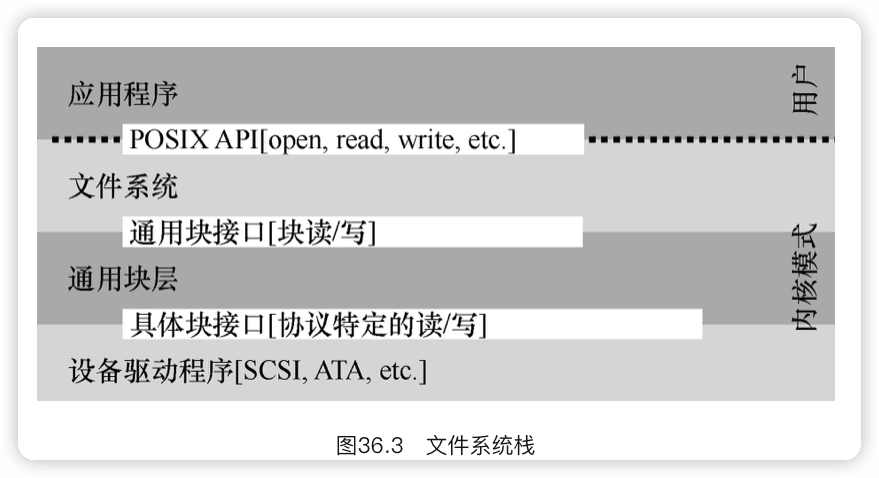

#### 36.8 案例研究：简单的IDE磁盘驱动程序


### 37 磁盘驱动器


### 38 廉价冗余磁盘阵列（RAID）


### 39 插叙：文件和目录

> 关键问题：如何管理持久存储设备

39.1　文件和目录

39.2　文件系统接口

39.3　创建文件

39.4　读写文件

39.5　读取和写入，但不按顺序

39.6　用fsync()立即写入

39.7　文件重命名

39.8　获取文件信息

39.9　删除文件

39.10　创建目录

39.11　读取目录

39.12　删除目录

39.13　硬链接

39.14　符号链接

39.15　创建并挂载文件系统


### 40 文件系统实现


### 41 局部性和快速文件系统


### 42 崩溃一致性：FSCK和日志

> 关键问题：考虑到崩溃，如何更新磁盘


### 43 日志结构文件系统


### 44 数据完整性和保护


### 45 持久的总结


### 47 分布式系统

> 关键问题：如何构建在组件故障时仍能工作的系统

47.1　通信基础

47.2　不可靠的通信层

47.3　可靠的通信层

47.4　通信抽象

47.5　远程过程调用（RPC）


### 48 Sun的网络文件系统（NFS）

> 关键问题：如何构建分布式文件系统


### 49 Andrew文件系统（AFS）


### 50 分布式的总结
