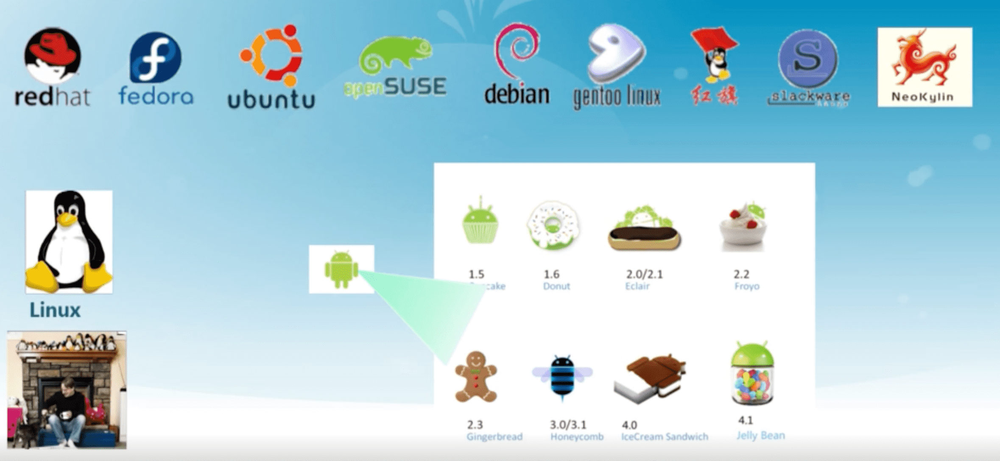

操作系统（清华大学）
--------

[操作系统-学堂在线](http://www.xuetangx.com/courses/course-v1:TsinghuaX+30240243X+sp/about)

https://piazza.com/tsinghua.edu.cn/spring2015/30240243x

https://piazza.com/class/i5j09fnsl7k5x0

## 一、概述
wiki http://os.cs.tsinghua.edu.cn/oscourse/OS2015
ucore

向勇副教授 清华大学计算机系

### 预备知识
- 计算机结构原理
- C与汇编程序设计
- 数据结构

### 参考书籍
- 《操作系统概念》 （Operating System Concepts 9th)
- 《操作系统 : 精髓与设计原理》 （operating systems internals and design principles 8th）

### 教学内容
- 操作系统结构
- 中断及系统调用 中断是管理外面的硬件

操作系统管理的资源：

- 内存管理
- 进程及线程
- 处理机调度     进程调度使用CPU
- 同步互斥      进程间的交流通讯
- 文件系统
- I/O子系统     管理外设设备

### 练习与实验

### 课程设计
- ucore+模块化改进
- 在真实系统上运行ucore+
 + 树莓派（Raspberry PI）
 + Intel Edison
- 自选操作系统题目
  http://os.cs.tsinghua.edu.cn/oscourse/OS2015/projects

### 什么是操作系统
#### 定义

没有公认的精确定义
操作系统是一个**控制程序**
操作系统是一个**资源管理器**

- 应用程序与硬件之间的中间层
- 管理各种计算机软硬件资源
- 提供访问计算机软硬件资源的高效手段
- 解决资源访问冲突，确保资源公平使用

#### 操作系统的地位

#### 操作系统软件的分类

#### 操作系统软件的组成

- Shell-命令行接口

  通过键盘操纵
  方便用户进行命令输入

- GUI-图形用户接口龙

  WIMP（视窗（Window ）、图标（ Icon）、选单（ Menu)、指针（Pointer）
  口直接操作和所见即所得
  
- Kernel-操作系统的内部
  
  执行各种资源管理等功能

####  ucore教学操作系统内核

#### 操作系统内核特征

- 并发

  计算机系统中同时存在多个运行的程序，需要OS管理和调度

- 共享
  + 宏观上，“同时“访问
  + 微观上，互斥共享
  
- 虚拟

  利用多道程序设计技术，让没个用户都觉得有一个计算机专门为他服务

- 异步

  程序的执行不是一贯到底，而是走走停停，向前推进的速度不可预知

  只要运行环境相同，OS需要保证程序运行的结果也要相同

### 为啥要学操作系统

#### 哪里在做操作系统研究？

- 顶尖大学的计算机科学部门
- 计算机产业
  旧时：Xerox (PARC), IBM, DEC (SRC), Bell Labs
  现代： Microsoft, Google, Yahoo, IBM, HP, Sun, VMware, Amazon,
  国内：阿里巴巴、百度、华为。
- 研究协会
  ACM SIGOPS
  USENIX

#### 操作系统研究的顶级会议

- ACM 操作系统原理研讨会 (SOSP)
  ACM SIGOPS
  每两年（奇数：1967-)
  ~20 论文
- USENIX 操作系统设计和实现研讨会 (OSDI)
  USENIX
  每两年（偶数：1994-)
  ~20论文

#### 最具影响力的操作系统论文

- SIGOPS Hall-of-Fame Awards
  论文必须发表在同行评议的文献中至少十年
  到目前为止有三十多篇论文获奖

- 假如你想做操作系统研究

  需要阅读和理解这些论文
  http://www.sigops.org/award-hof.html

#### 掌握操作系统具有挑战性

- 操作系统很大

  Windows XP 有4500万行

- 操作系统管理并发

  并发导致有趣的编程桃战

- 操作系统代码管理原始硬件

  时间依赖行为，非法行为,硬件做障

- 操作系统代码必须是高效的，低耗CPU、内存、磁盘的

- 操作系统出错，就意味着机器出错

  操作系统必须比用户程序拥有更高的稳定性

- 操作系统是系统安全的基础

操作系统并不仅仅关于并发性和琐碎的调度算法

- 并发性是一小部分

  内核里不存在管程和哲学家问题
  内核中的锁问题需要太多的背景知识

- 磁盘调度大多是不相干的(SCSl己经做了这些）
- 进程调度是个比较小话题

权衡

- 时间与空间
- 性能与可预测性
- 公平与性能(哪种设计能工作？为什么？）

硬件

- 如何让中断、异常、上下文切换真正有效？
- TLB是如何工作的？这对页表又意味着什么？
- 如果你不展示任何汇编代码，那么你就不是教操作系统的！

### 如何学习操作系统？

- ”不间不若间之，间之不若见之，见之不学至子行之而止矣。“ ——荀子《儒效篇》
  

### 操作系统实例

#### UNIX家族

#### Linux家族

#### Windows家族

### 操作系统的演变

#### 操作系统为什么改变

- 主要功能：硬件抽象和协调管理
- 原则：设计随着各种相关技术的改变而做出一定的改变
- 在过去二十年底层技术有极大的改变！！

#### 单用户系统(45-55)

操作系统 = 装载器 + 通用子程序库

问题：昂贵组件的低利用率

`执行时间/(执行时间+读卡时间) = %利用率`

#### 批处理系统(55-65)

顺序执行与批处理

#### 多程序系统(65-80)

保持多个工作在内存中并且在各工作间复用CPU

#### 分时(70- )

定时中断用于工作对CPU的复用

#### 个人计算机

个人电脑系统

- 单用户 

- 利用率已不再是关注点

- 重点是用户界面和多媒体功能
- 很多老的服务和功能不存在

演变

- 最初：操作系统作为一个简单的服务提供者(简单库)
- 现在：支持协调和沟通的多应用系统
- 越来越多的安全问题(如，电子南务、医疗记录）

#### 分布式操作系统

每个用户多个系统

- 网络支持成为一个重要的功能

- 通常支持分布式服务

  跨多系统的数据共享和协调

- 可能使用多个处理器
  松、紧糯合系统
- 高可用性与可靠性的要求

#### 操作系统演变中的计算机系统

### 操作系统的结构

#### 简单结构

MS-DOS —— 在最小的空间，设计用于提供大部分功能（1981~·994）

- 没有拆分为模块
- MS-DOS在接口和功能水平没有很好地分离，主要用汇编编写

#### 分层结构

- 操作系统分为很多层 (levels)

  每层建立在低层之上
  最底层 (layer 0)，是硬件
  最高层(layer N) 是用户界面

- 使用模块化，每一层仅使用更低一层的功能（操作）和服务。

分层后操作系统能更好地移植，高层用高级语言编写，底层还是用汇编编写

Unix操作系统与C语言

1972 

#### 微内核结构(Microkernel)

- 尽可能把内核功能移到用户空间
- 用户模块间的童星使用消息传递
- 好处：灵活/安全
- 缺点：性能

 

#### 外核结构(Exokernel)

- 让内核分配机器的物理资源给多个应用程序，并让每个程序决定如何处理这些资源
- 程序能链接到操作系统库（libOS）实现了操作系统抽象
- 保护与控制分离

#### VMM(虚拟机管理器)

虚拟机管理器将单独的机器接口转换成很多的虚拟机，每个虚拟机都是一个原始计算机系统的有效副本，并能完成所有的处理器指令。

## 二、实验零 操作系统实验环境准备

### 前言

对操作系统课程教学的理解( Why )

- 计算机科学与计算机工程相结合
- 原理和实验教学内容井行进行
  实验--＞原理-->实验--＞原理--＞
- 强调动手编程实践
- 实验需求
  理解系统  循序渐进 把握全局 功能完善 闭读代码 改进创新

### 国内外现状

国外

- MIT : xv6 和JOS7

  千行以下，C语言，支持×86SMP架构

- Harvard : Os161-1.4.1

  1万1千行代码，C语言，支持MIPS架构

- Columbia : Linux
  部分Linux核心代码，C语言
- Berkeley: Nachos
  1万行左右，C++/java语言，模拟MIPS架构
- Stanford : PintOS
  1万1千行代码，C语言
- Univ.of Maryland: geek OS
  <10000行代码，C语言，x86

国内

- ucore

  清华 基于jos/xV6/OS161/linux：200-10000行 C语言，以
  ×86-32为主，且支持×86-64/ARM/MIPS

- xv6和JOS
  北大

- Linux
  国防科大、浙大、西邮、清华

- MINIX
  上海交大，南开

- Nachos
  南开，山大

- Solaris, Windows WRK, Wince, RTEMS, UCos-II, eCos…

### OS实验目标

设计思路
方便且利用理解细节

- 大量采用开源软件
- 宝环境：Windows/Linux
- 源码阅读工具：understand
- 源码文档自动生成工具：Doxygen
- 编译环境：gcc, make, Binutils
- 真实/虛拟运行环境：×86机器或QEMU
- 调试工具：改进的QEMU + (GDB O.R. IDE)
- IDE工具：Eclipse-CDT
  

设计思路

- 采用小巧全面的操作系统ucore并进行改进覆盖操作系统的关键点，为此增加：
  - 外设：I/O管理/中断管理
  - 内存：虛存管理/页表/缺页处理/ 页替換算法
  - CPU:进程管理/调度器算法
  - 井发：信号量实现和同步互斥应用
  - 存储：基于链表/FAT的文件系统
  - 完整代码量控制在10000行以内
  - 提供实验讲义和源码分析文档

### 8个实验概述

#### Lab1：Bootloader/Interrupt/Device Driver

启动操作系统的bootloader，了解操作系统启动前的状态和要做的准备工作，了解运行操作系统的硬件支持，操作系统如何加载到内存中，理解两类中断——
“外设中断"“陷阱中断〞等；

- 基于分段机制的存储管理
- 设备管理的基本概念
- PC启动bootloader的过程
- bootloader的文件组成
- 编译运行bootloader的过程
- 调试bootloader的方法
- 在汇编级了解栈的结构和处理过程
- 中断处理机制
- 通过串口/井口/CGA输出字符的方法

#### Lab2：物理内存管理

理解x86分段/分页模式，了解操作系统如何管理连续空间的物理内存

- 理解內存地址的转换和保护
- 实现页表的建立和使用方法
- 实现物理内存的管理方法
- 了解常用的减少碎片的方法

#### Lab3：虚拟内存管理

了解页表机制和换出（swap）机制以及中断-“故障中断”、缺页故障
处理等，基于页的内存替换算法；

- 理解换页的软硬件协同机制 

- 实现虛拟内存的Page Fault异常处理
- 实现贡替换算法

#### Lab4：内核线程管理

了解如何利用CPU来高效地完成各种工作的设计与实现基础，如何创建相对与用户进程更加简单的内核态线程，如何对内核线程进行动态管理等；

- 建立内核线程的关键信息
- 实现内核线程的管理方法

#### Lab5：用户进程管理

了解用户态进程创建、执行、切换和结束的动态管理过程，了解在用户态通过系統调用得到内核态的内核服务的过程
- 建立用户进程的关键信息
- 实现用户进程管理
- 分析进程和内存管理的关系
- 实现系统调用的处理过程

#### Lab6：进程调度

用于理解操作系统的调度过程和调度算法

- 熟悉ucore的系统调度器推架，以及内置的Round-Robin调度算法
- 基于调度器框架实现一个调度器算法

#### Lab7：同步互斥

了解进程间如何进行信息交换和共享，并了解同步互斥的具体实现以及对系统
性能的影响，研究死锁产生的原因，以及如何避免死锁；

- 熟悉 ucore 的同步互斥机制
- 理解基本的spinlock. semphpore、condition variable的实现
- 用各种同步机制解决同步问题

哲学家吃饭问题

#### Lab8：文件系统

了解文件系统的具体实现，与进程管理等的关系，了解缓存对操作系统IO访问
的性能改进，了解虛拟文件系统（VFS)、buffer cache和disk driver之间的关系。

- 掌握基本的文件系统系统调用的实现方法；
- 了解一个基于索引节点组织方式的Simple FS文件系统的设计与实现；
- 了解文件系统抽象层-VFS的设计与实现；

#### 扩展实验

U0: core porting on x86-64
Status: 100%, ucorer: wnz

U1: local page replacement framework with different algorithms of local page replacement
status: 100%, corer: yxh

U2:ucore支持ARM CPU(with mmu)
Status: 100 %, ucorer: wjf, ykl, xb

...

U9:ucore文件系统框架：支持在VFS下同时支持FAT32等文件系统，实现更加简化的VFS、FAT和SFS，井能够实现高性能的基于DMA方式的磁盘访问
status: 100%, ucorer: qz,rsw

...

U12:ucore支持GO programming
Status: 100%, ucorer: cr,fiy

#### 效果

好的方面

- 理论和实验能够较好地结合起来，不再感到OS课是一
  只要死记硬背的课程了
- 理解了一个0S的全局设计实现，而不是一个一个分离的
  知识点
- 掌握了许多OS原理上没有涉及或涉及不够的东西，比如
  中断/系统调用的实现 ，X86的段页机制，进程上下文如
  何切换的，内核态和用户态的具体区别是什么
- 这是大学期碰到的最复杂的软件，学习了分析和设计大型
  系统软件的方法

 

### 实验环境搭建

🔖2.4 

## 三、启动、中断、异常和系统调用

### 3.1 BIOS

### 3.2 系统启动流程

### 3.3 中断、异常和系统调用比较

### 3.4 系统调用

## 四、实验一

## 五、物理内存管理：连续内存分配

## 六、物理内存管理：非连续内存分配

## 七、实验二

## 八、虚拟存储

## 九、页面置换算法

## 十、实验三

## 十一、进程和线程

## 十二、进程控制

## 十三、实验四

## 十四、实验五

## 十五、处理机调度

## 十六、实验六

## 十七、同步互斥

## 十八、信号量与管程

## 十九、实验七

## 二十、死锁和进程通信

## 二十一、文件系统

## 二十二、实验八

## 二十三、I/O系统

