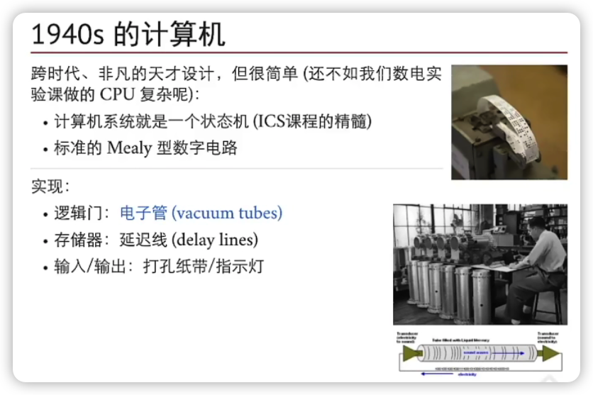
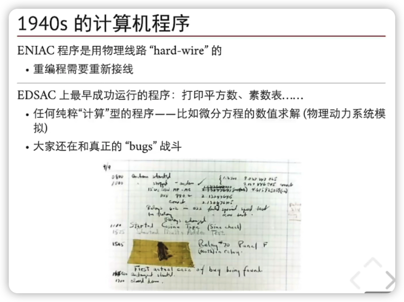

操作系统：设计与实现
----------

[2020 南京大学 “操作系统：设计与实现” (蒋炎岩)](https://www.bilibili.com/video/BV1N741177F5?p=2）)

https://ics.nju.edu.cn/~jyywiki

## 回顾：什么事操作系统

>  有一类软件负责让程序运行变得容易（甚至允许你同时运行多个程序），允许程序共享内存，让程序能够与设备交互，以及其他类似的有趣的工作。这些软件称为操作系统（Operating System，OS）。

理解操作系统的历史，就要理解计算机（和程序）发展的历史

在历史上，操作系统增加了什么对象、提供什么操作？



数字电路课，计算机系统基础课

计算机系统 -》状态机   计数器

计算机其实和计数器没有本质区别




```shell
objdump -d a.out | less
```

