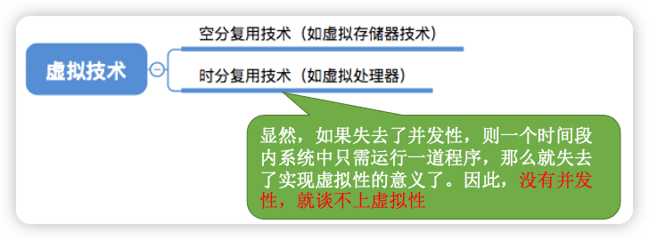

王道操作系统
---

https://www.bilibili.com/video/BV1YE411D7nH

http://cskaoyan.com/

## 1 操作系统概述

### 操作系统的概念(定义)、功能和目标

#### 概念(定义)——什么是操作系统

一台电脑的诞生~
Step 1:厂家组装一台裸机
Step 2:出售前安装操作系统
Step 3:用户安装应用程序(eg:QQ) 
Step 4:使用 QQ 聊天

==操作系统==(Operating System，OS)是指控制和==管理==整个计算机系统的==硬件和软件==资源（1️⃣**操作系统是系统资源的管理者**），并合理地组织调度计算机的工作和资源的分配;以==提供给用户和其他软件方便的接口和环境==（2️⃣**向上层提供方便易用的服务**）;它是计算机系统中最基本的==系统软件==（3️⃣**是最接近硬件的一层软件**）。

直观的例子:打开 Windows 操作系统的“任务管理器”(快捷键:Ctrl+Alt+Del)

#### 功能和目标（要做些什么）——作为系统资源的管理者

补充知识:执行一个程序前==需要将该程序放到内存中==，才能被CPU处理。

#### 功能和目标**——**向上层提供方便易用的服务

> ==封装思想==:操作系统把一些丑陋的硬件功能封装成简单易用的服务，使用户能更方便地使用计算机，用户无需关心底层硬件的原理，只需要对操作系统发出命令即可。

GUI:图形化用户接口(Graphical User Interface) 用户可以使用形象的图形界面进行操作，而不再需要记忆复杂的命令、参数。 

例子:在 Windows 操作系统中，删除一个文件只需要把文件“拖拽”到回收站即可。

==联机命令接口==实例(Windows系统)  联机命令接口= ==交互式==（特点:用户说一句，系统跟着做一句）命令接口
Step 1:win键+R
Step 2:输入cmd，按回车，打开命令解释器 特点:用户说一句， 
Step 3:尝试使用 time 命令 

==脱机命令接口==实例(Windows系统) 脱机命令接口= ==批处理==（特点:用户说一堆，系统跟着做一堆）命令接口

使用windows系统的搜索功能，搜索C盘中的*.bat文件，用记事本任意打开一个

==程序接口==:可以在程序中进行==系统调用==来使用程序接口。普通用户不能直接使用程序接口，只能通过程
序代码==间接==使用。

#### 功能和目标**——**作为最接近硬件的层次

需要实现==对硬件机器的拓展==。
没有任何软件支持的计算机称为==裸机==。在裸机上安装的操作系统，可以提供资源管理功能和方便用户的服务功能，将裸机改造成功能更强、使用更方便的机器。
通常把覆盖了软件的机器成为**扩充机器**，又称之为**虚拟机**。

类比汽车:
发动机 —— 只会转;轮胎 —— 只会滚; 
在原始的硬件机器上覆盖一层传动系统 —— 让发动机带着轮子转 —— 使原始的硬件机器得到拓展。

操作系统对硬件机器的拓展：将CPU、内存、磁盘、显示器、键盘等硬件合理地组织起来，让各种硬件能够相互协调配合，实现更多更复杂的功能。普通用户无需关心这些硬件在底层是怎么组织起来工作的，只需直接使用操作系统提供的接口即可。

#### 小结

### 操作系统的四个特征

#### 并发

==并发==:指两个或多个事件在同一时间间隔内发生。这些事件==宏观上是同时发生==的，但==微观上是交替发生==的。常考易混概念——并行:指两个或多个事件在同一时刻同时发生。 

并发 VS 并行

eg:假设小渣和老渣每人有两个女朋友。任务1:和一号约会;任务2:和二号约会...

==操作系统的并发性==指计算机系统中“同时”运行着多个程序，这些程序宏观上看是同时运行着的，而微观
上看是交替运行的。
操作系统就是伴随着“多道程序技术”而出现的。因此，==操作系统和程序并发是一起诞生的==。

> 注意(重要考点): 
>
> 单核CPU同一时刻只能执行**一个程序**，各个程序只能**并发**地执行 
>
> 多核CPU同一时刻可以同时执行**多个程序**，多个程序可以**并行**地执行
>
> 比如Intel 的第八代 i3 处理器就是 4 核CPU，意味着可以并行地执行4个程序。即使是对于4核CPU来说，只要有4个以上的程序需要“同时”运行，那么并 发性依然是必不可少的，因此**并发性是操作系统一个最基本的特性**。

#### 共享

共享即资源共享，是指系统中的资源可供内存中多个并发执行的进程共同使用。

两种资源共享方式：

1. 互斥共享。系统中的某些资源，虽然可以提供给多个进程使用，但**一个时间段内只允许一个进程访问该资源**。

2. 同时共享。系统中的某些资源，**允许一个时间段内由多个进程“同时”对它们进行访问**。

所谓的“同时”往往是宏观上的，而在微观上，这些进程可能是交替地对该资源进行访问的(即分时共享)。

生活实例:

互斥共享方式:使用QQ和微信视频。同一时间段内摄像头只能分配给其中一个进程。 

同时共享方式:使用QQ发送文件A，同时使用微信发送文件B。宏观上看，两边都在同时读取并发送文件， 说明两个进程都在访问硬盘资源，从中读取数据。微观上看，两个进程是交替着访问硬盘的。

#### 并发和共享的关系

**并发性**指计算机系统中同时存在着多个运行着的程序。
**共享性**是指系统中的资源可供内存中多个并发执行的进程共同使用。

通过上述例子来看并发与共享的关系: 

使用QQ发送文件A，同时使用微信发送文件B。

1. 两个进程正在并发执行(==并发性==)。如果失去共享性，则系统中只有一个程序正在运行，则共享性失去存在的意义。
2. 需要共享地访问硬盘资源(==共享性==)。如果失去共享性，则QQ和微信不能同时访问硬盘资源，就无法实现同时发送文件，也就无法并发。

🔖

#### 虚拟🔖

==虚拟==是指把一个物理上的实体变为若干个逻辑上的对应物。物理实体(前者)是实际存在的，而逻辑上对应物(后者)是用户感受到的。 

用一个例子来理解

背景知识:一个程序**需要放入内存**并给它**分配CPU**才能执行

GTA5需要4GB的运行内存，QQ 需要256MB的内存，迅雷需要256MB的内 存，网易云音乐需要256MB的内存......
我的电脑:4GB内存 

问题:这些程序同时运行需要的内存远大于4GB，那么为什么它们还可以 在我的电脑上同时运行呢?

答:这是虚拟存储器技术。实际只有4GB的内存，在用户看来似乎远远大于4GB

虚拟技术中的“空分复用技术”

问题:既然一个程序需要被分配CPU才能正常执行，那么为什么单核CPU 的电脑中能同时运行这么多个程序呢? 

答:这是虚拟处理器技术。实际上只有一个单核CPU，在用户看来似乎有 6个CPU在同时为自己服务。

虚拟技术中的“时分复用技术”。微观上处理机在各个微小的时间段内交替着为各个进程服务。

#### 异步

==异步==是指，在多道程序环境下，允许多个程序并发执行，但由于资源有限，进程的执行不是一贯到底的，而是走走停停，以不可预知的速度向前推进，这就是进程的异步性。

老渣要和两个女孩并发约会

与一、二号的约会 = 两道并发执行的程序

老渣的心 = 有限的系统资源

由于并发运行的程序会争抢着使用系统资源，而系统中的资源有限，因此进程的执行不是一贯到底的，而是走走停停的，以不可预知的速度向前推进。
如果失去了并发性，即系统只能串行地运行各个程序，那么每个程序的执行会一贯到底。**只有系统拥有并发性，才有可能导致异步性**。

#### 小结

理解并发和并行的区别
并发和共享互为存在条件
没有并发和共享，就谈不上虚拟和异步，因此并发和共享是操作系统的两个最基本的特征

### 操作系统的发展与分类

学习提示:要重点关注和理解各类操作系统主要想解决的是什么问题，各自的优缺点。

#### 手工操作阶段

#### 批处理阶段**——**单道批处理系统

引入==脱机输入/输出技术==(用外围机+磁带完成)，并由==监督程序==负责控制作业的输入、输出

主要优点:缓解了一定程度的人机速度矛盾，资源利用率有所提升。
主要缺点:**内存中仅能有一道程序运行**，只有该程序运行结束之后才能调入下一道程序。 C**PU有大量的时间是在 空闲等待I/O完成**。资源利用率依然很低。

#### 批处理阶段**——**多道批处理系统

主要优点:多道程序**并发**执行，**共享**计算机资源。**资源利用率大幅提升**，CPU和其他资源更能保持“忙碌”状态，系统吞吐量增大。
主要缺点:用户响应时间长，**没有人机交互功能**(用户提交自己的作业之后就只能等待计算机处理完成，中间不能控制自己的作业执行。eg:无法调试程序/无法在程序运行过程中输入一些参数)

#### 分时操作系统

分时操作系统:计算机以==时间片==为单位==轮流==为各个用户/作业服务，各个用户可通过终端与计算机进行交互。 

主要优点:用户请求可以被即时响应，解决了人机交互问题。允许多个用户同时使用一台计算机，并且用户对计算机的操作相互独立，感受不到别人的存在。 

主要缺点:**不能优先处理一些紧急任务**。操作系统对各个用户/作业都是完全公平的，循环地为每个用户/作业服务一个时间片，不区分任务的紧急性。

#### 实时操作系统

主要优点:能够优先响应一些紧急任务，某些紧急任务不需时间片排队。

在实时操作系统的控制下，计算机系统接收到外部信号后及时进行处理，并且**要在严格的时限内处理完事件**。实时操作系统的主要特点是==及时性和可靠性==。

#### 其他几种操作系统

网络操作系统:是伴随着计算机网络的发展而诞生的，能把网络中各个计算机有机地结合起来，实现数据传送等功能，**实现网络中各种资源的共享(如文件共享)和各台计算机之间的通信**。(如:Windows NT 就是一种典型的网络操作系统，网站服务器就可以使用)

分布式操作系统:主要特点是==分布性和并行性==。系统中的各台计算机地位相同，任**何工作都可以分布在这些计算机上，由它们并行、协同完成这个任务**。

个人计算机操作系统:如 Windows XP、MacOS，方便个人使用。

#### 小结

### 操作系统的运行机制🔖

#### 小结

### 中断和异常

#### 中断的作用

“中断”会使CPU**由用户态变为内核态**，使操作系统重新夺回对CPU的控制权。

CPU上会运行两种程序，一种是==操作系统内核程序==（整个系统的管理者），一种是==应用程序==。

在合适的情况下，操作系统内核会把CPU的使用权主动让给应用程序(第二章进程管理相关内容) 。

“中断”是**让操作系统内核夺回CPU使用权的唯一途径**。 

如果没有“中断”机制，那么一旦应用程序上CPU运行，CPU就会一直运行这个应用程序。

==内核态->用户态==:执行一条**特权指令——修改PSW**的标志位为“用户态”，这个动作意味着操作系统将主动让出CPU使用权；

==用户态->内核态==:由“中断”引发，**硬件自动完成变态过程**，触发中断信号意味着操作系统将强行夺回CPU的使用权。

#### 中断的类型/分类

- 内中断：与当前执行的指令有关，中断信号来源于CPU内部。

- 外中断：与当前执行的指令无关，中断信号来源于CPU外部。

大多数的教材、试卷中，“中断”特指狭义的中断，即外中断。而内中断一般称为“异常”。

#### 中断机制的基本原理

不同的中断信号，需要用不同的中断处理程序来处理。当CPU检测到中断信号后，会根据中断信号的类型去查询“中断向量表”，以此来找到相应的中断处理程序在内存中的存放位置。

#### 小结

### 系统调用

#### 什么是系统调用，有何作用?

知识点回顾:
操作系统作为用户和计算机硬件之间的接口，需要向上提供一些简单易用的服务。主要包括命令接口和程序接口。其中，程序接口由一组==系统调用==组成。

“系统调用”是操作系统提供给应用程序(程序员/编程人员)使用的接口，可以理解为一种可供应用程序调用的特殊函数，**应用程序可以通过系统调用来请求获得操作系统内核的服务**。

#### 系统调用与库函数的区别

#### 为什么系统调用是必须的?

生活场景:去学校打印店打印论文，你按下了 WPS 的“打印”选项，打印机开 始工作。
你的论文打印到一半时，另一位同学按下了 Word 的“打印”按钮，开始打印他 自己的论文。

思考:如果两个进程可以随意地、并发地共享打印机资源，会发生什么情况? 

两个进程并发运行，打印机设备交替地收到 WPS 和 Word 两个进程发来的打印请求，结果两篇论文的内容混杂在一起了...

解决方法:由操作系统内核对共享资源进行统一的管理，并向上提供 “系统调用” ，用户进程想要使用打印机这种共享资源，只能通过系统调用向操作系统内核发出请求。内核会对各个请求进行协调处理。

#### 什么功能要用到系统调用?

应用程序通过系统调用请求操作系统的服务。而系统中的各种共享资源都由操作系统内核统一掌管，因此**凡是与共享资源有关的操作(如存储分配、I/O操作、文件管理等)，都必须通过系统调用的方式向操作系统内核提出服务请求**，由操作系统内核代为完成。这样可以**保证系统的稳定性和安全性**，防止用户进行非法操作。

> 拓展:感兴趣的同学可以搜索“Linux 系统调用”，了解 Linux 操作系统提供了哪些系统调用

#### 系统调用的过程

#### 小结

### 操作系统的体系结构 🔖

#### 操作系统的内核

==内核==是操作系统最基本、最核心的部分。
实现操作系统内核功能的那些程序就是==内核程序==。

注意:
操作系统内核需要运行在内核态
操作系统的非内核功能运行在用户态

一个故事:现在，应用程序想要请求操作系统的服务，这个服务的处理同时涉及到进程管理、存储管理、设备管理

注意:变态的过程是有成本的，要消耗不少时间，频繁地变态会降低系统性能

#### 小结

典型的大内核/宏内核/单内核 操作系统: Linux、UNIX 

典型的微内核 操作系统: Windows NT

### 操作系统引导

### 虚拟机

## 2 进程管理
