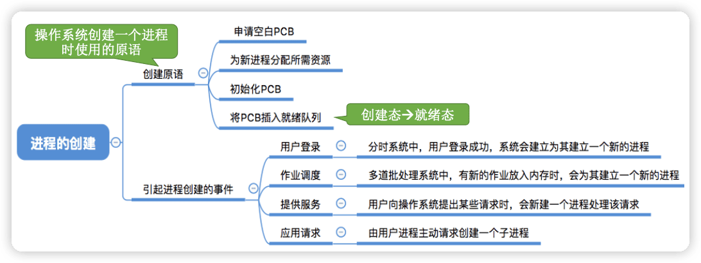

王道操作系统
---

https://www.bilibili.com/video/BV1YE411D7nH

http://cskaoyan.com/

学完一节，做一些习题测试

## 1 操作系统概述

### 1.1 概念(定义)、功能和目标


#### 概念(定义)——什么是操作系统

一台电脑的诞生~
Step 1:厂家组装一台裸机
Step 2:出售前安装操作系统
Step 3:用户安装应用程序(eg:QQ) 
Step 4:使用 QQ 聊天


==操作系统==(Operating System，OS)是指控制和==管理==整个计算机系统的==硬件和软件==资源（1️⃣**操作系统是系统资源的==管理者==**），并合理地组织调度计算机的工作和资源的分配;以==提供给用户和其他软件方便的接口和环境==（2️⃣**向上层提供方便易用的服务**）;它是计算机系统中最基本的==系统软件==（3️⃣**是最接近硬件的一层软件**）。


直观的例子:打开 Windows 操作系统的“任务管理器”(快捷键:Ctrl+Alt+Del)


#### 功能和目标（要做些什么）——作为系统资源的管理者

补充知识:执行一个程序前==需要将该程序放到内存中==，才能被CPU处理。


#### 功能和目标**——**向上层提供方便易用的服务


> ==封装思想==:操作系统把一些丑陋的硬件功能封装成简单易用的服务，使用户能更方便地使用计算机，用户无需关心底层硬件的原理，只需要对操作系统发出命令即可。

操作系统向上层提供四种接口：

- GUI:图形化用户接口(Graphical User Interface) 用户可以使用形象的图形界面进行操作，而不再需要记忆复杂的命令、参数。 

例子:在 Windows 操作系统中，删除一个文件只需要把文件“拖拽”到回收站即可。

- ==联机命令接口==实例(Windows系统)  联机命令接口= ==交互式==（特点:用户说一句，系统跟着做一句）命令接口
  Step 1:win键+R
  Step 2:输入cmd，按回车，打开命令解释器 特点:用户说一句， 
  Step 3:尝试使用 time 命令 

- ==脱机命令接口==实例(Windows系统) 脱机命令接口= ==批处理==（特点:用户说一堆，系统跟着做一堆）命令接口

使用windows系统的搜索功能，搜索C盘中的*.bat文件，用记事本任意打开一个


- ==程序接口==:可以在程序中进行==系统调用==来使用程序接口。普通用户不能直接使用程序接口，只能通过程序代码==间接==使用。


#### 功能和目标**——**作为最接近硬件的层次


需要实现==对硬件机器的拓展==。

没有任何软件支持的计算机称为==裸机==。在裸机上安装的操作系统，可以提供资源管理功能和方便用户的服务功能，将裸机改造成功能更强、使用更方便的机器。

通常把覆盖了软件的机器成为**扩充机器**，又称之为**虚拟机**。

类比汽车:
发动机 —— 只会转;轮胎 —— 只会滚; 
在原始的硬件机器上覆盖一层传动系统 —— 让发动机带着轮子转 —— 使原始的硬件机器得到拓展。

操作系统对硬件机器的拓展：将CPU、内存、磁盘、显示器、键盘等硬件合理地组织起来，让各种硬件能够相互协调配合，实现更多更复杂的功能。普通用户无需关心这些硬件在底层是怎么组织起来工作的，只需直接使用操作系统提供的接口即可。

#### 小结


### 1.2 操作系统的四个特征

#### 并发

==并发==:指两个或多个事件在同一时间间隔内发生。这些事件==宏观上是同时发生==的，但==微观上是交替发生==的。常考易混概念——并行:指两个或多个事件在同一时刻同时发生。 

并发 VS 并行

eg:假设小渣和老渣每人有两个女朋友。任务1:和一号约会;任务2:和二号约会...


==操作系统的并发性==指计算机系统中“同时”运行着多个程序，这些程序宏观上看是同时运行着的，而微观上看是交替运行的。

操作系统就是伴随着“多道程序技术”而出现的。因此，==操作系统和程序并发是一起诞生的==。

> 注意(重要考点): 
>
> 单核CPU同一时刻只能执行**一个程序**，各个程序只能**并发**地执行 
>
> 多核CPU同一时刻可以同时执行**多个程序**，多个程序可以**并行**地执行
>
> 比如Intel 的第八代 i3 处理器就是 4 核CPU，意味着可以并行地执行4个程序。即使是对于4核CPU来说，只要有4个以上的程序需要“同时”运行，那么并发性依然是必不可少的，因此**==并发性是操作系统一个最基本的特性==**。

#### 共享

共享即==资源共享==，是指系统中的资源可供内存中多个并发执行的进程共同使用。

两种资源共享方式：

1. 互斥共享。系统中的某些资源，虽然可以提供给多个进程使用，但**一个时间段内只允许一个进程访问该资源**。

2. 同时共享。系统中的某些资源，**允许一个时间段内由多个进程“同时”对它们进行访问**。

所谓的“同时”往往是宏观上的，而在微观上，这些进程可能是交替地对该资源进行访问的(即分时共享)。

生活实例:

互斥共享方式:使用QQ和微信视频。同一时间段内摄像头只能分配给其中一个进程。 

同时共享方式:使用QQ发送文件A，同时使用微信发送文件B。宏观上看，两边都在同时读取并发送文件， 说明两个进程都在访问硬盘资源，从中读取数据。微观上看，两个进程是交替着访问硬盘的。

#### 并发和共享的关系

**并发性**指计算机系统中同时存在着多个运行着的程序。
**共享性**是指系统中的资源可供内存中多个并发执行的进程共同使用。

通过上述例子来看并发与共享的关系: 

使用QQ发送文件A，同时使用微信发送文件B。

1. 两个进程正在并发执行(==并发性==)。如果失去共享性，则系统中只有一个程序正在运行，则共享性失去存在的意义。
2. 需要共享地访问硬盘资源(==共享性==)。如果失去共享性，则QQ和微信不能同时访问硬盘资源，就无法实现同时发送文件，也就无法并发。


#### 虚拟

==虚拟==是指把一个物理上的实体变为若干个逻辑上的对应物。物理实体(前者)是实际存在的，而逻辑上对应物(后者)是用户感受到的。 

用一个例子来理解

背景知识:一个程序**需要放入内存**并给它**分配CPU**才能执行

GTA5需要4GB的运行内存，QQ 需要256MB的内存，迅雷需要256MB的内 存，网易云音乐需要256MB的内存......
我的电脑:4GB内存 

问题:这些程序同时运行需要的内存远大于4GB，那么为什么它们还可以 在我的电脑上同时运行呢?

答:这是虚拟存储器技术。实际只有4GB的内存，在用户看来似乎远远大于4GB

虚拟技术中的“空分复用技术”


某单核CPU的计算中，用户打开了很多软件。

问题:既然一个程序需要被分配CPU才能正常执行，那么为什么单核CPU的电脑中能同时运行这么多个程序呢? 

答:这是**虚拟处理器技术**。实际上只有一个单核CPU，在用户看来似乎有 6个CPU在同时为自己服务。

虚拟技术中的“**时分复用技术**”。微观上处理机在各个微小的时间段内交替着为各个进程服务。


#### 异步

==异步==是指，在多道程序环境下，允许多个程序并发执行，但由于资源有限，进程的执行不是一贯到底的，而是走走停停，以不可预知的速度向前推进，这就是进程的异步性。

老渣要和两个女孩并发约会


与一、二号的约会 = 两道并发执行的程序

老渣的心 = 有限的系统资源

由于并发运行的程序会争抢着使用系统资源，而系统中的资源有限，因此进程的执行不是一贯到底的，而是走走停停的，以不可预知的速度向前推进。
如果失去了并发性，即系统只能串行地运行各个程序，那么每个程序的执行会一贯到底。**只有系统拥有并发性，才有可能导致异步性**。

#### 小结


- 理解并发和并行的区别
- 并发和共享互为存在条件
- 没有并发和共享，就谈不上虚拟和异步，因此并发和共享是操作系统的两个最基本的特征

### 1.3 操作系统的发展与分类

学习提示:要重点关注和理解各类操作系统主要想解决的是什么问题，各自的优缺点。

#### 手工操作阶段


#### 批处理阶段**——**单道批处理系统

引入==脱机输入/输出技术==(用外围机+磁带完成)，并由==监督程序==（操作系统的雏形）负责控制作业的输入、输出


主要优点:缓解了一定程度的人机速度矛盾，资源利用率有所提升。

主要缺点:**内存中仅能有一道程序运行**，只有该程序运行结束之后才能调入下一道程序。 C**PU有大量的时间是在 空闲等待I/O完成**。资源利用率依然很低。

#### 批处理阶段**——**多道批处理系统


主要优点:多道程序**并发**执行，**共享**计算机资源。**资源利用率大幅提升**，CPU和其他资源更能保持“忙碌”状态，系统吞吐量增大。

主要缺点:用户响应时间长，**没有人机交互功能**(用户提交自己的作业之后就只能等待计算机处理完成，中间不能控制自己的作业执行。eg:**无法调试程序/无法在程序运行过程中输入一些参数**)

#### 分时操作系统


分时操作系统:计算机以==时间片==为单位**==轮流==**为各个用户/作业服务，各个用户可通过终端与计算机进行交互。 

主要优点:用户请求可以被即时响应，==解决了人机交互问题==。允许多个用户同时使用一台计算机，并且用户对计算机的操作相互独立，感受不到别人的存在。 

主要缺点:**不能优先处理一些紧急任务**。操作系统对各个用户/作业都是完全公平的，循环地为每个用户/作业服务一个时间片，不区分任务的紧急性。

#### 实时操作系统

主要优点:能够优先响应一些紧急任务，某些紧急任务不需时间片排队。

在实时操作系统的控制下，计算机系统接收到外部信号后及时进行处理，并且**要在严格的时限内处理完事件**。实时操作系统的主要特点是**==及时性和可靠性==**。


#### 其他几种操作系统

网络操作系统:是伴随着计算机网络的发展而诞生的，能把网络中各个计算机有机地结合起来，实现数据传送等功能，**实现网络中各种资源的共享(如文件共享)和各台计算机之间的通信**。(如:Windows NT 就是一种典型的网络操作系统，网站服务器就可以使用)

分布式操作系统:主要特点是==分布性和并行性==。系统中的各台计算机地位相同，任**何工作都可以分布在这些计算机上，由它们并行、协同完成这个任务**。

个人计算机操作系统:如 Windows XP、MacOS，方便个人使用。

#### 小结


### 1.4 操作系统的运行机制

#### 预备知识：程序是如何运行的？


程序运行的过程其实就是**CPU执行一条一条的机器指令的过程**。

==“指令”==就是处理器（CPU）能识别、执行的最基本命令

注：很多人习惯把Linux、Windows、MacOS 的“小黑框”中使用的命令也称为”指令“，其实这是”交互式命令接口“，注意与本节的“指今” 区别开，本节中的”指令“指二进制机器指令。

#### **内核程序 vs 应用程序**

我们普通程序员写的程序就是“应用程序”。

微软、苹果有一帮人负责实现操作系统，他们写的是“内核程序”。由很多内核程序组成了“操作系统内核”，或简称“==内核（Kernel）==”。

内核是操作系统最重要最核心的部分，也是最接近硬件的部分。甚至可以说，一个操作系统只要有内核就够了（eg:Docker >仅需Linux内核）

操作系统的功能未必都在内核中，如图形化用户界面 GUI。

#### 特权指令 vs 非特权指令

操作系统内核作为”管理者“，有时会让CPU执行一些”特权指令“，如，内存清零指令。这些指令影响重大，只允许”管理者“——即操作系统内核来使用。

应用程序只能使用”非特权指令“，如加法指令、减法指令等。

在==CPU设计和生产的时候就划分了特权指令和非特权指令==，因此CPU执行一条指令前就能判断出其类型。

#### 内核态 vs 用户态

CPU能判断出指令类型，但是它怎么区分此时正在运行的事内核程序or应用程序？

为了让CPU区分此时运行的指令是属于内核程序还属于应用程序，CPU会被划分为两种状态，”==内核态==“和”==用户态==“

处于内核态时，说明此时正在运行的是内核程序，此时可以执行特权指令；

处于用户态时，说明此时正在运行的是应用程序，此时只能执行非特权指令。


拓展：CPU 中有一个寄存器叫 **==程序状态字寄存器（PSW）==**，其中有个二进制位，1表示“内核态”，0表示“用户态”。

别名：内核态=核心态===管态==；用户态===目态==

Program Status Word

#### 内核态、用户态的切换

一个故事：

1. 刚开机时，CPU为”内核态“，操作系统内核程序先上CPU运行
2. 开机完成后，用户可以启动某个应用程序
3. 操作系统内核程序在合适的时候主动让出CPU，让该应用程序上CPU运行（操作系统内核让出CPU之前，会==用一条特权指令把PSW的标志位设置为”用户态“==）
4. 应用程序运行在”用户态“
5. 此时，一个猥琐黑客在应用程序中植入了一条特权指令，企图破坏系统...
6. CPU发现接下来要执行的这条指令是特权指令，但是自己又处于”用户态“
7. 这个非法事件会引发一个==中断信号==（==CPU检测到中断信号后，会立即变为”内核态”==，并停止运行当前的应用程序，转而运行处理中断信号的内核程序）
8. “中断”使操作系统再次夺回CPU的控制权
9. 操作系统会对引发中断的事情进行处理，处理完了再把CPU使用权交给别的应用程序


> 内核态 -> 用户态：执行一条==特权指令——修改PSW的标志位==为“用户态”，这个动作意味着操作系统将主动让出CPU使用权。
>
> 用户态 -> 内核态：有“==中断==”引发，==硬件自动完成变态过程==，触发中断信号意味着操作系统将强行夺回CPU的使用权。（除了非法使用特权指令之外，还后很多事件会触发中断信号。一个共性是，==但凡需要操作系统接入的地方，都会触发中断信号==）

#### 小结


### 1.5 中断和异常

#### 中断的作用

“中断”会使CPU**由用户态变为内核态**，使操作系统重新夺回对CPU的控制权。

CPU上会运行两种程序，一种是==操作系统内核程序==（整个系统的管理者），一种是==应用程序==。

在合适的情况下，操作系统内核会把CPU的使用权主动让给应用程序(第二章进程管理相关内容) 。

“中断”是**让操作系统内核夺回CPU使用权的==唯一==途径**。 

如果没有“中断”机制，那么一旦应用程序上CPU运行，CPU就会一直运行这个应用程序。


==内核态->用户态==:执行一条**特权指令——修改PSW**的标志位为“用户态”，这个动作意味着操作系统将主动让出CPU使用权；

==用户态->内核态==:由“中断”引发，**硬件自动完成变态过程**，触发中断信号意味着操作系统将强行夺回CPU的使用权。

#### 中断的类型/分类

- 内中断：与当前执行的指令有关，中断信号来源于CPU内部。

- 外中断：与当前执行的指令无关，中断信号来源于CPU外部。


外中断的例子

例子1：时钟中断——由时钟部件发来的中断信号


例子2：I/O中断——有输入/输出设备发来的中断信号

当输入输出任务（比如打印）完成时，向CPU发送中断信号   ->  处理I/O中断的内核程序


> ==每条指令执行结束时==，CPU都会例行检查是否有外中断信号。


大多数的教材、试卷中，“中断”特指狭义的中断，即外中断。而内中断一般称为“异常”。

#### 中断机制的基本原理

==不同的中断信号，需要用不同的中断处理程序来处理==。当CPU检测到中断信号后，会根据中断信号的类型去查询“**==中断向量表==**”，以此来找到相应的中断处理程序在内存中的存放位置。


#### 小结


### 1.6 系统调用

#### 什么是系统调用，有何作用?

知识点回顾:
操作系统作为用户和计算机硬件之间的接口，需要向上提供一些简单易用的服务。主要包括命令接口和程序接口。其中，程序接口由一组==系统调用==组成。


“系统调用”是操作系统提供给应用程序(程序员/编程人员)使用的接口，可以理解为一种可供应用程序调用的特殊函数，**应用程序可以通过系统调用来请求获得操作系统内核的服务**。

#### 系统调用与库函数的区别


 

#### 为什么系统调用是必须的?

生活场景:去学校打印店打印论文，你按下了 WPS 的“打印”选项，打印机开 始工作。
你的论文打印到一半时，另一位同学按下了 Word 的“打印”按钮，开始打印他 自己的论文。

> 思考:如果两个进程可以随意地、并发地共享打印机资源，会发生什么情况? 

两个进程并发运行，打印机设备交替地收到 WPS和Word两个进程发来的打印请求，结果两篇论文的内容混杂在一起了（WPS和Word各打一行）...

它们需要互斥共享打印机资源

解决方法:由操作系统内核对共享资源进行统一的管理，并向上提供 “系统调用” ，用户进程想要使用打印机这种共享资源，只能通过系统调用向操作系统内核发出请求。内核会对各个请求进行协调处理。

#### 什么功能要用到系统调用?

应用程序通过==系统调用==请求操作系统的服务。而系统中的各种共享资源都由操作系统内核统一掌管，因此**凡是==与共享资源有关的操作==(如存储分配、I/O操作、文件管理等)，都必须通过系统调用的方式向操作系统内核提出服务请求**，由操作系统内核代为完成。这样可以**==保证系统的稳定性和安全性==**，防止用户进行非法操作。


> 拓展:感兴趣的同学可以搜索“Linux系统调用”，了解Linux操作系统提供了哪些系统调用。🔖

#### 系统调用的过程


🔖 梳理成文字


#### 小结


### 1.7 操作系统的体系结构 

体系结构，也就是内存怎么设计

#### 操作系统的内核


==时钟管理==、==中断处理==、==原语==（不能被中断）是操作系统与硬件结合最紧密的部分。

==内核==是操作系统最基本、最核心的部分。
实现操作系统内核功能的那些程序就是==内核程序==。


注意:
操作系统内核需要运行在内核态
操作系统的非内核功能运行在用户态


一个故事:现在，应用程序想要请求操作系统的服务，这个服务的处理同时涉及到进程管理、存储管理、设备管理


注意:CPU==变态的过程是有成本的==，要消耗不少时间，频繁地变态会降低系统性能

> "变态"  ---  CPU状态的转变

#### 小结


典型的大内核/宏内核/单内核操作系统: Linux、UNIX 

典型的微内核操作系统: Windows NT（微软的服务器操作系统）


下面三个是新出现的系统结构。


红色是新增内容 

🔖p9 各种类型系统的区别讲解


- 分层结构


最底层是硬件，最高层是用户接口

每层只能调用相连更低一层，不能跨级调用

- 模块化

模块化是将操作系统按功能划分为若干个具有一定独立性的模块。每个模块具有某方面的管理功能，并规定好各模块间的接口，使各模块之间能通过接口进行通信。还可以进一步将各模块细分为若干个具有一定功能的子模块，同样也规定好各子模块之间的接口。把这种设计方法称为==模块-接口法==，如图所示为由模块、子模块等组成的模块化操作系统结构。


- 外核

这种结构比较少见


### 1.8 操作系统引导

操作系统引导（boot）就是开机的时候怎么让操作系统运行起来。

#### 磁盘里边有哪些与引导相关的数据？

安装操作系统后的磁盘：


==分区表==，标明了这个磁盘中每个分区分别占多少空间以及每个分区的地址范围。

C盘安装了操作系统，也叫这个磁盘的==活动分区==。

#### 操心系统引导（开机过程）

操作系统要启动，肯定要放到主存内。计算机的主存有RAM和ROM组成，平常说的内存是指RAM，而ROM芯片被集成在电脑主板上，ROM存储的是BIOS（Basic Input/Output System，基本输出输入系统）。

BIOS是一系列程序，其中最重要的是**ROM引导程序（自举程序）**。

RAM中数据断电会被清空，而ROM不会。

- 电脑开机通电后，CPU会到ROM固定位置读取ROM引导程序，这个程序会把磁盘中==MBR==读取到RAM中
- CPU执行==磁盘引导程序==，这个程序根据==分区表==知道C盘所处位置
- 读入C盘中的==PBR==，运行这个程序负责找到**启动管理器**（通常存储在根目录下的某个位置）
- 这个启动管理器就会完成操作系统初始化的一系列工作


> 备注：Windows的操作系统初始化程序（即启动管理器）在“根目录”（c盘）的`/Windows/Boot`下

### 1.9 虚拟机

虚拟机：使用虚拟化技术，将一台物理机器虛拟化为多台虛拟机器（Virtual Machine, VM），每个虚拟机器都可以独立运行一个操作系统。

同义术语：虚拟机管理程序/虚拟机监控程序/Virtual Machine Monitor（==VMM==）/Hypervisor

两类VMM：

- 第一类，直接运行在硬件上


把CPU的时间片划分给多个虚拟机

只有VMM在内核态，上层虚拟操作系统是不能使用特权指令的，当其使用特权指令，会被VMM截获，然后对其进行特价的转换

- 第二类，运行在宿主操作系统上

比如常用的VitualBox、VMare


虚拟层次越多，性能降的越多，虚拟文件（或内存）不是连续的，查找时效率低。未经抽象的表示可以是连续的。

> CPU指令除了特权指令和非特权指令的划分，还可以更多级别的划分：
>
> 


## 2 进程管理

### 2.1 进程的概念、组成、 特征

#### 概念

程序:是==静态==的，就是个存放在磁盘里的可执行文件，就是一系列的指令集合。

进程(Process):是==动态==的，是程序的一次执行过程。（同一个程序多次执行会对应多个进程）


#### 进程的组成——PCB

> 思考:操作系统是这些进程的管理者，它要怎么区分各个进程?

当进程被创建时，操作系统会为该进程分配一个==唯一的、不重复的==“身份证 号”—— ==PID==(Process ID，进程ID)。

- 操作系统要记录PID、进程所属用户ID(UID)【基本的进程描述信息，可以让操作系统区分各个进程】

- 还要记录给进程分配了哪些资源(如:分配了多少内存、正在使用哪些I/O设备、正在使用哪些文件)【可用于实现操作系统对资源的管理】
- 还要记录进程的运行情况(如:CPU使用时间、磁盘使用情况、网络流量使用情况等)【可用于实现操作系统对进程的控制、调度】

这些信息都被保存在一个数据结构**==PCB==** (Process Control Block)中，即==进程控制块== 。操作系统需要对各个并发运行的进程进行管理，**但凡管理时所需要的信息，都会被放在PCB中**。

PCB是进程存在的==唯一标志==，当进程被创建时，操作系统为其创建PCB，当进程结束时，会回收其PCB。


> Linux源码中，显示它的PCB叫[`task_struct`](https://github.com/torvalds/linux/blob/0f5cc96c367f2e780eb492cc9cab84e3b2ca88da/include/linux/sched.h#L746)  
>
> 

#### 进程的组成**——**程序段、数据段


**PCB是给操作系统用的。** 

**程序段、数据段是给进程自己用的。**

##### 程序是如何运行的?【细化】


#### 进程的特征

 程序是静态的，进程是动态的，相比于程序，进程拥有以下特征:


#### 小结


### 2.2 进程的状态、转换、组织

#### 进程的状态

进程正在被创建时，它的状态是“**==创建态==**”，在这个阶段操作系统会为进程分配资源、初始化PCB。

当进程创建完成后，便进入“**==就绪态==**”，处于就绪态的进程已经具备运行条件，但由于没有空闲CPU，就暂时不能运行。

如果一个进程此时在CPU上运行，那么这个进程处于“**==运行态==**”。CPU会执行该进程对应的程序（执行指令序列）。


在进程运行的过程中，可能会请求等待某个事件的发生（如等待某种系统资源的分配，或者等待其他进程的响应）。在这个事件发生之前，进程无法继续往下执行，此时操作系统会让这个进程下CPU，并让它进入“**==阻塞态==**”。


当CPU空闲时，又会选择另一个“就绪态”进程上CPU运行。

一个进程可以执行exit系统调用，请求操作系统终止该进程。此时该进程会进入“**==终止态==**”，操作系统会让该进程下CPU，并回收内存空间等资源，最后还要回收该进程的PCB。当终止进程的工作完成之后，这个进程就彻底消失了。

#### 进程状态的转换


进程PCB中，会有一个变量`state`来表示进程的当前状态。如：1表示创建态、2表示就绪态、3表示运行态....

为了对同一个状态下的各个进程进行统一的管理，操作系统会将各个进程的PCB组织起来。

#### 进程的组织

在一个系统中，通常有数十、数百乃至数千个PCB。为了能对他们加以有效的管理，应该用适当的方式把这些PCB组织起来。 

注:进程的**组成**讨论的是一个**进程内部**由哪些部分构成的问题，而进程的**组织**讨论的是**多个进程之间的组织方式**问题


大多数操作系统采用的链接方式。


#### 小结

 


### 2.3 进程控制

#### 什么是进程控制?

进程控制的主要功能是对系统中的所有进程实施有效的管理，它具有创建新进程、撤销已有进程、实现进程状态转换等功能。

简化理解:反正进程控制就是要==实现进程状态转换==。


#### 如何实现进程控制?

用“==原语==”实现


原语的执行具有“原子性”，一气呵成。

> 思考:为何进程控制(状态转换)的过程要“一气呵成”?

如果不能“一气呵成”，就有可能导致操作系统中的某些关键数据结构信息不统一的情况，这会影响操作系统进行别的管理工作。

Eg:假设PCB中的变量 state 表示进程当前所处状态，1表示就绪态，2表示阻塞态...


假设此时进程2等待的事件发生，则操作系统中，负责进程控制的内核程序至少需要做这样两件事:

1. 将PCB2的 state 设为 1 （完成了第一步后收到中断信号，那么PCB2 的state=1，但是它却被放在阻塞队列里）
2. 将PCB2从阻塞队列放到就绪队列


##### 如何实现原语的“原子性”?

原语的执行具有原子性，即执行过程只能一气呵成，期间**不允许被中断**。 

可以用 “==关中断指令==”和“==开中断指令==”这两个**特权指令**实现原子性。


正常情况:CPU每执行完一条指令都会例行检查是否有（外部）中断信号需要处理，如果有，则暂停运行当前这段程序，转而执行相应的中断处理程序。


当CPU执行了==关中断指令==之后，就不再例行检查中断信号，直到执行==开中断指令==之后才会恢复检查。

这样，关中断、开中断之间的这些指令序列就是不可被中断的，这就实现了“原子性”。

> 思考:如果这两个特权指令允许用户程序使用的话，会发生什么情况?
>
> 可能会让用户程序一直霸占CPU，这是不行的。


#### 进程控制相关的原语

##### 进程的创建

**创建原语**



> 作业就是放在外存中的还没运行的程序，作业调度就是从外存中挑选一个程序放入内存中，让它运行。

##### 进程的终止

**撤销原语**


##### 进程的阻塞和唤醒

**阻塞原语**

**唤醒原语**

成对使用


##### 进程的切换

**切换原语**


> 进程的运行环境信息就是进程运行过程中寄存器中存储的一些中间结构。
>
> 当一个进程从CPU下来时，要把它的运行环境信息存储到PCB，以便下一次上CPU是恢复之前的运行环境。

##### 程序是如何运行的？【再升级】

CPU中设置了很多“==寄存器==”，用来存放程序运行过程中所需的某些数据。

比如==PSW==（程序状态字寄存器）、==PC==（程序计数器，存放下一条指令的地址）、==IR==（指令寄存器，存放当前正在执行的指令）、==通用寄存器==（其它一些必要信息）等等。


#### 小结


学习技巧:进程控制会导致进程状态的转换。无论哪个进程控制原语，要做的无非三类事情: 

1. 更新PCB中的信息

   a. 所有的进程控制原语一定都会修改进程状态标志

   b. 剥夺当前运行进程的CPU使用权必然需要保存其运行环境 

   c. 某进程开始运行前必然要恢复期运行环境

2. 将PCB插入合适的队列 
3. 分配/回收资源


### 2.4 进程通信

#### 什么是进程通信?

进程通信（Inter-Process Communication, ==IPC==）就是指进程之间的数据交互。

为什么进程同行需要操作系统支持？

进程是分配系统资源的单位(包括内存地址空间)，因此**各进程**拥有的**==内存地址空间相互独立==**。


为了保证安全，**一个进程不能直接访问另一个进程的地址空间**。

但是进程之间的信息交换又是必须实现的。为了保证进程间的安全通信，操作系统提供了一些方法。


#### 共享存储


> Linux中，如何实现共享内存：
>
> ```c
> int shm_open (.....) ; 	 // 通过shm_open系统调用，申请一片共享内存区
> void * mmap (.....);		// 通过mmap系统调用，将共享内存区映射到进程自己的地址空间
> ```
>
> 

为了避免出错，各个进程对共享空间的==访问==应该是==互斥==的。

各个进程可是哟共操作系统内核提供的同步互斥工具（如P、V操作）

两种共享方式：

==基于数据结构==的共享：比如共享空间里只能放一个长度为10的数组。这种共享方式速度慢、限制多，是一种==低级通信==方式。

==基于存储区==的共享：在内存中划出一块共享存储区，数据的形式、存放位置都由进程控制，而不是操作系统。相比之下，这种共享方式速度更快，是一种==高级通信==方式。


#### 消息传递

进程间的数据交换以**==格式化的消息==**(Message)为单位。进程通过操作系统提供的“发送消息/接收消息”两个**原语**进行数据交换。


消息传递又可分为两种方式：

- 直接通信方式。消息发送进程要指明接收进程的ID
- 间接通信方式。通过”信箱“间接地通信，因此又称”信箱通信方式“。


#### 管道通信


> 双向同时通信指可以同时双向通信；而半双工通信是指一个时间段只可以单向通信，但过一段时间可以换一个方向通信。

1. 管道只能采用==半双工通信==，某一时间段内只能实现单向的传输。如果要实现==双向同时通信==，则需要设置两个管道。

2. 各进程要==互斥==地访问管道（由操作系统实现）。

3. 数据以字符流的形式写入管道，当**管道写满**时，**写进程将阻塞**，直到读进程将管道中的数据取走，即可唤醒写进程；

4. 当**管道读空**，**读进程**将**阻塞**，直到写进程往管道中写入数据，即可唤醒读进程。

5. 如果**没写满，就不允许读**。如果**没读空，就不允许写**。

6. 管道中的数据一旦被读出，就彻底消失。因此，当多个进程读同一个管道时，可能会错乱。对此，通常有两种解决方案：

   1️⃣一个管道允许==多个写进程，一个读进程==

   2️⃣允许有==多个写进程，多个读进程==，但系统会让各个读进程轮流从管道中读数据（Linux的方案）


#### 小结


> 修正：
>
> 写进程往管道写数据，即便管道没被写满，**只要管道没空，读进程就可以从管道读数据读**
>
> 进程从管道读数据，即便管道没被读空，**只要管道没满，写进程就可以往管道写数据**

### 2.5 线程概念和多线程模型


#### 什么是线程，为什么要引入线程?


有的进程可能需要”同时“做很多事，而传统的进程只能串行地执行一些列程序。为此，引入了”线程“，来增加==并发度==。


可以把线程理解为“轻量级进程”。

==线程==是一个基本的==CPU执行单元==，也是==程序执行流的最小单位==。

引入线程之后，不仅是进程之间可以并发，进程内的各线程之间也可以并发，从而进一步提升了系统的并发度，使得一个进程内也可以并发处理各种任务（如QQ视频、文字聊天、传文件）

引入线程后，==进程==只作为除CPU之外的系统资源的==分配单元==（如打印机、内存地址空间等都是分配给进程的）。

引入线程机制后的变化：


> 类比：
>
> 去图书馆看书。
>
> 切换进程运行环境：有一个不认识的人要用桌子，你需要你的书收走，他把自己的书放到桌上
>
> 同一进程内的线程切换=你的舍友要用这张书桌，可以不把桌子上的书收走

#### 线程的属性

- 线程是处理机调度的单位

- 多CPU计算机中，各个线程可占用不同的CPU

- 每个线程都有一个线程ID、线程控制块（TCB）
- 线程也有就绪、阻塞、运行三种基本状态
- 线程几乎不拥有系统资源
- 同一进程的不同线程间共享进程的资源
- 由于共享内存地址空间，同一进程中的线程间通信甚至无需系统干预
- 同一进程中的线程切换，不会引起进程切换
- 不同进程中的线程切换，会引起进程切换
- 切换同进程内的线程，系统开销很小
- 切换进程，系统开销较大


#### 线程的实现方式

##### 用户级线程

只有用户感知到线程的存在


从代码的角度看，线程其实就是一段代码逻辑。上述三段代码逻辑上可以看作三个“线程”。while循环就是一个最弱智的“线程库”，线程库完成了对线程的管理工作（如调度）。

很多编程语言提供了强大的线程库，可以实现线程的创建、销毁、调度等功能。

1. 用户级线程由应用程序通过线程库实现，所有的**线程管理工作都由应用程序负责**（包括线程切换）
2. 用户级线程中，**线程切换**可以在**用户态下即可完成**，无需操作系统干预。
3. 在用户看来，是有多个线程。但是在操作系统内核看来，并意识不到线程的存在。“用户级线程”就是“从用户视角看能看到的线程”

4. 优点：用户级线程的切换在用户空间即可完成，不需要切换到核心态，线程管理的系统开销小，效率高
5. 缺点：当一个用户级线程被阻塞后，整个进程都会被**阻塞**，**并发度不高**。多个线程不可在多核处理机上并行运行。

##### 内核级线程

内核级线程（Kernel-Level Thread，KLT，又称”内核支持的线程“），有操作系统支持的线程。


1. 内核级线程的管理工作由操作系统内核完成。
2. 线程调度、切换等工作都由内核负责，因此**内核级线程的切换**必然需要在**核心态**下才能完成。
3. 操作系统会每个内核级线程建立相应的TCB（Thread Control Block，线程控制块），通过TCB对线程进行管理。“内核级线程”就是“从操作系统内核视角看能看到的线程”
4. 优点：当一个线程被阻塞后，别的线程还可以继续执行，并发能力强。多线程可在多核处理机上并行执行。
5. 缺点：一个用户进程会占用多个内核级线程，线程切换由操作系统内核完成，需要切换到核心态，因此线程管理的成本高，开销大。

#### 多线程模型

把上面两种线程结合起来，在内核级线程中引入线程库，把若干个用户级线程映射到某一个内核级线程。

根据用户级线程和内核级线程的映射关系，可以划分为多种多线程模型。

- ==一对一模型==：一个用户级线程映射到一个内核级线程。每个用户进程有与用户级线程同数量的内核级线程。

  优点：当一个线程被阻塞后，别的线程还可以继续执行，并发能力强。多线程可在多核处理机上并行执行。

  缺点：一个用户进程会占用多个内核级线程，线程切换由操作系统内核完成，需要切换到核心态，因此线程管理的成本高，开销大。


- ==多对一模型==：多个用户级线程映射到一个内核级线程。且一个进程只被分配一个内核级线程。


这种模型就退化为存粹的用户级线程。

优点：用户级线程的切换在用户空间即可完成，不需要切换到核心态，线程管理的系统开销小，效率高

缺点：当一个用户级线程被阻塞后，整个进程都会被阻塞，并发度不高。多个线程不可在多核处理机上并行运行

> 重点重点重点：操作系统只“看得见”内核级线程，因此只有内核级线程才是处理机分配的单位。

- ==多对多模型==：n用户及线程映射到m 个内核级线程（n>=m）。每个用户进程对应m 个内核级线程。

克服了多对一模型并发度不高的缺点（一个阻塞全体阻塞），又克服了一对一模型中一个用户进程占用太多内核级线程，开销太大的缺点。


> 可以这么理解：
>
> - 用户级线程是“==代码逻辑==”的载体
>
> - 内核级线程是“==运行机会==”的载体（内核级线程才是处理机分配的单位。例如：多核CPU环境下，左边这个进程最多能被分配两个核。）
>
> 一段“代码逻辑”只有获得了“运行机会”才能被CPU执行
>
> 内核级线程中可以运行任意一个有映射关系的用户级线程代码，只有两个内核级线程中正在运行的代码逻辑都阻塞时，这个进程才会阻塞


#### 小结


### 2.6 线程的状态与转换

线程的状态与转换，与进程基本一致


#### 线程的组织与控制


每一个TCB就可以表示一个线程


线程表，不同的系统会有不同的组织方式。


### 2.7 处理机调度

#### 调度的基本概念


当有一堆任务要处理，但由于资源有限，这些事情没法同时处理。这就需要确定==某种规则==来决定处理这些任务的顺序，这就是“==调度==”研究的问题。


#### 调度的层次

##### 高级调度


==高级调度（作业调度）==（简化理解：好几个程序需要启动，到底先启动哪个）。按一定的原则从外存的作业后备队列中挑选一个作业调入内存，并创建进程。==每个作业只调入一次，调出一次==。作业调入时会建立PCB，调出时才撤销PCB。

##### 低级调度

==低级调度（进程调度/处理机调度）==——按照某种策略从就绪队列中选取一个进程，将处理机分配给它。

进程调度是操作系统中==最基本==的一种调度，在一般的操作系统中都必须配置进程调度。

进程调度的==频率很高==，一般几十毫秒一次。

##### 中级调度

内存不够时，可将某些进程的数据调出外存。等内存空闲或者进程需要运行时再重新调入内存。

暂时调到外存等待的进程状态为==挂起状态==。被挂起的进程PCB会被组织成==挂起队列==。

==中级调度（内存调度）==—— 按照某种策略决定将哪个处于挂起状态的进程重新调入内存。

一个进程可能会被多次调出、调入内存，因此**中级调度发生的频率要比高级调度更高**。


##### 补充知识：进程的挂起态与七状态模型

暂时调到外存等待的进程状态为==挂起状态（挂起态，suspend）==。

挂起态又可以进一步细分为==就绪挂起==、==阻塞挂起==两种状态

五状态模型 -> 七状态模型


##### 三层调度的联系、对比


#### 小结


#### 进程调度的时机、切换与过程、方式

##### 进程调度的时机

进程调度（低级调度），就是按照某种算法从就绪队列中选择一个进程为其分配处理机。

**==需要进行==进程调度与切换的情况？**

- 当前运行的进程==主动放弃==处理机

  进程正常终止

  运行过程中发生异常而终止

  进程主动请求阻塞（如等待I/O）

- 当前运行的进程==被动放弃==处理机

  分给进程的时间片用完

  有更紧急的事需要处理（如I/O中断）

  有更高优先级的进程进入就绪队列

**==不能进行==进程调度与切换的情况？**

1. 在==处理中断的过程中==。中断处理过程复杂，与硬件密切相关，很难做到在中断处理过程中进行进程切换。
2. 进程在==操作系统内核程序临界区==中。
3. 在==原子操作过程中==（原语）。原子操作不可中断，要一气呵成（如之前讲过的修改PCB中进程状态标志，并把PCB放到相应队列）

> 
>
> ==临界资源==：一个时间段内只允许一个进程使用的资源。各进程需要互斥地访问临界资源。
>
> ==临界区==：访问临界资源的那段代码。
>
> ==内核程序临界区==一般是用来访问==某种内核数据结构==的，比如进程的就绪队列（由各就绪进程的PCB组成）
>
> 
>
> 🔖p20


> 有的系统中，只允许进程主动放弃处理机
>
> 有的系统中，进程可以主动放弃处理机，当有更紧急的任务需要处理时，也会强行剥夺处理机（被动放弃）

##### 进程调度的方式

- ==非剥夺调度方式==，又称==非抢占方式==。即，只允许进程主动放弃处理机。在运行过程中即便有更紧迫的任务到达，当前进程依然会继续使用处理机，直到该进程终止或主动要求进入阻塞态。

  实现简单，系统开销小但是无法及时处理紧急任务，适合于早期的批处理系统。

- ==剥夺调度方式==，又称==抢占方式==。当一个进程正在处理机上执行时，如果有一个更重要或更紧迫的进程需要使用处理机，则立即暂停正在执行的进程，将处理机分配给更重要紧迫的那个进程。

  可以优先处理更紧急的进程，也可实现让各进程按时间片轮流执行的功能（通过时钟中断）。适合于分时操作系统、实时操作系统。


##### 进程的切换与过程

“狭义的进程调度”与“进程切换”的区别：

==狭义的进程调度==指的是从就绪队列中==选中一个要运行的进程==。（这个进程可以是刚刚被暂停执行的进程，也可能是**另一个进程**，后一种情况就需要**进程切换**）

==进程切换==是指一个进程让出处理机，由另一个进程占用处理机的过程。

==广义的进程调度==包含了选择一个进程和进程切换两个步骤。

进程切换的过程主要完成了：

1. 对原来运行进程各种数据的保存
2. 对新的进程各种数据的恢复

（如：程序计数器、程序状态字、各种数据寄存器等处理机现场信息，这些信息一般保存在进程控制块）


注意：进程切换是有==代价==的，因此如果==过于频繁==的进行进程调度、切换，必然会使整个**系统的效率降低**，使系统大部分时间都花在了进程切换上，而真正用于执行进程的时间减少。


##### 小结


#### 调度器/调度程序（scheduler）


2、3由调度程序引起，调度程序决定：

让谁运行？ —— 调度算法

运行多长时间？ —— 时间片大小


调度时机 —— 什么事件会触发“调度程序”？

- ==创建新进程==
- ==进程退出==
- 运行==进程阻塞==
- ==I/O中断==发生（可能唤醒某些阻塞进程）


- 非抢占式调度策略，只有运行进程阻塞或退出才触发调度程序工作
- 抢占式调度策略，每个==时钟中断==或k个时钟中断会触发调度程序工作


#### 闲逛进程

调度程序永远的备胎，没有其他就绪进程时，运行闲逛进程（idle）。

闲逛进程的特性：

- 优先级最低
- 可以是0地址指令，占一个完整的指令周期（指令周期末尾例行检查中断）
- 能耗低


#### 调度算法的评价指标

##### **CPU**利用率

由于早期的CPU造价极其昂贵，因此人们会**希望让CPU尽可能多地工作**

CPU利用率:指CPU“忙碌”的时间占总时间的比例。


Eg:某计算机只支持单道程序，某个作业刚开始需要在CPU上运行5秒， 再用打印机打印输出5秒，之后再执行5秒，才能结束。在此过程中， CPU利用率、打印机利用率分别是多少?


##### 系统吞吐量

对于计算机来说，希望能用尽可能少的时间处理完尽可能多的作业
系统吞吐量:单位时间内完成作业的数量

系统吞吐量= 总共完成了多少道作业 / 总共花了多少时间

Eg:某计算机系统处理完10道作业，共花费100秒，则系统吞吐量为?   10/100 = 0.1 道/秒

##### 周转时间

对于计算机的用户来说，他很关心自己的作业从提交到完成花了多少时间。

周转时间，是指**从作业被提交给系统开始，到作业完成为止**的这段时间间隔。 

它包括四个部分:作业在外存后备队列上等待作业调度(高级调度)的时间、进程在就绪队列上等 待进程调度(低级调度)的时间、进程在CPU上执行的时间、进程等待I/O操作完成的时间。

后三项 在一个作业的整个处理过程中，可能发生多次。


思考:有的作业运行时间短，有的作业运行时间长，因此在周转时间相同的情况下，运行时间不同的作业，给用户的感觉肯定是不一样的

一个有味道的例子:排队等厕所


对于周转时间相同的两个作业，实际运行时间长的作业在相同时间内被服务的时间更多，带权周转时间更小，用户满意度更高。

对于实际运行时间相同的两个作业，周转时间短的带权周转时间更小，用户满意度更高。

##### 等待时间

计算机的用户希望自己的作业尽可能少的等待处理机 

==等待时间==，指进程/作业处于等待处理机状态时间之和，等待时间越长，用户满意度越低。


对于**进程**来说，等待时间就是指进程建立后**等待被服务的时间之和**，在等待I/O完成的期间其实进 程也是在被服务的，所以不计入等待时间。 

对于**作业**来说，不仅要考虑建立进程后的等待时间，还要加上作业在外存后备队列中等待的时间。

一个作业总共需要被CPU服务多久，被I/O设备服务多久一般是确定不变的，因此调度算法其实只会 影响作业/进程的等待时间。当然，与前面指标类似，也有“**平均等待时间**”来评价整体性能。


##### 响应时间

对于计算机用户来说，会希望自己的提交的请求(比如通过键盘输入了一个调试命令)尽早地开始被系统服务、回应。
响应时间，指从用户**提交请求**到**首次产生响应**所用的时间。

##### 小结


#### 调度算法

Tips:各种调度算法的学习思路

1. 算法思想
2. 算法规则
3. 这种调度算法是用于 作业调度 还是 进程调度?
4. 抢占式?非抢占式?

1. 优点和缺点
2. 是否会导致==饥饿==（某进程/作业长期得不到服务）

##### 先来先服务（FCFS）

先来先服务(FCFS, First Come First Serve)


##### 最短作业优先（SJF）

短作业优先(SJF, Shortest Job First)


##### 最高响应比优先（HRRN）

高响应比优先(HRRN, Highest Response Ratio Next)

##### 小结


注:这几种算法主要关心对用户的公平性、平均周转时间、平均等待时间等评价系统整体性能的指标，但是不关心“响应时间”，也并不区分任务的紧急程度，因此对于用户来说，交互性很糟糕。因此这三种算法一般适合用于**早期的批处理系统**，当然，FCFS算法也常结合其他的算法使用，在现在也扮演着很重要的角色。而适合用于**交互式系统**的调度算法将在下个小节介绍...


🔖🔖p26

### 2.8 进程同步、进程互斥


### 进程互斥的软件实现方法


### 进程互斥的硬件实现方法


### 互斥锁


### 信号量机制


### 用信号量机制实现进程互斥、同步、前驱关系


### 生产者消费者问题


### 多生产者-多消费者


### 吸烟者问题


### 读者-写者问题


### 哲学家进餐问题


### 管程


### 死锁


### 死锁的处理策略——预防死锁


### 死锁的处理策略——避免死锁


### 死锁的处理策略——检测和解除


## 3 内存管理

### 内存的基础知识


### 内存管理的概念


### 覆盖与交换


### 连续分配管理方式


### 动态分区分配算法


### 基本分页存储管理的基本概念


### 基本地址变换机构


### 具有快表的地址变换机构


### 两级页表


### 基本分段存储管理方式


### 段页式管理方式


### 虚拟内存的基本概念


### 请求分页管理方式


### 页面置换算法


### 页面分配策略


### 内存映射文件


## 4 文件管理

### 初识文件管理


### 文件的逻辑结构


### 文件目录


### 文件的物理结构(文件分配方式)


### 逻辑结构vs物理结构


### 文件存储空间管理


### 文件的基本操作


### 文件共享


### 文件保护


4.2 文件系统实现

### 文件系统的层次结构


### 文件系统的全局结构（布局）


### 虚拟文件系统&文件系统挂载（安装）


## 5 I/O管理

### I/O设备的概念和分类


### I/O控制器


### I/O控制方式


### I/O软件层次结构


### 输入/输出应用程序接口&设备驱动程序接口


### I/O核心子系统


### 假脱机技术（SPOOLing技术）


### 设备的分配与回收


### 缓冲区管理


5.3 磁盘组织与管理

### 磁盘结构


### 磁盘调度算法


### 减少延迟时间的方法


### 磁盘的管理


### 固态硬盘SSD


