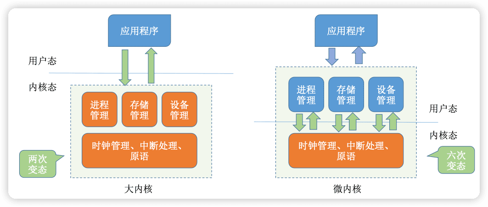
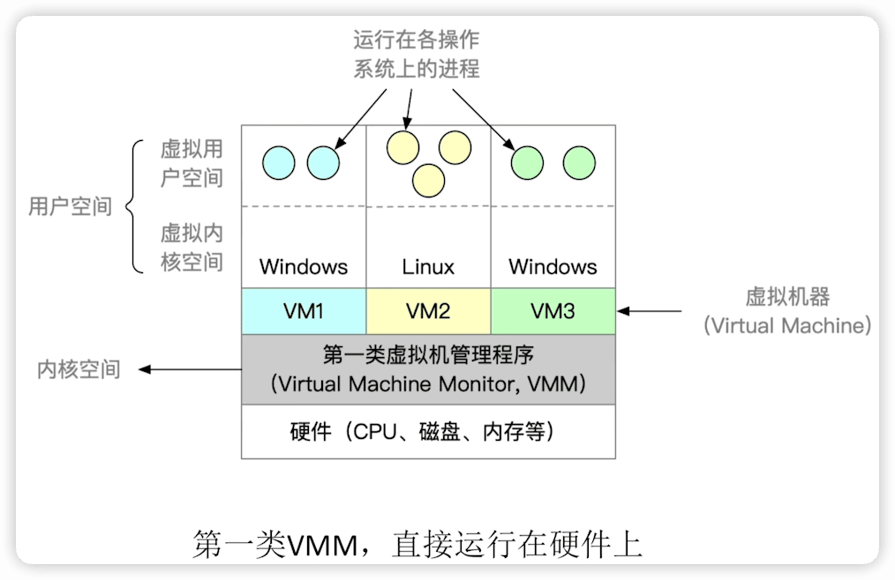
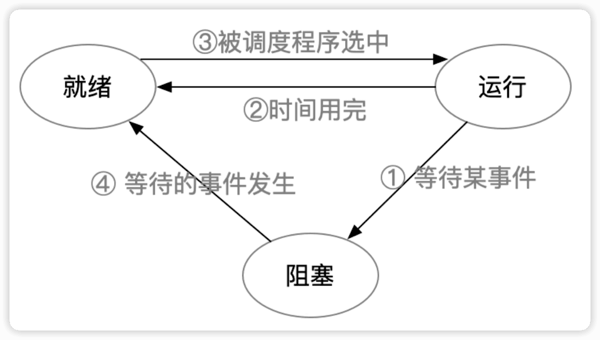
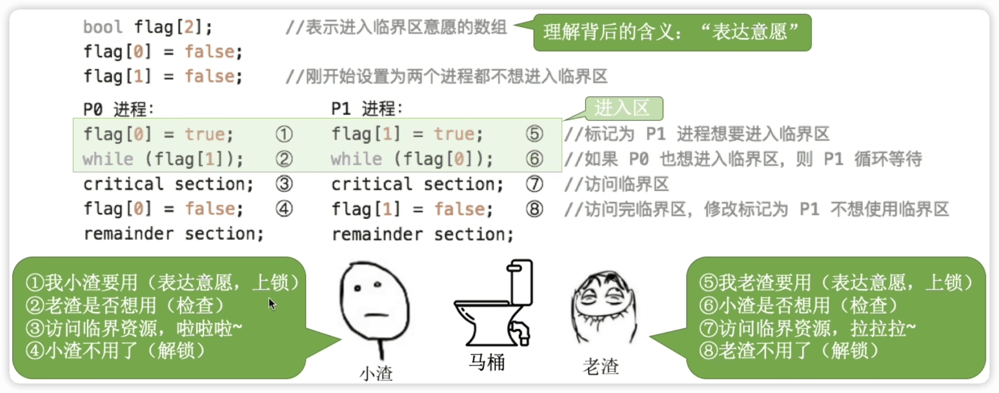
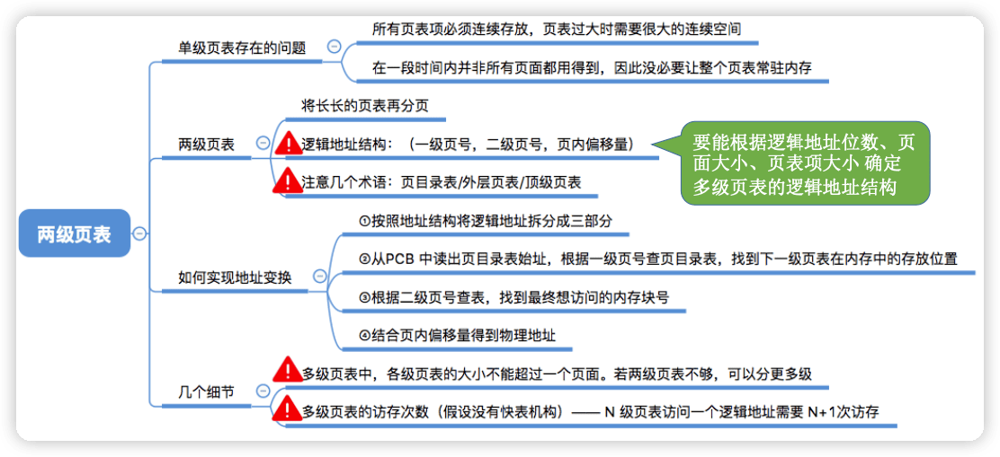
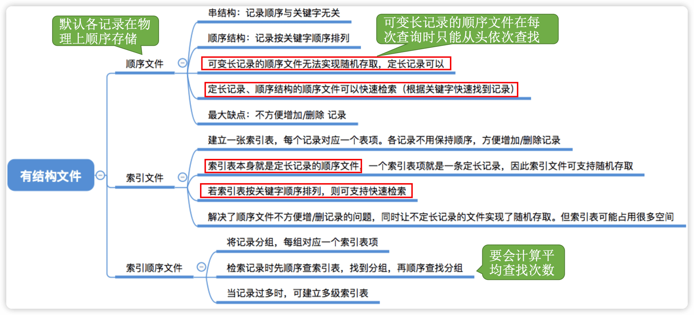

王道操作系统
---

https://www.bilibili.com/video/BV1YE411D7nH

http://cskaoyan.com/

学完一节，做一些习题测试

## 1 操作系统概述

### 1.1 概念(定义)、功能和目标


#### 概念(定义)——什么是操作系统

一台电脑的诞生~
Step 1:厂家组装一台裸机
Step 2:出售前安装操作系统
Step 3:用户安装应用程序(eg:QQ) 
Step 4:使用 QQ 聊天


==操作系统==(Operating System，OS)是指控制和==管理==整个计算机系统的==硬件和软件==资源（1️⃣**操作系统是系统资源的==管理者==**），并合理地组织调度计算机的工作和资源的分配;以==提供给用户和其他软件方便的接口和环境==（2️⃣**向上层提供方便易用的服务**）;它是计算机系统中最基本的==系统软件==（3️⃣**是最接近硬件的一层软件**）。


直观的例子:打开 Windows 操作系统的“任务管理器”(快捷键:Ctrl+Alt+Del)


#### 功能和目标（要做些什么）——作为系统资源的管理者

补充知识:执行一个程序前==需要将该程序放到内存中==，才能被CPU处理。


#### 功能和目标**——**向上层提供方便易用的服务


> ==封装思想==:操作系统把一些丑陋的硬件功能封装成简单易用的服务，使用户能更方便地使用计算机，用户无需关心底层硬件的原理，只需要对操作系统发出命令即可。

操作系统向上层提供四种接口：

- GUI:图形化用户接口(Graphical User Interface) 用户可以使用形象的图形界面进行操作，而不再需要记忆复杂的命令、参数。 

例子:在 Windows 操作系统中，删除一个文件只需要把文件“拖拽”到回收站即可。

- ==联机命令接口==实例(Windows系统)  联机命令接口= ==交互式==（特点:用户说一句，系统跟着做一句）命令接口
  Step 1:win键+R
  Step 2:输入cmd，按回车，打开命令解释器 特点:用户说一句， 
  Step 3:尝试使用 time 命令 

- ==脱机命令接口==实例(Windows系统) 脱机命令接口= ==批处理==（特点:用户说一堆，系统跟着做一堆）命令接口,

使用windows系统的搜索功能，搜索C盘中的*.bat文件，用记事本任意打开一个


- ==程序接口==:可以在程序中进行==系统调用==来使用程序接口。普通用户不能直接使用程序接口，只能通过程序代码==间接==使用。


#### 功能和目标**——**作为最接近硬件的层次


需要实现==对硬件机器的拓展==。

没有任何软件支持的计算机称为==裸机==。在裸机上安装的操作系统，可以提供资源管理功能和方便用户的服务功能，将裸机改造成功能更强、使用更方便的机器。

通常把覆盖了软件的机器成为**扩充机器**，又称之为**虚拟机**。

类比汽车:
发动机 —— 只会转;轮胎 —— 只会滚; 
在原始的硬件机器上覆盖一层传动系统 —— 让发动机带着轮子转 —— 使原始的硬件机器得到拓展。

操作系统对硬件机器的拓展：将CPU、内存、磁盘、显示器、键盘等硬件合理地组织起来，让各种硬件能够相互协调配合，实现更多更复杂的功能。普通用户无需关心这些硬件在底层是怎么组织起来工作的，只需直接使用操作系统提供的接口即可。

#### 小结


### 1.2 操作系统的四个特征

#### 并发

==并发==:指两个或多个事件在同一时间间隔内发生。这些事件==宏观上是同时发生==的，但==微观上是交替发生==的。常考易混概念——并行:指两个或多个事件在同一时刻同时发生。 

并发 VS 并行

eg:假设小渣和老渣每人有两个女朋友。任务1:和一号约会;任务2:和二号约会...


==操作系统的并发性==指计算机系统中“同时”运行着多个程序，这些程序宏观上看是同时运行着的，而微观上看是交替运行的。

操作系统就是伴随着“多道程序技术”而出现的。因此，==操作系统和程序并发是一起诞生的==。

> 注意(重要考点): 
>
> 单核CPU同一时刻只能执行**一个程序**，各个程序只能**并发**地执行 
>
> 多核CPU同一时刻可以同时执行**多个程序**，多个程序可以**并行**地执行
>
> 比如Intel 的第八代 i3 处理器就是 4 核CPU，意味着可以并行地执行4个程序。即使是对于4核CPU来说，只要有4个以上的程序需要“同时”运行，那么并发性依然是必不可少的，因此**==并发性是操作系统一个最基本的特性==**。

#### 共享

共享即==资源共享==，是指系统中的资源可供内存中多个并发执行的进程共同使用。

两种资源共享方式：

1. 互斥共享。系统中的某些资源，虽然可以提供给多个进程使用，但**一个时间段内只允许一个进程访问该资源**。

2. 同时共享。系统中的某些资源，**允许一个时间段内由多个进程“同时”对它们进行访问**。

所谓的“同时”往往是宏观上的，而在微观上，这些进程可能是交替地对该资源进行访问的(即分时共享)。

生活实例:

互斥共享方式:使用QQ和微信视频。同一时间段内摄像头只能分配给其中一个进程。 

同时共享方式:使用QQ发送文件A，同时使用微信发送文件B。宏观上看，两边都在同时读取并发送文件， 说明两个进程都在访问硬盘资源，从中读取数据。微观上看，两个进程是交替着访问硬盘的。

#### 并发和共享的关系

**并发性**指计算机系统中同时存在着多个运行着的程序。
**共享性**是指系统中的资源可供内存中多个并发执行的进程共同使用。

通过上述例子来看并发与共享的关系: 

使用QQ发送文件A，同时使用微信发送文件B。

1. 两个进程正在并发执行(==并发性==)。如果失去共享性，则系统中只有一个程序正在运行，则共享性失去存在的意义。
2. 需要共享地访问硬盘资源(==共享性==)。如果失去共享性，则QQ和微信不能同时访问硬盘资源，就无法实现同时发送文件，也就无法并发。


#### 虚拟

==虚拟==是指把一个物理上的实体变为若干个逻辑上的对应物。物理实体(前者)是实际存在的，而逻辑上对应物(后者)是用户感受到的。 

用一个例子来理解

背景知识:一个程序**需要放入内存**并给它**分配CPU**才能执行

GTA5需要4GB的运行内存，QQ 需要256MB的内存，迅雷需要256MB的内 存，网易云音乐需要256MB的内存......
我的电脑:4GB内存 

问题:这些程序同时运行需要的内存远大于4GB，那么为什么它们还可以 在我的电脑上同时运行呢?

答:这是虚拟存储器技术。实际只有4GB的内存，在用户看来似乎远远大于4GB

虚拟技术中的“空分复用技术”


某单核CPU的计算中，用户打开了很多软件。

问题:既然一个程序需要被分配CPU才能正常执行，那么为什么单核CPU的电脑中能同时运行这么多个程序呢? 

答:这是**虚拟处理器技术**。实际上只有一个单核CPU，在用户看来似乎有 6个CPU在同时为自己服务。

虚拟技术中的“**时分复用技术**”。微观上处理机在各个微小的时间段内交替着为各个进程服务。


#### 异步

==异步==是指，在多道程序环境下，允许多个程序并发执行，但由于资源有限，进程的执行不是一贯到底的，而是走走停停，以不可预知的速度向前推进，这就是进程的异步性。

老渣要和两个女孩并发约会


与一、二号的约会 = 两道并发执行的程序

老渣的心 = 有限的系统资源

由于并发运行的程序会争抢着使用系统资源，而系统中的资源有限，因此进程的执行不是一贯到底的，而是走走停停的，以不可预知的速度向前推进。
如果失去了并发性，即系统只能串行地运行各个程序，那么每个程序的执行会一贯到底。**只有系统拥有并发性，才有可能导致异步性**。

#### 小结


- 理解并发和并行的区别
- 并发和共享互为存在条件
- 没有并发和共享，就谈不上虚拟和异步，因此并发和共享是操作系统的两个最基本的特征

### 1.3 操作系统的发展与分类

学习提示:要重点关注和理解各类操作系统主要想解决的是什么问题，各自的优缺点。

#### 手工操作阶段


#### 批处理阶段**——**单道批处理系统

引入==脱机输入/输出技术==(用外围机+磁带完成)，并由==监督程序==（操作系统的雏形）负责控制作业的输入、输出


主要优点:缓解了一定程度的人机速度矛盾，资源利用率有所提升。

主要缺点:**内存中仅能有一道程序运行**，只有该程序运行结束之后才能调入下一道程序。 C**PU有大量的时间是在 空闲等待I/O完成**。资源利用率依然很低。

#### 批处理阶段**——**多道批处理系统


主要优点:多道程序**并发**执行，**共享**计算机资源。**资源利用率大幅提升**，CPU和其他资源更能保持“忙碌”状态，系统吞吐量增大。

主要缺点:用户响应时间长，**没有人机交互功能**(用户提交自己的作业之后就只能等待计算机处理完成，中间不能控制自己的作业执行。eg:**无法调试程序/无法在程序运行过程中输入一些参数**)

#### 分时操作系统


分时操作系统:计算机以==时间片==为单位**==轮流==**为各个用户/作业服务，各个用户可通过终端与计算机进行交互。 

主要优点:用户请求可以被即时响应，==解决了人机交互问题==。允许多个用户同时使用一台计算机，并且用户对计算机的操作相互独立，感受不到别人的存在。 

主要缺点:**不能优先处理一些紧急任务**。操作系统对各个用户/作业都是完全公平的，循环地为每个用户/作业服务一个时间片，不区分任务的紧急性。

#### 实时操作系统

主要优点:能够优先响应一些紧急任务，某些紧急任务不需时间片排队。

在实时操作系统的控制下，计算机系统接收到外部信号后及时进行处理，并且**要在严格的时限内处理完事件**。实时操作系统的主要特点是**==及时性和可靠性==**。


#### 其他几种操作系统

网络操作系统:是伴随着计算机网络的发展而诞生的，能把网络中各个计算机有机地结合起来，实现数据传送等功能，**实现网络中各种资源的共享(如文件共享)和各台计算机之间的通信**。(如:Windows NT 就是一种典型的网络操作系统，网站服务器就可以使用)

分布式操作系统:主要特点是==分布性和并行性==。系统中的各台计算机地位相同，任**何工作都可以分布在这些计算机上，由它们并行、协同完成这个任务**。

个人计算机操作系统:如 Windows XP、MacOS，方便个人使用。

#### 小结


### 1.4 操作系统的运行机制

#### 预备知识：程序是如何运行的？


程序运行的过程其实就是**CPU执行一条一条的机器指令的过程**。

==“指令”==就是处理器（CPU）能识别、执行的最基本命令

注：很多人习惯把Linux、Windows、MacOS 的“小黑框”中使用的命令也称为”指令“，其实这是”交互式命令接口“，注意与本节的“指今” 区别开，本节中的”指令“指二进制机器指令。

#### **内核程序 vs 应用程序**

我们普通程序员写的程序就是“应用程序”。

微软、苹果有一帮人负责实现操作系统，他们写的是“内核程序”。由很多内核程序组成了“操作系统内核”，或简称“==内核（Kernel）==”。

内核是操作系统最重要最核心的部分，也是最接近硬件的部分。甚至可以说，一个操作系统只要有内核就够了（eg:Docker >仅需Linux内核）

操作系统的功能未必都在内核中，如图形化用户界面 GUI。

#### 特权指令 vs 非特权指令

操作系统内核作为”管理者“，有时会让CPU执行一些”特权指令“，如，内存清零指令。这些指令影响重大，只允许”管理者“——即操作系统内核来使用。

应用程序只能使用”非特权指令“，如加法指令、减法指令等。

在==CPU设计和生产的时候就划分了特权指令和非特权指令==，因此CPU执行一条指令前就能判断出其类型。

#### 内核态 vs 用户态

CPU能判断出指令类型，但是它怎么区分此时正在运行的事内核程序or应用程序？

为了让CPU区分此时运行的指令是属于内核程序还属于应用程序，CPU会被划分为两种状态，”==内核态==“和”==用户态==“

处于内核态时，说明此时正在运行的是内核程序，此时可以执行特权指令；

处于用户态时，说明此时正在运行的是应用程序，此时只能执行非特权指令。


拓展：CPU 中有一个寄存器叫 **==程序状态字寄存器（PSW）==**，其中有个二进制位，1表示“内核态”，0表示“用户态”。

别名：内核态=核心态===管态==；用户态===目态==

Program Status Word

#### 内核态、用户态的切换

一个故事：

1. 刚开机时，CPU为”内核态“，操作系统内核程序先上CPU运行
2. 开机完成后，用户可以启动某个应用程序
3. 操作系统内核程序在合适的时候主动让出CPU，让该应用程序上CPU运行（操作系统内核让出CPU之前，会==用一条特权指令把PSW的标志位设置为”用户态“==）
4. 应用程序运行在”用户态“
5. 此时，一个猥琐黑客在应用程序中植入了一条特权指令，企图破坏系统...
6. CPU发现接下来要执行的这条指令是特权指令，但是自己又处于”用户态“
7. 这个非法事件会引发一个==中断信号==（==CPU检测到中断信号后，会立即变为”内核态”==，并停止运行当前的应用程序，转而运行处理中断信号的内核程序）
8. “中断”使操作系统再次夺回CPU的控制权
9. 操作系统会对引发中断的事情进行处理，处理完了再把CPU使用权交给别的应用程序


> 内核态 -> 用户态：执行一条==特权指令——修改PSW的标志位==为“用户态”，这个动作意味着操作系统将主动让出CPU使用权。
>
> 用户态 -> 内核态：有“==中断==”引发，==硬件自动完成变态过程==，触发中断信号意味着操作系统将强行夺回CPU的使用权。（除了非法使用特权指令之外，还后很多事件会触发中断信号。一个共性是，==但凡需要操作系统接入的地方，都会触发中断信号==）

#### 小结


### 1.5 中断和异常

#### 中断的作用

“中断”会使CPU**由用户态变为内核态**，使操作系统重新夺回对CPU的控制权。

CPU上会运行两种程序，一种是==操作系统内核程序==（整个系统的管理者），一种是==应用程序==。

在合适的情况下，操作系统内核会把CPU的使用权主动让给应用程序(第二章进程管理相关内容) 。

“中断”是**让操作系统内核夺回CPU使用权的==唯一==途径**。 

如果没有“中断”机制，那么一旦应用程序上CPU运行，CPU就会一直运行这个应用程序。


==内核态->用户态==:执行一条**特权指令——修改PSW**的标志位为“用户态”，这个动作意味着操作系统将主动让出CPU使用权；

==用户态->内核态==:由“中断”引发，**硬件自动完成变态过程**，触发中断信号意味着操作系统将强行夺回CPU的使用权。

#### 中断的类型/分类

- 内中断：与当前执行的指令有关，中断信号来源于CPU内部。

- 外中断：与当前执行的指令无关，中断信号来源于CPU外部。


外中断的例子

例子1：时钟中断——由时钟部件发来的中断信号


例子2：I/O中断——有输入/输出设备发来的中断信号

当输入输出任务（比如打印）完成时，向CPU发送中断信号   ->  处理I/O中断的内核程序


> ==每条指令执行结束时==，CPU都会例行检查是否有外中断信号。


大多数的教材、试卷中，“中断”特指狭义的中断，即外中断。而内中断一般称为“异常”。

#### 中断机制的基本原理

==不同的中断信号，需要用不同的中断处理程序来处理==。当CPU检测到中断信号后，会根据中断信号的类型去查询“**==中断向量表==**”，以此来找到相应的中断处理程序在内存中的存放位置。


#### 小结


### 1.6 系统调用

#### 什么是系统调用，有何作用?

知识点回顾:
操作系统作为用户和计算机硬件之间的接口，需要向上提供一些简单易用的服务。主要包括命令接口和程序接口。其中，程序接口由一组==系统调用==组成。


“系统调用”是操作系统提供给应用程序(程序员/编程人员)使用的接口，可以理解为一种可供应用程序调用的特殊函数，**应用程序可以通过系统调用来请求获得操作系统内核的服务**。

#### 系统调用与库函数的区别


 

#### 为什么系统调用是必须的?

生活场景:去学校打印店打印论文，你按下了 WPS 的“打印”选项，打印机开 始工作。
你的论文打印到一半时，另一位同学按下了 Word 的“打印”按钮，开始打印他 自己的论文。

> 思考:如果两个进程可以随意地、并发地共享打印机资源，会发生什么情况? 

两个进程并发运行，打印机设备交替地收到 WPS和Word两个进程发来的打印请求，结果两篇论文的内容混杂在一起了（WPS和Word各打一行）...

它们需要互斥共享打印机资源

解决方法:由操作系统内核对共享资源进行统一的管理，并向上提供 “系统调用” ，用户进程想要使用打印机这种共享资源，只能通过系统调用向操作系统内核发出请求。内核会对各个请求进行协调处理。

#### 什么功能要用到系统调用?

应用程序通过==系统调用==请求操作系统的服务。而系统中的各种共享资源都由操作系统内核统一掌管，因此**凡是==与共享资源有关的操作==(如存储分配、I/O操作、文件管理等)，都必须通过系统调用的方式向操作系统内核提出服务请求**，由操作系统内核代为完成。这样可以**==保证系统的稳定性和安全性==**，防止用户进行非法操作。


> 拓展:感兴趣的同学可以搜索“Linux系统调用”，了解Linux操作系统提供了哪些系统调用。🔖

#### 系统调用的过程


🔖 梳理成文字


#### 小结


### 1.7 操作系统的体系结构 

体系结构，也就是内存怎么设计

#### 操作系统的内核


==时钟管理==、==中断处理==、==原语==（不能被中断）是操作系统与硬件结合最紧密的部分。

==内核==是操作系统最基本、最核心的部分。
实现操作系统内核功能的那些程序就是==内核程序==。


注意:
操作系统内核需要运行在内核态
操作系统的非内核功能运行在用户态


一个故事:现在，应用程序想要请求操作系统的服务，这个服务的处理同时涉及到进程管理、存储管理、设备管理



注意:CPU==变态的过程是有成本的==，要消耗不少时间，频繁地变态会降低系统性能

> "变态"  ---  CPU状态的转变

#### 小结


典型的大内核/宏内核/单内核操作系统: Linux、UNIX 

典型的微内核操作系统: Windows NT（微软的服务器操作系统）


下面三个是新出现的系统结构。


红色是新增内容 

🔖p9 各种类型系统的区别讲解


- 分层结构


最底层是硬件，最高层是用户接口

每层只能调用相连更低一层，不能跨级调用

- 模块化

模块化是将操作系统按功能划分为若干个具有一定独立性的模块。每个模块具有某方面的管理功能，并规定好各模块间的接口，使各模块之间能通过接口进行通信。还可以进一步将各模块细分为若干个具有一定功能的子模块，同样也规定好各子模块之间的接口。把这种设计方法称为==模块-接口法==，如图所示为由模块、子模块等组成的模块化操作系统结构。


- 外核

这种结构比较少见


### 1.8 操作系统引导

操作系统引导（boot）就是开机的时候怎么让操作系统运行起来。

#### 磁盘里边有哪些与引导相关的数据？

安装操作系统后的磁盘：


==分区表==，标明了这个磁盘中每个分区分别占多少空间以及每个分区的地址范围。

C盘安装了操作系统，也叫这个磁盘的==活动分区==。

#### 操心系统引导（开机过程）

操作系统要启动，肯定要放到主存内。计算机的主存有RAM和ROM组成，平常说的内存是指RAM，而ROM芯片被集成在电脑主板上，ROM存储的是BIOS（Basic Input/Output System，基本输出输入系统）。

BIOS是一系列程序，其中最重要的是**ROM引导程序（自举程序）**。

RAM中数据断电会被清空，而ROM不会。

- 电脑开机通电后，CPU会到ROM固定位置读取ROM引导程序，这个程序会把磁盘中==MBR==读取到RAM中
- CPU执行==磁盘引导程序==，这个程序根据==分区表==知道C盘所处位置
- 读入C盘中的==PBR==，运行这个程序负责找到**启动管理器**（通常存储在根目录下的某个位置）
- 这个启动管理器就会完成操作系统初始化的一系列工作


> 备注：Windows的操作系统初始化程序（即启动管理器）在“根目录”（c盘）的`/Windows/Boot`下

### 1.9 虚拟机

虚拟机：使用虚拟化技术，将一台物理机器虛拟化为多台虛拟机器（Virtual Machine, VM），每个虚拟机器都可以独立运行一个操作系统。

同义术语：虚拟机管理程序/虚拟机监控程序/Virtual Machine Monitor（==VMM==）/Hypervisor

两类VMM：

- 第一类，直接运行在硬件上



把CPU的时间片划分给多个虚拟机

只有VMM在内核态，上层虚拟操作系统是不能使用特权指令的，当其使用特权指令，会被VMM截获，然后对其进行特价的转换

- 第二类，运行在宿主操作系统上

比如常用的VitualBox、VMare


虚拟层次越多，性能降的越多，虚拟文件（或内存）不是连续的，查找时效率低。未经抽象的表示可以是连续的。

> CPU指令除了特权指令和非特权指令的划分，还可以更多级别的划分：
>
> 


## 2 进程管理

### 2.1 进程的概念、组成、 特征

#### 概念

程序:是==静态==的，就是个存放在磁盘里的可执行文件，就是一系列的指令集合。

进程(Process):是==动态==的，是程序的一次执行过程。（同一个程序多次执行会对应多个进程）


#### 进程的组成——PCB

> 思考:操作系统是这些进程的管理者，它要怎么区分各个进程?

当进程被创建时，操作系统会为该进程分配一个==唯一的、不重复的==“身份证 号”—— ==PID==(Process ID，进程ID)。

- 操作系统要记录PID、进程所属用户ID(UID)【基本的进程描述信息，可以让操作系统区分各个进程】

- 还要记录给进程分配了哪些资源(如:分配了多少内存、正在使用哪些I/O设备、正在使用哪些文件)【可用于实现操作系统对资源的管理】
- 还要记录进程的运行情况(如:CPU使用时间、磁盘使用情况、网络流量使用情况等)【可用于实现操作系统对进程的控制、调度】

这些信息都被保存在一个数据结构**==PCB==** (Process Control Block)中，即==进程控制块== 。操作系统需要对各个并发运行的进程进行管理，**但凡管理时所需要的信息，都会被放在PCB中**。

PCB是进程存在的==唯一标志==，当进程被创建时，操作系统为其创建PCB，当进程结束时，会回收其PCB。


> Linux源码中，显示它的PCB叫[`task_struct`](https://github.com/torvalds/linux/blob/0f5cc96c367f2e780eb492cc9cab84e3b2ca88da/include/linux/sched.h#L746)  
>
> 

#### 进程的组成**——**程序段、数据段


**PCB是给操作系统用的。** 

**程序段、数据段是给进程自己用的。**

##### 程序是如何运行的?【细化】


#### 进程的特征

 程序是静态的，进程是动态的，相比于程序，进程拥有以下特征:


#### 小结


### 2.2 进程的状态、转换、组织

#### 进程的状态

进程正在被创建时，它的状态是“**==创建态==**”，在这个阶段操作系统会为进程分配资源、初始化PCB。

当进程创建完成后，便进入“**==就绪态==**”，处于就绪态的进程已经具备运行条件，但由于没有空闲CPU，就暂时不能运行。

如果一个进程此时在CPU上运行，那么这个进程处于“**==运行态==**”。CPU会执行该进程对应的程序（执行指令序列）。


在进程运行的过程中，可能会请求等待某个事件的发生（如等待某种系统资源的分配，或者等待其他进程的响应）。在这个事件发生之前，进程无法继续往下执行，此时操作系统会让这个进程下CPU，并让它进入“**==阻塞态==**”。


当CPU空闲时，又会选择另一个“就绪态”进程上CPU运行。

一个进程可以执行exit系统调用，请求操作系统终止该进程。此时该进程会进入“**==终止态==**”，操作系统会让该进程下CPU，并回收内存空间等资源，最后还要回收该进程的PCB。当终止进程的工作完成之后，这个进程就彻底消失了。

#### 进程状态的转换


进程PCB中，会有一个变量`state`来表示进程的当前状态。如：1表示创建态、2表示就绪态、3表示运行态....

为了对同一个状态下的各个进程进行统一的管理，操作系统会将各个进程的PCB组织起来。

#### 进程的组织

在一个系统中，通常有数十、数百乃至数千个PCB。为了能对他们加以有效的管理，应该用适当的方式把这些PCB组织起来。 

注:进程的**组成**讨论的是一个**进程内部**由哪些部分构成的问题，而进程的**组织**讨论的是**多个进程之间的组织方式**问题


大多数操作系统采用的链接方式。


#### 小结

 


### 2.3 进程控制

#### 什么是进程控制?

进程控制的主要功能是对系统中的所有进程实施有效的管理，它具有创建新进程、撤销已有进程、实现进程状态转换等功能。

简化理解:反正进程控制就是要==实现进程状态转换==。


#### 如何实现进程控制?

用“==原语==”实现


原语的执行具有“原子性”，一气呵成。

> 思考:为何进程控制(状态转换)的过程要“一气呵成”?

如果不能“一气呵成”，就有可能导致操作系统中的某些关键数据结构信息不统一的情况，这会影响操作系统进行别的管理工作。

Eg:假设PCB中的变量 state 表示进程当前所处状态，1表示就绪态，2表示阻塞态...


假设此时进程2等待的事件发生，则操作系统中，负责进程控制的内核程序至少需要做这样两件事:

1. 将PCB2的 state 设为 1 （完成了第一步后收到中断信号，那么PCB2 的state=1，但是它却被放在阻塞队列里）
2. 将PCB2从阻塞队列放到就绪队列


##### 如何实现原语的“原子性”?

原语的执行具有原子性，即执行过程只能一气呵成，期间**不允许被中断**。 

可以用 “==关中断指令==”和“==开中断指令==”这两个**特权指令**实现原子性。


正常情况:CPU每执行完一条指令都会例行检查是否有（外部）中断信号需要处理，如果有，则暂停运行当前这段程序，转而执行相应的中断处理程序。


当CPU执行了==关中断指令==之后，就不再例行检查中断信号，直到执行==开中断指令==之后才会恢复检查。

这样，关中断、开中断之间的这些指令序列就是不可被中断的，这就实现了“原子性”。

> 思考:如果这两个特权指令允许用户程序使用的话，会发生什么情况?
>
> 可能会让用户程序一直霸占CPU，这是不行的。


#### 进程控制相关的原语

##### 进程的创建

**创建原语**


> 作业就是放在外存中的还没运行的程序，作业调度就是从外存中挑选一个程序放入内存中，让它运行。

##### 进程的终止

**撤销原语**


##### 进程的阻塞和唤醒

**阻塞原语**

**唤醒原语**

成对使用


##### 进程的切换

**切换原语**


> 进程的运行环境信息就是进程运行过程中寄存器中存储的一些中间结构。
>
> 当一个进程从CPU下来时，要把它的运行环境信息存储到PCB，以便下一次上CPU是恢复之前的运行环境。

##### 程序是如何运行的？【再升级】

CPU中设置了很多“==寄存器==”，用来存放程序运行过程中所需的某些数据。

比如==PSW==（程序状态字寄存器）、==PC==（程序计数器，存放下一条指令的地址）、==IR==（指令寄存器，存放当前正在执行的指令）、==通用寄存器==（其它一些必要信息）等等。


#### 小结


学习技巧:进程控制会导致进程状态的转换。无论哪个进程控制原语，要做的无非三类事情: 

1. 更新PCB中的信息

   a. 所有的进程控制原语一定都会修改进程状态标志

   b. 剥夺当前运行进程的CPU使用权必然需要保存其运行环境 

   c. 某进程开始运行前必然要恢复期运行环境

2. 将PCB插入合适的队列 
3. 分配/回收资源


### 2.4 进程通信

#### 什么是进程通信?

进程通信（Inter-Process Communication, ==IPC==）就是指进程之间的数据交互。

为什么进程同行需要操作系统支持？

进程是分配系统资源的单位(包括内存地址空间)，因此**各进程**拥有的**==内存地址空间相互独立==**。


为了保证安全，**一个进程不能直接访问另一个进程的地址空间**。

但是进程之间的信息交换又是必须实现的。为了保证进程间的安全通信，操作系统提供了一些方法。


#### 共享存储


> Linux中，如何实现共享内存：
>
> ```c
> int shm_open (.....) ; 	 // 通过shm_open系统调用，申请一片共享内存区
> void * mmap (.....);		// 通过mmap系统调用，将共享内存区映射到进程自己的地址空间
> ```
>
> 

为了避免出错，各个进程对共享空间的==访问==应该是==互斥==的。

各个进程可是哟共操作系统内核提供的同步互斥工具（如P、V操作）

两种共享方式：

==基于数据结构==的共享：比如共享空间里只能放一个长度为10的数组。这种共享方式速度慢、限制多，是一种==低级通信==方式。

==基于存储区==的共享：在内存中划出一块共享存储区，数据的形式、存放位置都由进程控制，而不是操作系统。相比之下，这种共享方式速度更快，是一种==高级通信==方式。


#### 消息传递

进程间的数据交换以**==格式化的消息==**(Message)为单位。进程通过操作系统提供的“发送消息/接收消息”两个**原语**进行数据交换。


消息传递又可分为两种方式：

- 直接通信方式。消息发送进程要指明接收进程的ID
- 间接通信方式。通过”信箱“间接地通信，因此又称”信箱通信方式“。


#### 管道通信


> 双向同时通信指可以同时双向通信；而半双工通信是指一个时间段只可以单向通信，但过一段时间可以换一个方向通信。

1. 管道只能采用==半双工通信==，某一时间段内只能实现单向的传输。如果要实现==双向同时通信==，则需要设置两个管道。

2. 各进程要==互斥==地访问管道（由操作系统实现）。

3. 数据以字符流的形式写入管道，当**管道写满**时，**写进程将阻塞**，直到读进程将管道中的数据取走，即可唤醒写进程；

4. 当**管道读空**，**读进程**将**阻塞**，直到写进程往管道中写入数据，即可唤醒读进程。

5. 如果**没写满，就不允许读**。如果**没读空，就不允许写**。

6. 管道中的数据一旦被读出，就彻底消失。因此，当多个进程读同一个管道时，可能会错乱。对此，通常有两种解决方案：

   1️⃣一个管道允许==多个写进程，一个读进程==

   2️⃣允许有==多个写进程，多个读进程==，但系统会让各个读进程轮流从管道中读数据（Linux的方案）


#### 小结


> 修正：
>
> 写进程往管道写数据，即便管道没被写满，**只要管道没空，读进程就可以从管道读数据读**
>
> 进程从管道读数据，即便管道没被读空，**只要管道没满，写进程就可以往管道写数据**

### 2.5 线程概念和多线程模型


#### 什么是线程，为什么要引入线程?


有的进程可能需要”同时“做很多事，而传统的进程只能串行地执行一些列程序。为此，引入了”线程“，来增加==并发度==。


可以把线程理解为“轻量级进程”。

==线程==是一个基本的==CPU执行单元==，也是==程序执行流的最小单位==。

引入线程之后，不仅是进程之间可以并发，进程内的各线程之间也可以并发，从而进一步提升了系统的并发度，使得一个进程内也可以并发处理各种任务（如QQ视频、文字聊天、传文件）

引入线程后，==进程==只作为除CPU之外的系统资源的==分配单元==（如打印机、内存地址空间等都是分配给进程的）。

引入线程机制后的变化：


> 类比：
>
> 去图书馆看书。
>
> 切换进程运行环境：有一个不认识的人要用桌子，你需要你的书收走，他把自己的书放到桌上
>
> 同一进程内的线程切换=你的舍友要用这张书桌，可以不把桌子上的书收走

#### 线程的属性

- 线程是处理机调度的单位

- 多CPU计算机中，各个线程可占用不同的CPU

- 每个线程都有一个线程ID、线程控制块（TCB）
- 线程也有就绪、阻塞、运行三种基本状态
- 线程几乎不拥有系统资源
- 同一进程的不同线程间共享进程的资源
- 由于共享内存地址空间，同一进程中的线程间通信甚至无需系统干预
- 同一进程中的线程切换，不会引起进程切换
- 不同进程中的线程切换，会引起进程切换
- 切换同进程内的线程，系统开销很小
- 切换进程，系统开销较大


#### 线程的实现方式

##### 用户级线程

只有用户感知到线程的存在


从代码的角度看，线程其实就是一段代码逻辑。上述三段代码逻辑上可以看作三个“线程”。while循环就是一个最弱智的“线程库”，线程库完成了对线程的管理工作（如调度）。

很多编程语言提供了强大的线程库，可以实现线程的创建、销毁、调度等功能。

1. 用户级线程由应用程序通过线程库实现，所有的**线程管理工作都由应用程序负责**（包括线程切换）
2. 用户级线程中，**线程切换**可以在**用户态下即可完成**，无需操作系统干预。
3. 在用户看来，是有多个线程。但是在操作系统内核看来，并意识不到线程的存在。“用户级线程”就是“从用户视角看能看到的线程”

4. 优点：用户级线程的切换在用户空间即可完成，不需要切换到核心态，线程管理的系统开销小，效率高
5. 缺点：当一个用户级线程被阻塞后，整个进程都会被**阻塞**，**并发度不高**。多个线程不可在多核处理机上并行运行。

##### 内核级线程

内核级线程（Kernel-Level Thread，KLT，又称”内核支持的线程“），有操作系统支持的线程。


1. 内核级线程的管理工作由操作系统内核完成。
2. 线程调度、切换等工作都由内核负责，因此**内核级线程的切换**必然需要在**核心态**下才能完成。
3. 操作系统会每个内核级线程建立相应的TCB（Thread Control Block，线程控制块），通过TCB对线程进行管理。“内核级线程”就是“从操作系统内核视角看能看到的线程”
4. 优点：当一个线程被阻塞后，别的线程还可以继续执行，并发能力强。多线程可在多核处理机上并行执行。
5. 缺点：一个用户进程会占用多个内核级线程，线程切换由操作系统内核完成，需要切换到核心态，因此线程管理的成本高，开销大。

#### 多线程模型

把上面两种线程结合起来，在内核级线程中引入线程库，把若干个用户级线程映射到某一个内核级线程。

根据用户级线程和内核级线程的映射关系，可以划分为多种多线程模型。

- ==一对一模型==：一个用户级线程映射到一个内核级线程。每个用户进程有与用户级线程同数量的内核级线程。

  优点：当一个线程被阻塞后，别的线程还可以继续执行，并发能力强。多线程可在多核处理机上并行执行。

  缺点：一个用户进程会占用多个内核级线程，线程切换由操作系统内核完成，需要切换到核心态，因此线程管理的成本高，开销大。


- ==多对一模型==：多个用户级线程映射到一个内核级线程。且一个进程只被分配一个内核级线程。


这种模型就退化为存粹的用户级线程。

优点：用户级线程的切换在用户空间即可完成，不需要切换到核心态，线程管理的系统开销小，效率高

缺点：当一个用户级线程被阻塞后，整个进程都会被阻塞，并发度不高。多个线程不可在多核处理机上并行运行

> 重点重点重点：操作系统只“看得见”内核级线程，因此只有内核级线程才是处理机分配的单位。

- ==多对多模型==：n用户及线程映射到m 个内核级线程（n>=m）。每个用户进程对应m 个内核级线程。

克服了多对一模型并发度不高的缺点（一个阻塞全体阻塞），又克服了一对一模型中一个用户进程占用太多内核级线程，开销太大的缺点。


> 可以这么理解：
>
> - 用户级线程是“==代码逻辑==”的载体
>
> - 内核级线程是“==运行机会==”的载体（内核级线程才是处理机分配的单位。例如：多核CPU环境下，左边这个进程最多能被分配两个核。）
>
> 一段“代码逻辑”只有获得了“运行机会”才能被CPU执行
>
> 内核级线程中可以运行任意一个有映射关系的用户级线程代码，只有两个内核级线程中正在运行的代码逻辑都阻塞时，这个进程才会阻塞


#### 小结


### 2.6 线程的状态与转换

线程的状态与转换，与进程基本一致



#### 线程的组织与控制


每一个TCB就可以表示一个线程


线程表，不同的系统会有不同的组织方式。


### 2.7 处理机调度

#### 调度的基本概念


当有一堆任务要处理，但由于资源有限，这些事情没法同时处理。这就需要确定==某种规则==来决定处理这些任务的顺序，这就是“==调度==”研究的问题。


#### 调度的层次

##### 高级调度


==高级调度（作业调度）==（简化理解：好几个程序需要启动，到底先启动哪个）。按一定的原则从外存的作业后备队列中挑选一个作业调入内存，并创建进程。==每个作业只调入一次，调出一次==。作业调入时会建立PCB，调出时才撤销PCB。

##### 低级调度

==低级调度（进程调度/处理机调度）==——按照某种策略从就绪队列中选取一个进程，将处理机分配给它。

进程调度是操作系统中==最基本==的一种调度，在一般的操作系统中都必须配置进程调度。

进程调度的==频率很高==，一般几十毫秒一次。

##### 中级调度

内存不够时，可将某些进程的数据调出外存。等内存空闲或者进程需要运行时再重新调入内存。

暂时调到外存等待的进程状态为==挂起状态==。被挂起的进程PCB会被组织成==挂起队列==。

==中级调度（内存调度）==—— 按照某种策略决定将哪个处于挂起状态的进程重新调入内存。

一个进程可能会被多次调出、调入内存，因此**中级调度发生的频率要比高级调度更高**。


##### 补充知识：进程的挂起态与七状态模型

暂时调到外存等待的进程状态为==挂起状态（挂起态，suspend）==。

挂起态又可以进一步细分为==就绪挂起==、==阻塞挂起==两种状态

五状态模型 -> 七状态模型


##### 三层调度的联系、对比


#### 小结


#### 进程调度的时机、切换与过程、方式

##### 进程调度的时机

进程调度（低级调度），就是按照某种算法从就绪队列中选择一个进程为其分配处理机。

**==需要进行==进程调度与切换的情况？**

- 当前运行的进程==主动放弃==处理机

  进程正常终止

  运行过程中发生异常而终止

  进程主动请求阻塞（如等待I/O）

- 当前运行的进程==被动放弃==处理机

  分给进程的时间片用完

  有更紧急的事需要处理（如I/O中断）

  有更高优先级的进程进入就绪队列

**==不能进行==进程调度与切换的情况？**

1. 在==处理中断的过程中==。中断处理过程复杂，与硬件密切相关，很难做到在中断处理过程中进行进程切换。
2. 进程在==操作系统内核程序临界区==中。
3. 在==原子操作过程中==（原语）。原子操作不可中断，要一气呵成（如之前讲过的修改PCB中进程状态标志，并把PCB放到相应队列）

> 
>
> ==临界资源==：一个时间段内只允许一个进程使用的资源。各进程需要互斥地访问临界资源。
>
> ==临界区==：访问临界资源的那段代码。
>
> ==内核程序临界区==一般是用来访问==某种内核数据结构==的，比如进程的就绪队列（由各就绪进程的PCB组成）
>
> 
>
> 🔖p20


> 有的系统中，只允许进程主动放弃处理机
>
> 有的系统中，进程可以主动放弃处理机，当有更紧急的任务需要处理时，也会强行剥夺处理机（被动放弃）

##### 进程调度的方式

- ==非剥夺调度方式==，又称==非抢占方式==。即，只允许进程主动放弃处理机。在运行过程中即便有更紧迫的任务到达，当前进程依然会继续使用处理机，直到该进程终止或主动要求进入阻塞态。

  实现简单，系统开销小但是无法及时处理紧急任务，适合于早期的批处理系统。

- ==剥夺调度方式==，又称==抢占方式==。当一个进程正在处理机上执行时，如果有一个更重要或更紧迫的进程需要使用处理机，则立即暂停正在执行的进程，将处理机分配给更重要紧迫的那个进程。

  可以优先处理更紧急的进程，也可实现让各进程按时间片轮流执行的功能（通过时钟中断）。适合于分时操作系统、实时操作系统。


##### 进程的切换与过程

“狭义的进程调度”与“进程切换”的区别：

==狭义的进程调度==指的是从就绪队列中==选中一个要运行的进程==。（这个进程可以是刚刚被暂停执行的进程，也可能是**另一个进程**，后一种情况就需要**进程切换**）

==进程切换==是指一个进程让出处理机，由另一个进程占用处理机的过程。

==广义的进程调度==包含了选择一个进程和进程切换两个步骤。

进程切换的过程主要完成了：

1. 对原来运行进程各种数据的保存
2. 对新的进程各种数据的恢复

（如：程序计数器、程序状态字、各种数据寄存器等处理机现场信息，这些信息一般保存在进程控制块）


注意：进程切换是有==代价==的，因此如果==过于频繁==的进行进程调度、切换，必然会使整个**系统的效率降低**，使系统大部分时间都花在了进程切换上，而真正用于执行进程的时间减少。


##### 小结


#### 调度器/调度程序（scheduler）


2、3由调度程序引起，调度程序决定：

让谁运行？ —— 调度算法

运行多长时间？ —— 时间片大小


调度时机 —— 什么事件会触发“调度程序”？

- ==创建新进程==
- ==进程退出==
- 运行==进程阻塞==
- ==I/O中断==发生（可能唤醒某些阻塞进程）


- 非抢占式调度策略，只有运行进程阻塞或退出才触发调度程序工作
- 抢占式调度策略，每个==时钟中断==或k个时钟中断会触发调度程序工作


#### 闲逛进程

调度程序永远的备胎，没有其他就绪进程时，运行闲逛进程（idle）。

闲逛进程的特性：

- 优先级最低
- 可以是0地址指令，占一个完整的指令周期（指令周期末尾例行检查中断）
- 能耗低


#### 调度算法的评价指标🔖

##### **CPU**利用率

由于早期的CPU造价极其昂贵，因此人们会**希望让CPU尽可能多地工作**

CPU利用率:指CPU“忙碌”的时间占总时间的比例。


Eg:某计算机只支持单道程序，某个作业刚开始需要在CPU上运行5秒， 再用打印机打印输出5秒，之后再执行5秒，才能结束。在此过程中， CPU利用率、打印机利用率分别是多少?


##### 系统吞吐量

对于计算机来说，希望能用尽可能少的时间处理完尽可能多的作业
系统吞吐量:单位时间内完成作业的数量

系统吞吐量= 总共完成了多少道作业 / 总共花了多少时间

Eg:某计算机系统处理完10道作业，共花费100秒，则系统吞吐量为?   10/100 = 0.1 道/秒

##### 周转时间

对于计算机的用户来说，他很关心自己的作业从提交到完成花了多少时间。

周转时间，是指**从作业被提交给系统开始，到作业完成为止**的这段时间间隔。 

它包括四个部分:作业在外存后备队列上等待作业调度(高级调度)的时间、进程在就绪队列上等 待进程调度(低级调度)的时间、进程在CPU上执行的时间、进程等待I/O操作完成的时间。

后三项 在一个作业的整个处理过程中，可能发生多次。


思考:有的作业运行时间短，有的作业运行时间长，因此在周转时间相同的情况下，运行时间不同的作业，给用户的感觉肯定是不一样的

一个有味道的例子:排队等厕所


对于周转时间相同的两个作业，实际运行时间长的作业在相同时间内被服务的时间更多，带权周转时间更小，用户满意度更高。

对于实际运行时间相同的两个作业，周转时间短的带权周转时间更小，用户满意度更高。

##### 等待时间

计算机的用户希望自己的作业尽可能少的等待处理机 

==等待时间==，指进程/作业处于等待处理机状态时间之和，等待时间越长，用户满意度越低。


对于**进程**来说，等待时间就是指进程建立后**等待被服务的时间之和**，在等待I/O完成的期间其实进 程也是在被服务的，所以不计入等待时间。 

对于**作业**来说，不仅要考虑建立进程后的等待时间，还要加上作业在外存后备队列中等待的时间。

一个作业总共需要被CPU服务多久，被I/O设备服务多久一般是确定不变的，因此调度算法其实只会 影响作业/进程的等待时间。当然，与前面指标类似，也有“**平均等待时间**”来评价整体性能。


##### 响应时间

对于计算机用户来说，会希望自己的提交的请求(比如通过键盘输入了一个调试命令)尽早地开始被系统服务、回应。
响应时间，指从用户**提交请求**到**首次产生响应**所用的时间。

##### 小结


#### 调度算法🔖

Tips:各种调度算法的学习思路

1. 算法思想
2. 算法规则
3. 这种调度算法是用于 作业调度 还是 进程调度?
4. 抢占式?非抢占式?

1. 优点和缺点
2. 是否会导致==饥饿==（某进程/作业长期得不到服务）

##### 先来先服务（FCFS）

先来先服务(FCFS, First Come First Serve)


##### 最短作业优先（SJF）

短作业优先(SJF, Shortest Job First)


##### 最高响应比优先（HRRN）

高响应比优先(HRRN, Highest Response Ratio Next)

##### 小结


注:这几种算法主要关心对用户的公平性、平均周转时间、平均等待时间等评价系统整体性能的指标，但是不关心“响应时间”，也并不区分任务的紧急程度，因此对于用户来说，交互性很糟糕。因此这三种算法一般适合用于**早期的批处理系统**，当然，FCFS算法也常结合其他的算法使用，在现在也扮演着很重要的角色。而适合用于**交互式系统**的调度算法将在下个小节介绍...


### 2.8 进程同步、进程互斥

#### 什么是进程同步

知识点回顾：进程具有==异步性==的特性。异步性是指，各并发执行的进程以各自独立的、不可预知的速度向前推进。


另一个例子：进程同行——管道通信


读进程和写进程并发地运行，由于并发必然导致异步性，因此“写数据”和“读数据”两个操作执行的先后顺序是不确定的。而实际应用中，又必须按照“==写数据 -> 读数据==”的顺序来执行的。

如何解决这种==异步==问题，就是“进程==同步==”所讨论的内容。

同步亦称==直接制约关系==，它是指为完成某种任务而建立的两个或多个进程，这些进程因为需要在某些位置上协调它们的工作次序而产生的制约关系。进程间的直接制约关系就是源于它们之间的相互合作。

#### 什么是进程互斥

进程的“并发”需要“共享”的支持。各个并发执行的进程不可避免的需要共享一些系统资源（比如内存，又比如打印机、摄像头这样的I/O设备）


我们把一个时间段内只允许一个进程使用的资源称为==临界资源==。许多物理设备（比如摄像头、打印机）都属于临界资源。此外还有许多变量、数据、内存缓冲区等都属于临界资源。

对临界资源的访问，必须==互斥==地进行。互斥，亦称==间接制约关系==。==进程互斥==指当一个进程访问某临界资源时，另一个想要访问该临界资源的进程必须等待。当前访问临界资源的进程访问结束，释放该资源之后，另一个进程才能去访问临界资源。

对临界资源的互斥访问，可以在逻辑上分为如下四个部分：


注意：

临界区是进程中访==问临界资源==的代码段。

进入区和退出区是负责==实现互斥==的代码段。

临界区也可称为“临界段”。

> 如果一个进程暂时不能进入临界区，那么该进程是否应该一直占着处理机？该进程有没有可能一直进不了临界区？

为了实现对临界资源的互斥访问，同时保证系统整体性能，需要遵循以下原则：

1. 空闲让进。临界区空闲时，可以允许一个请求进入临界区的进程立即进入临界区；
2. 忙则等待。当已有进程进入临界区时，其他试图进入临界区的进程必须等待；
3. 有限等待。对请求访问的进程，应保证能在有限时间内进入临界区（保证不会饥饿）；
4. 让权等待。当进程不能进入临界区时，应立即释放处理机，防止进程忙等待。

#### 小结


#### 进程互斥的软件实现方法

> 如果没有注意进程互斥？
>
> 进程A、进程B在系统中并发地运行
>
> 
>
> 先调度A上处理机运行
>
> 当A在使用打印机的过程中，分配给它的时间片用完了，接下来操作系统调度B让它上处理机运行进程B也在使用打印机
>
> 结局：A、B的打印内容混在一起了
>
> 如何实现进程互斥？

##### 单标志法

算法思想：两个进程在**访问完临界区后**会把使用临界区的权限转交给另一个进程。也就是说**每个进程进入临界区的权限只能被另一个进程赋予**。


turn的初值0，即刚开始只允许0号进程进入临界区。

若P1先上处理机运行，则会一直卡在⑤。直到P1的时间片用完，发生调度，切换P0上处理机运行。

代码①不会卡住P0，P0可以正常访问临界区，在P0访问临界区期间即时切换回P1，P1依然会卡在⑤。

只有P0在退出区将turn改为1后，P1才能进入临界区。

因此，该算法==可以实现“同一时刻最多只允许一个进程访问临界区”==。


只能按P0->P1->P0->P1->...这样轮流访问。这种必须“轮流访问”带来的问题是，如果此时允许进入临界区的进程是P0，而P0一直不访问临界区，那么虽然此时临界区空闲，但是并不允许P1访问。

因此，单标志法存在的主要问题是：**违背“空闲让进”原则**。

##### 双标志先检查法

算法思想：设置一个布尔型数组flag[]，数组中各个元素用来**标记各进程想进入临界区的==意愿==**，比如“flag[0］=ture”意味着0号进程P0现在想要进入临界区。每个进程在进入临界区之前先检查当前有没有别的进程想进入界区，如果没有，则把自身对应的标志 flag[i]设为 true，之后开始访问临界区。


若按照①⑤②⑥③⑦...的顺序执行，P0和P1将会同时访问临界区。

因此，双标志先检查法的主要问题是：**违反“忙则等待”原则**。

原因在于，进入区的“检查”和“上锁”两个处理不是一气呵成的。“检查”后，“上锁”前可能发生进程切换。

##### 双标志后检查法

算法思想：双标志先检查法的改版。前一个算法的问题是先“检查”后“上锁”，但是这两个操作又无法一气呵成，因此导致了两个进程同时进入临界区的问题。因此，人们又想到先“上锁”后“检查”的方法，来避免上述问题。



若按照 ①⑤②⑥...的顺序执行，P0和P1将都无法进入临界区

因此，双标志后检查法虽然**解决了“忙则等待”的问题**，但是**又违背了“空闲让进”和“有限等待”原则**，会因各进程都长期无法访问临界资源而**产生“饥饿”现象**。

两个进程都争着想进入临界区，但是谁也不让谁，最后谁都无法进入临界区。

##### Peterson算法

算法思想：结合双标志法、单标志法的思想。如果双方都争着想进入临界区，那可以让进程尝试“孔融让梨”（谦让）。做一个礼貌的进程。


谁最后说了“客气话”，谁就失去了行动的优先权。

Eg：过年了，某阿姨给你发压岁钱。

场景一

阿姨：乖，收下阿姨的心意~你：不用了阿姨，您的心意我领了

阿姨：对阿姨来说你还是个孩子，你就收下吧

结局...

场景二

阿姨：乖，收下阿姨的心意~

你：不用了阿姨，您的心意我领了

阿姨：对阿姨来说你还是个孩子，你就收下吧

你：真的不用了阿姨，我已经成年了

结局...


Peterson算法用软件方法解决了进程互斥问题，==遵循了空闲让进、忙则等待、有限等待三个原则==，但是依然==未遵循让权等待==的原则。

Peterson算法相较于之前三种软件解决方案来说，是最好的，但依然不够好。

##### 小结


#### 进程互斥的硬件实现方法

##### 中断屏蔽方法

利用“开/关中断指令”实现（与原语的实现思想相同，即在某进程开始访问临界区到结束访问为止都不允许被中断，也就不能发生进程切换，因此也不可能发生两个同时访问临界区的情况）


优点：简单、高效

缺点：不适用于多处理机：只适用于操作系统内核进程，不适用于用户进程（因为开/关中断指令只能运行在内核态，这组指令如果能让用户随意使用会很危险）

##### TestAndSet指令

简称TS指令，也有地方称TestAndSetLock指令，或TS 指令。

TSL指令是用硬件实现的，执行的过程不允许被中断，只能一气呵成。以下是用C语言描述的逻辑：


若刚开始lock 是false，则TSL返回的old 值为 false，while 循环条件不满足，直接跳过循环，进入临界区。若刚开始lock 是true，则执行 TLS 后old 返回的值为true，while 循环条件满足，会一直循环，直到当前访问临界区的进程在退出区进行“解锁”。

相比软件实现方法，TSL指令把“上锁”和“检查”操作用硬件的方式变成了一气呵成的原子操作。

优点：实现简单，无需像软件实现方法那样严格检查是否会有逻辑漏洞；适用于**多处理机环境**。

缺点：**不满足“让权等待”原则**，暂时无法进入临界区的进程会占用CPU并循环执行TSL指令，从而导致“忙等”。

##### Swap指令

有的地方也叫Exchange指令，或简称XCHG指令。

Swap指令是用硬件实现的，执行的过程不允许被中断，只能一气呵成。以下是用C语言描述的逻辑：


逻辑上来看Swap 和TSL 并无太大区别，都是先记录下此时临界区是否已经被上锁（记录在 old 变量上），再将上锁标记lock 设置为true，最后检查old，如果 old false 则说明之前没有别的进程对临界区上锁，则可跳出循环，进入临界区。

优点：实现简单，无需像软件实现方法那样严格检查是否会有逻辑漏洞：适用于多处理机环境。

缺点：不满足“让权等待”原则，暂时无法进入临界区的进程会占用CPU并循环执行TSL指令，从而导致“忙等”。

##### 小结


### 2.9 进程互斥：锁

锁可用来实现互斥，可以把锁简单理解一个布尔变量

1. 互斥锁

解决临界区最简单的工具就是互斥锁（mutex lock）。一个进程在进入临界区时应获得锁；在退出临界区时释放锁。函数 `acquire()`获得锁，而函数`release()`释放锁。

每个互斥锁有一个布尔变量 available，表示锁是否可用。如果锁是可用的，调用 acqiure()会成功，且锁不再可用。当一个进程试图获取不可用的锁时，会被阻塞，直到锁被释放。


acquire()或 release()的执行必须是原子操作，因此互斥锁通常采用硬件机制来实现。

互斥锁的主要缺点是==忙等待==，当有一个进程在临界区中，任何其他进程在进入临界区时必须连续循环调用 acquire()。当多个进程共享同一CPU时，就浪费了 CPU 周期。因此，互斥锁通常用于多处理器系统，一个线程可以在一个处理器上等待，不影响其他线程的执行。

需要连续循环忙等的互斥锁，都可称为==自旋锁（spin lock）==，如 TSL指令、swap指令、单标志法。

特性：

• 需忙等，进程时间片用完才下处理机，违反“让权等待”

• 优点：等待期间不用切换进程上下文，多处理器系统中，若上锁的时间短，则等待代价很低

• 常用于多处理器系统，一个核忙等，其他核照常工作，并快速释放临界区

• 不太适用于单处理机系统，忙等的过程中不可能解锁


### 2.10 信号量机制

复习回顾+思考：之前学习的这些进程互斥的解决方案分别存在哪些问题？

进程互斥的四种软件实现方式（单标志法、双标志先检查、双标志后检查、Peterson算法）

进程互斥的三种硬件实现方式（中断屏蔽方法、TS/TSL指令、Swap/XCHG指令）

1. 在双标志先检查法中，==进入区的“检查”、“上锁”操作无法一气呵成==，从而导致了两个进程有可能同时进入临界区的问题；
2. 所有的解决方案都==无法实现“让权等待”==

1965年，荷兰学者Dijkstra提出了一种卓有成效的实现进程互斥、同步的方法——==信号量机制==。

用户进程可以通过使用操作系统提供的**一对原语**来对**信号量**进行操作，从而很方便的实现了进程互斥、进程同步。

==信号量==其实就是一个变量（<u>可以是一个整数，也可以是更复杂的记录型变量</u>），可以用一个信号量来==表示系统中某种资源的数==量，比如：系统中只有一台打印机，就可以设置一个初值为1的信号量。

==原语==是一种特的程序段，其==执行只能一气呵成，不可被中断==。原语是由==关中断/开中断指令==实现的。软件解决方案的主要问题是由“进入区的各种操作无法一气呵成”，因此如果能把进入区、退出区的操作都用“原语”实现，使这些操作能“一气呵成”就能避免问题。

一对原语：==wait(S)==原语和==signal(S)==原语，可以把原语理解为我们自己写的函数，函数名分别为wait和signal，括号里的==信号量S==其实就是函数调用时传入的一个参数。

wait、signal 原语常简称为==P、V操作==（来自荷兰语 proberen 和 verhogen）。因此，做题的时候常把wait（S）、Signal（S）两个操作分别写为**==P(S)、V(S)==**。

#### 整型信号量

用一个==整数型的变量==作为信号量，用来==表示系统中某种资源的数量==。（与普通整数变量相比，作为信号量的整数型变量的操作只有三种，即初始化、P操作、V操作）

Eg：某计算机系统中有一台打印机...


#### 记录型信号量❤️

整型信号量的缺陷是存在“忙等”问题，因此人们又提出了“记录型信号量”，即用记录型数据结构表示的信号量。


🔖 动画例子  p30 18：00


在考研题目中 wait（S）、signal（S）也可以记P（S）、V（S），这对原语可用于==实现系统资源的“申请”和“释放”==。

==S.value的初值==表示系统中==某种资源的数目==。

对信号量S的==一次P操作==意味着进程==请求一个单位的该类资源==，因此需要执行 `S.value--`，表示资源数减1，当S.value<0时表示该类资源已分配完毕，因此进程应==调用block 原语==进行自我阻塞（当前运行的进程从==运行态->阻塞态==），主动放弃处理机，并插入该类资源的等待队列S.L中。可见，该机制==遵循了“让权等待”原则==，不会出现“忙等”现象。

对信号量S的==一次V操作==意味着进程==释放一个单位的该类资源==，因此需要执行 `S.value++`，表示资源数加1，若加1后仍是 S.value <=0，表示依然有进程在等待该类资源，因此应==调用 wakeup 原语唤醒等待队列中的第一个进程==（被唤醒进程从==阻塞态->就绪态==）。


#### 小节


#### 用信号量机制实现进程互斥、同步、前驱关系

Tips:不要一头钻到代码里，要注意理解信号量背后的含义，==一个信号量对应一种资源== 

信号量的值 = 这种资源的剩余数量(信号量的值如果小于0，说明此时有进程在等待这种资源)

P(S) —— 申请一个资源S，如果==资源不够就阻塞等待==
V(S) —— 释放一个资源S，如果有进程在等待该资源，则==唤醒一个进程==

##### 实现进程互斥

1. 分析并发进程的关键活动，划定临界区(如:对临界资源打印机的访问就应放在临界区)
2. 设置==互斥信号量== mutex，==初值为 1==
3. 在进入区P(mutex)——==申请资源==
4. 在退出区V(mutex)——==释放资源==

理解:信号量 mutex 表示 信号量机制实现进程互斥 “进入临界区的名额”

注意:对**不同的临界资源**需要**设置不同的互斥信号量**。 ==P、V操作必须成对出现==。缺少 P(mutex) 就不能保证临界资源的互 斥访问。缺少 V(mutex) 会导致资源永不被释放，等待进程永不被唤醒。


##### 实现进程同步

进程同步:要让各并发进程按要求有序地推进。


比如，P1、P2并发执行，由于存在异步性，因此二者交替推进的次序是不确定的。 

若 P2 的“代码4”要基于 P1 的“代码1”和“代码2”的运行结果才能执行，那么我

们就必须保证“代码4”一定是在“代码2”之后才会执行。 

这就是进程同步问题，让本来异步并发的进程互相配合，有序推进。


用信号量实现进程同步:

1. 分析什么地方需要实现“同步关系”，即必须保证“一前一后”执行的两个操作(或两句代码)

2. 设置==同步信号量S, 初始为 0==

3. ==在“前操作”之后执行 V(S)==

4. ==在“后操作”之前执行 P(S)==

**==【前V后P】==**


若先执行到 V(S) 操作，则 S++ 后 S=1。之后当执行到 P(S) 操作 时，由于 S=1，表示有可用资源，会执行 S--，S 的值变回 0， P2 进程不会执行 block 原语，而是继续往下执行代码4。

若先执行到 P(S) 操作，由于 S=0，S-- 后 S=-1，表示此时没有可用资源，因此P操作中会执行 block 原语，主动请求阻塞。 之后当执行完代码2，继而执行 V(S) 操作， S++，使 S 变回 0， 由于此时有进程在该信号量对应的阻塞队列中，因此会在 V 操作中执行 wakeup 原语，唤醒 P2 进程。这样 P2 就可以继续 执行代码4了

##### 实现前驱关系

进程 P1 中有句代码 S1，P2 中有句代码 S2 ，P3中有句代码S3 ...... P6 中有句代码 S6。这些代码要求按如下前驱图所示的顺序来执行:

其实每一对前驱关系都是一个进程同步问题(需要保证一前一后的操作) 因此，

1. 要为每一对前驱关系各设置一个同步信号量
2. 在“前操作”之后对相应的同步信号量执行 V 操作
3. 在“后操作”之前对相应的同步信号量执行 P 操作


##### 小结


#### 生产者消费者问题

使用信号量机制来解决各种线程同步和互斥问题。

##### 问题描述

系统中有一组生产者进程和一组消费者进程，生产者进程每次生产一个产品放入缓冲区，消费者进程每次从缓冲区中取出一个产品并使用。(注:这里的“产品”理解为某种数据)
生产者、消费者共享一个==初始为空、大小为n的缓冲区==。 

只有==缓冲区没满==时，生产者才能把产品放入缓冲区，否则必须等待。 【缓冲区没满->生产者生产】

只有==缓冲区不空==时，消费者才能从中取出产品，否则必须等待。  【缓冲区没空->消费者消费】

缓冲区是临界资源，各进程必须==互斥地访问==。  【互斥关系】

🔖

##### 问题分析


PV操作题目分析步骤:
1. 关系分析。找出题目中描述的各个进程，分析它们之间的同步、互斥关系。
2. 整理思路。根据各进程的操作流程确定P、V操作的大致顺序。
3. 设置信号量。并根据题目条件确定信号量初值。(互斥信号量初值一般为1，同步信号量的初始值要看对应资源的初始值是多少)


##### 思考:能否改变相邻**P**、**V**操作的顺序?


若此时缓冲区内已经放满产品，则 empty=0，full=n。
则生产者进程执行1️⃣使mutex变为0，再执行2️⃣，由于已没有空闲缓冲区，因此生产者被阻塞。 由于生产者阻塞，因此切换回消费者进程。消费者进程执行3️⃣，由于mutex为0，即生产者还没 释放对临界资源的“锁”，因此消费者也被阻塞。 

这就造成了生产者等待消费者释放空闲缓冲区，而消费者又等待生产者释放临界区的情况，生产者和消费者循环等待被对方唤醒，出现“死锁”。 

同样的，若缓冲区中没有产品，即full=0，empty=n。按3️⃣4️⃣1️⃣的顺序执行就会发生死锁。 

因此，==实现互斥的P操作一定要在实现同步的P操作之后。== 

V操作不会导致进程阻塞，因此==两个V操作顺序可以交换。==

##### 小结

PV 操作题目的解题思路:
1. 关系分析。找出题目中描述的各个进程，分析它们之间的同步、互斥关系。
2. 整理思路。根据各进程的操作流程确定P、V操作的大致顺序。
3. 设置信号量。设置需要的信号量，并根据题目条件确定信号量初值。(互斥信号量初值一般为1，同步信号量的初始值要看对应资源的初始值是多少)

生产者消费者问题是一个互斥、同步的综合问题。
对于初学者来说最难的是发现题目中隐含的两对同步关系。
有时候是消费者需要等待生产者生产，有时候是生产者要等待消费者消费，这是两个不同的“一前一后问题”，因此也需要设置两个同步信号量。


#### 多生产者-多消费者


##### 小结

解决“多生产者-多消费者问题”的关键在于理清复杂的同步关系。

在分析同步问题（一前一后问题）的时候不能从单个进程行为的角度来分析，要把“一前一后”发生的事看做是两种“事件”的前后关系。

比如，如果==从单个进程行为的角度来考虑==的话，我们会有以下结论：

**如果盘子里装有苹果，那么一定要女儿取走苹果后父亲或母亲才能再放入水果**

**如果盘子里装有橘子，那么一定要儿子取走橘子后父亲或母亲才能再放入水果**

这么看是否就意味着要设置四个同步信号量分别实现这四个“一前一后”的关系了？

正确的分析方法应该从“事件”的角度来考虑，我们可以把上述四对“进程行的前后关系”抽象为一对“事件的前后关系”

盘子变空事件->放入水果事件。“盘子变空事件”既可由儿子引发，也可由女儿引发；“放水果事件”既可能是父亲执行，也可能是母亲执行。这样的话，就可以用一个同步信号量解决问题了


#### 吸烟者问题


##### 小结

吸烟者问题可以为我们解决“可以生产多个产品的单生产者”问题提供一个思路。 

值得吸取的精华是:“轮流让各个吸烟者吸烟”必然需要“轮流的在桌上放上组合一、二、三”，注意体会我们是如何用一个整型变量 i 实现这个“轮流”过程的。 

如果题目改为“每次随机地让一个吸烟者吸烟”，我们有应该如何用代码写出这个逻辑呢?

若一个生产者要生产多种产品(或者说会引发多种前驱事件)，那么各个V操作应该放在各自对应的 “事件”发生之后的位置。


#### 读者-写者问题


##### 小结

读者-写者问题为我们解决复杂的互斥问题提供了一个参考思路。 

其核心思想在于设置了一个==计数器count== 用来记录当前正在访问共享文件的读进程数。我们可以用 count 的值来判断当前进入的进程是否是第一个/最后一个读进程，从而做出不同的处理。 

另外，对 count 变量的检查和赋值不能一气呵成导致了一些错误，如果==需要实现“一气呵成”，自然应该想到用互斥信号量==。
最后，还要认真体会我们是如何解决“写进程饥饿”问题的。

绝大多数的考研PV操作大题都可以用之前介绍的几种生产者-消费者问题的思想来解决，如果遇到更 复杂的问题，可以想想能否用读者写者问题的这几个思想来解决。


#### 哲学家进餐问题


##### 小结

哲学家进餐问题的关键在于解决进程死锁。
这些进程之间只存在互斥关系，但是与之前接触到的互斥关系不同的是，每个进程都需要同时持有两个临界资源，因此就有“死锁”问题的隐患。

如果在考试中遇到了一个进程需要同时持有多个临界资源的情况，应该参考哲学家问题的思想，分析题中给出的进程之间是否会发生循环等待，是否会发生死锁。
可以参考哲学家就餐问题解决死锁的三种思路。

### 2.11 管程

#### 为什么要引入管程


#### 管程的定义和基本特征

管程是一种特殊的软件模块，有这些部分组成: 

1. 局部于管程的==共享数据结构==说明;

2. 对该数据结构进行操作的==一组过程==;
3. 对局部于管程的共享数据设置初始值的语句; 
4. 管程有一个名字。


跨考Tips: “过程”其实就是“函数”

管程的基本特征:

1. 局部于管程的数据只能被局部于管程的过程所访问; 
2. 一个进程只有通过调用管程内的过程才能进入管程访问共享数据; 
3. ==每次仅允许一个进程在管程内执行某个内部过程==。

 

#### 拓展1 :用管程解决生产者消费者问题


#### 拓展**2**:Java中类似于管程的机制


#### 小结


### 2.12 死锁

#### 什么是死锁


#### 死锁、饥饿、死循环的区别


#### 死锁产生的必要条件


#### 什么时候会发生死锁


#### 死锁的处理策略

1. 预防死锁。破坏死锁产生的四个必要条件中的一个或几个。
2. 避免死锁。用某种方法防止系统进入不安全状态，从而避免死锁（银行家算法）
3. 死锁的检测和解除。允许死锁的发生，不过操作系统会负责检测出死锁的发生，然后采取某种措施解除死锁。


#### 小结


#### 死锁的处理策略——预防死锁

##### 破坏互斥条件

==互斥条件==:只有对必须互斥使用的资源的争抢才会导致死锁。

如果把只能互斥使用的资源改造为允许共享使用，则系统不会进入死锁状态。比如: ==SPOOLing技术==。 操作系统可以采用 SPOOLing 技术把独占设备在逻辑上改造成共享设备。比如，用SPOOLing技术将打 印机改造为共享设备...


该策略的==缺点==:并不是所有的资源都可以改造成可共享使用的资源。并且为了系统安全，很多地方还必须保护这种互斥性。因此，**很多时候都无法破坏互斥条件**。

##### 破坏不剥夺条件

==不剥夺条件==:进程所获得的资源在未使用完之前，不能由其他进程强行夺走，只能主动释放。

破坏不剥夺条件:

- 方案一:当某个进程请求新的资源得不到满足时，它必须立即释放保持的所有资源，待以后需要时再重新申请。也就是说，即使某些资源尚未使用完，也需要主动释放，从而破坏了不可剥夺条件。
- 方案二:当某个进程需要的资源被其他进程所占有的时候，可以由操作系统协助，将想要的资源强行剥夺。这种方式一般需要考虑各进程的优先级(比如:剥夺调度方式，就是将处理机资源强行剥夺给优先级更高的进程使用)

该策略的==缺点==:

1. 实现起来比较复杂。
2. 释放已获得的资源可能造成前一阶段工作的失效。因此这种方法一般只适用于易保存和恢复状态 的资源，如CPU。
3. 反复地申请和释放资源会增加系统开销，降低系统吞吐量。
4. 若采用方案一，意味着只要暂时得不到某个资源，之前获得的那些资源就都需要放弃，以后再重 新申请。如果一直发生这样的情况，就会导致进程饥饿。


##### 破坏请求和保持条件

==请求和保持条件==:进程**已经保持了至少一个资源**，但又提出了新的资源**请求**，而该资源又被其他进程占有，此时请求进程被阻塞，但又对自己已有的资源**保持**不放。

可以采用==静态分配方法==，即进程在运行前一次申请完它所需要的全部资源，在它的资源未满足前，不让它投入运行。一旦投入运行后，这些资源就一直归它所有，该进程就不会再请求别的任何资源了。

该策略实现起来简单，但也有明显的缺点:
有些资源可能只需要用很短的时间，因此如果进程的整个运行期间都一直保持着所有资源，就会造成严重的资源浪费，==资源利用率极低==。另外，该策略也有==可能导致某些进程饥饿==。


##### 破坏循环等待条件

循环等待条件:存在一种进程==资源的循环等待链==，链中的每一个进程已获得的资源同时被下一个进程所请求。

可采用==顺序资源分配法==。首先给系统中的资源编号，规定每个进程==必须按编号递增的顺序请求资源==，同类资源(即编号相同的资源)一次申请完。

原理分析:一个进程只有已占有小编号的资源时，才有资格申请更大编号的资源。按此规则，已持有大编号资源的进程不可能逆向地回来申请小编号的资源，从而就不会产生循环等待的现象。


该策略的缺点:
1. 不方便增加新的设备，因为可能 需要重新分配所有的编号;
2. 进程实际使用资源的顺序可能和 编号递增顺序不一致，会导致资源浪费;
3. 必须按规定次序申请资源，用户编程麻烦。

##### 小结


#### 死锁的处理策略——避免死锁

什么是安全序列

什么是系统的不安全状态，与死锁有何联系

如何避免系统进入不安全状态——银行家算法


##### 小结

数据结构:
长度为 m 的一维数组 Available 表示还有多少可用资源
`n*m` 矩阵 Max 表示各进程对资源的最大需求数
`n*m` 矩阵 Allocation 表示已经给各进程分配了多少资源
Max – Allocation = Need 矩阵表示各进程最多还需要多少资源 用长度为 m 的一位数组 Request 表示进程此次申请的各种资源数


银行家算法步骤:
1检查此次申请是否超过了之前声明的最大需求数
2检查此时系统剩余的可用资源是否还能满足这次请求
3试探着分配，更改各数据结构
4用安全性算法检查此次分配是否会导致系统进入不安全状态


安全性算法步骤:
检查当前的剩余可用资源是否能满足某个进程的最大需求，如果可以，就把该进程加入安全序列，
并把该进程持有的资源全部回收。
不断重复上述过程，看最终是否能让所有进程都加入安全序列。
系统处于不安全状态未必死锁，但死锁时一定处于不安全状态。系统处于安全状态一定不会死锁。


#### 死锁的处理策略——检测和解除

如果系统中既不采取预防死锁的措施，也不采取避免死锁的措施，系统就很可能发生死锁。在这种情况下，系统应当提供两个算法:

1. 死锁检测算法:用于检测系统状态，以确定系统中是否发生了死锁。
2. 死锁解除算法:当认定系统中已经发生了死锁，利用该算法可将系统从死锁状态中解脱出来。

##### 死锁的检测


##### 死锁的解除


##### 小结


---


## 3 内存管理

### 3.1 内存的基础知识

#### 什么是内存?有何作用?

内存可存放数据。程序执行前==需要先放到内存中才能被CPU处理==——缓和CPU与硬盘之间的速度矛盾

思考:在多道程序环境下，系统中会有多个程序并发执行，也就是说会有多个程序的数据需要同时放到内存中。那么，如何区分各个程序的数据是放在什么地方的呢?

方案:给内存的存储单元编地址


##### 补充知识:几个常用的数量单位


注:有的题目会告诉我们内存的大小，让我们确定地址长度应该是多少(即要多少个二进
制位才能表示相应数目的存储单元)


#### 进程运行的基本原理

##### 知识滚雪球:指令的工作原理

🔖动画

##### 装入的三种方式**——**绝对装入


##### 装入的三种方式**——**可重定位装入


##### 装入的三种方式**——**动态运行时装入


##### 从写程序到程序运行


##### 链接的三种方式


#### 小结


### 3.2 内存管理的概念


> 操作系统作为系统资源的管理者，当然也需要对内存进行管理，要管些什么呢?

1. 操作系统负责内存空间的分配与回收


2. 操作系统需要提供某种技术从逻辑上对内存空间进行扩充


3. 操作系统需要提供地址转换功能，负责程序的==逻辑地址==与==物理地址==的转换


4. 操作系统需要提供内存保护功能。保证各进程在各自存储空间内 运行，互不干扰


#### 内存空间的分配与回收


#### 内存空间的扩展


#### 地址转换


#### 内存保护


#### 小结


#### 覆盖与交换


##### 覆盖技术

早期的计算机内存很小，比如IBM推出的第一台PC机最大只支持1MB大小的内存。因此经常会出现内存大小不够的情况。
后来人们引入了==覆盖技术==，用来==解决“程序大小超过物理内存总和”的问题==。


覆盖技术的思想:将程序分**为多个段**(多个模块)。常用的段常驻内存，不常用的段在需要时调入内存。

内存中分为==一个“固定区”==和==若干个“覆盖区”==。需要常驻内存的段放在“固定区”中，调入后就不再调出(除非运行结束)；不常用的段放在“覆盖区”，需要用到时调入内存，用不到时调出内存。


==必须由程序员声明覆盖结构==，操作系统完成自动覆盖。缺点:==对用户不透明==，增加了用户编程负担。

覆盖技术只用于早期的操作系统中，现在已成为历史。

##### 交换技术

交换(对换)技术的设计思想:内存空间紧张时，系统将内存中某些进程暂时换出外存，把外存中某些已具备运行条件的进程换入内存(进程在内存与磁盘间动态调度)

中级调度(内存调度)，就是要决定将哪个处于挂起状态的进程重新调入内存。

🔖

##### 小结


#### 连续分配管理方式🔖


==连续分配==:指为用户进程分配的必须是一个**连续的内存空间**。

##### 单一连续分配


##### 固定分区分配


##### 动态分区分配


##### 小结


#### 动态分区分配算法

动态分区分配算法:在动态分区分配方式中， 当很多个空闲分区都能满足需求时，应该选择哪个 分区进行分配?

##### 首次适应算法


##### 最佳适应算法


##### 最坏适应算法


##### 邻近适应算法


#### 基本分页存储管理的基本概念


连续分配:为用户进程分配的必须是一个==连续==的内存空间。

非连续分配:为用户进程分配的可以是一些==分散==的内存空间。


##### 什么是“地址空间”


##### 什么是分页存储


##### 重要的数据结构**——**页表


问题一:每个页表项占多少字节?


问题二:如何实现地址的转换


子问题:如何确定一个逻辑地址对应的页号、页内偏移量?


子问题:为何页面大小要取**2**的整数幂?


##### 逻辑地址结构


#### 基本地址变换机构❤️

基本地址变换机构：用于实现逻辑地址到物理地址转换的一组硬件机构。


#### 具有快表的地址变换机构


#### 两级页表

单级页表存在的问题


如何解决单级页表的问题?


两级页表的原理、地址结构


如何实现地址变换





#### 基本分段存储管理方式

与“分页”最大的区别就 是——离散分配时所分配 地址空间的基本单位不同

##### 分段


##### 段表


##### 分段、分页管理的对比


##### 小结


#### 段页式管理方式

##### 分页、分段的优缺点分析


##### 分段+分页=段页式管理


##### 段页式管理的逻辑地址结构


##### 段表、页表


##### 小结


### 3.3 虚拟内存的基本概念


#### 传统存储管理方式的特征、缺点


#### 局部性原理


#### 虚拟内存的定义和特征


#### 如何实现虚拟内存技术


#### 小结


### 请求分页管理方式


### 页面置换算法


### 页面分配策略


### 内存映射文件


## 4 文件管理

### 4.1 初识文件管理

文件——就是一组有意义的信息/数据集合。

计算机中存放了各种各样的文件，一个文件有哪些属性?
文件内部的数据应该怎样组织起来?
文件之间又应该又应该怎么组织起来?

从下往上看，OS应提供哪些功能，才能方便用户、应用程序使用文件?

从上往下看，文件数据应该怎么存放在外存(磁盘)上?

#### 文件的属性

一个文件有哪些属性?
==文件名==:由创建文件的用户决定文件名，主要是为了方便用户找到文件，同一目录下不允许有重名文件。

==标识符==:一个系统内的各文件标识符唯一，对用户来说毫无可读性，因此标识符只是操作系统用于区分各个文件的一种内部名称。

==类型==:指明文件的类型

位置:文件存放的路径(让用户使用)、在外存中的地址(操作系统使用，对用户不可见)

==大小==:指明文件大小

==创建时间、上次修改时间==

==文件所有者信息==

==保护信息==:对文件进行保护的访问控制信息

#### 文件内部的数据应该怎样组织起来?


#### 文件之间应该怎样组织起来?


#### 操作系统应该向上提供哪些功能?


#### 从上往下看，文件应如何存放在外存?


#### 其他需要由操作系统实现的文件管理功能


#### 小结


### 4.2 文件的逻辑结构

所谓的“逻辑结构”，就是指在用户看来，文件内部的数据应该是如何组织起来的。

而“物理结构”指的是在操作系统看来，文件的数据是如何存放在外存中的。

类似于数据结构的“逻辑结构”和“物理结构”。 

如“线性表”就是一种逻辑结构，在用户角度看来，线性表就是一组有先后关系的元素序列，如:a, b,c,d,e...... 

“线性表”这种逻辑结构可以用不同的物理结构实现，如:顺序表/链表。顺序表的各个元素在逻辑 上相邻，在物理上也相邻;而链表的各个元素在物理上可以是不相邻的。因此，顺序表可以实现“随 机访问”，而“链表”无法实现随机访问。 

可见，算法的具体实现与逻辑结构、物理结构都有关(文件也一样，文件操作的具体实现与文件的逻 辑结构、物理结构都有关)

#### 无结构文件

按文件是否有结构分类，可以分为无结构文件、有结构文件两种。 

==无结构文件==:文件内部的数据就是一系列二进制流或字符流组成。又称“==流式文件==”。如: Windows 操作系统中的 .txt 文件。


#### 有结构文件

==有结构文件==:由一组相似的记录组成，又称“==记录式文件==”。每条记录又若干个数据项组成。如: 数据库表文件。一般来说，每条记录有一个数据项可作为==关键字==(作为识别不同记录的ID)

根据各条记录的长度(占用的 存储空间)是否相等，又可分为定长记录和可变长记录两种。


#### 顺序文件


#### 索引文件


#### 索引顺序文件


#### 多级索引顺序文件


#### 小结





### 4.3 文件目录

#### 文件控制块


#### 目录结构**——**单级目录结构

早期操作系统并不支持多级目录，整个系统中只建立一张目录表，每个文件占一个目录项。


#### 目录结构**——**两级目录结构

早期的多用户操作系统，采用两级目录结构。分为主文件目录(MFD，Master File Directory)和用户文件目录(UFD，User Flie Directory)。


#### 目录结构**——**多级目录结构


#### 目录结构**——**无环图目录结构


#### 索引结点(**FCB**的改进)


#### 小结


### 4.4 文件的物理结构(文件分配方式)


#### 文件块、磁盘块


#### 文件分配方式**——**连续分配


连续分配方式要求每个文件在磁盘上占有一组连续的块。
优点:支持顺序访问和直接访问(即随机访问);连续分配的文件在顺序访问时速度最快
缺点:不方便文件拓展;存储空间利用率低，会产生磁盘碎片

#### 文件分配方式**——**链接分配

链接分配采取离散分配的方式，可以为文件分配离散的磁盘块。分为隐式链接和显式链接两种。


链接分配**——**隐式链接


链接分配**——**显式链接


##### 小结

链接分配采取离散分配的方式，可以为文件分配离散的磁盘块。分为隐式链接和显式链接两种。

隐式链接——除文件的最后一个盘块之外，每个盘块中都存有指向下一个盘块的指针。文件目录 包括文件第一块的指针和最后一块的指针。 

优点:很方便文件拓展，不会有碎片问题，外存利用率高。 

缺点:只支持顺序访问，不支持随机访问，查找效率低，指向下一个盘块的指针也需要耗费少量 的存储空间。【考试题目中遇到未指明隐式/显式的“链接 分配”，默认指的是隐式链接的链接分配】


显式链接——把用于链接文件各物理块的指针显式地存放在一张表中，即 文件分配表(FAT，File Allocation Table)。一个磁盘只会建立一张文件分配表。开机时文件分配表放入内存，并常驻内 存。 

优点:很方便文件拓展，不会有碎片问题，外存利用率高，并且支持随机访问。相比于隐式链接 来说，地址转换时不需要访问磁盘，因此文件的访问效率更高。 

缺点:文件分配表的需要占用一定的存储空间。


#### 文件分配方式**——**索引分配


##### 小结

索引分配允许文件离散地分配在各个磁盘块中，系统会为每个文件建立一张索引表，索引表中记录了文 件的各个逻辑块对应的物理块(索引表的功能类似于内存管理中的页表——建立逻辑页面到物理页之间 的映射关系) 。索引表存放的磁盘块称为索引块。文件数据存放的磁盘块称为数据块。 

若文件太大，索引表项太多，可以采取以下三种方法解决: 

1️⃣链接方案:如果索引表太大，一个索引块装不下，那么可以将多个索引块链接起来存放。缺点:若文 件很大，索引表很长，就需要将很多个索引块链接起来。想要找到 i 号索引块，必须先依次读入 0~i-1 号索引块，这就导致磁盘I/O次数过多，查找效率低下。

2️⃣多层索引:建立多层索引(原理类似于多级页表)。使第一层索引块指向第二层的索引块。还可根据 文件大小的要求再建立第三层、第四层索引块。采用 K 层索引结构，且顶级索引表未调入内存，则访问 一个数据块只需要 K + 1 次读磁盘操作。缺点:即使是小文件，访问一个数据块依然需要K+1次读磁盘。

3️⃣混合索引:多种索引分配方式的结合。例如，一个文件的顶级索引表中，既包含直接地址索引(直接 指向数据块)，又包含一级间接索引(指向单层索引表)、还包含两级间接索引(指向两层索引表) 。 优点:对于小文件来说，访问一个数据块所需的读磁盘次数更少。

超级超级超级重要考点:1要会根据多层索引、混合索引的结构计算出文件的最大长度(Key:各级索 引表最大不能超过一个块);2要能自己分析访问某个数据块所需要的读磁盘次数(Key:FCB中会存有 指向顶级索引块的指针，因此可以根据FCB读入顶级索引块。每次读入下一级的索引块都需要一次读磁 盘操作。另外，要注意题目条件——顶级索引块是否已调入内存)


#### 三种分配方式小结


#### 易混难点:支持随机访问


### 4.5 逻辑结构vs物理结构


### 4.6 文件存储空间管理


### 4.7 文件的基本操作


#### 创建文件


#### 删除文件


#### 打开文件


#### 关闭文件


#### 读文件


#### 写文件


#### 小结


### 4.8 文件共享

操作系统为用户提供文件共享功能，可以让多个用户共享地使用同一个文件

注意：多个用户共享同一个文件，意味着系统中只有“一份”文件数据。并且只要某个用户修改了该文件的数据，其他用户也可以看到文件数据的变化。

如果是多个用户都“复制”了同一个文件，那么系统中会有“好几份”文件数据。其中一个用户修改了自己的那份文件数据，对其他用户的文件数据并没有影响。


### 4.9 文件保护


#### 口令保护


#### 加密保护


#### 访问控制


#### 小结


4.2 文件系统实现

### 文件系统的层次结构


### 文件系统的全局结构（布局）


### 虚拟文件系统&文件系统挂载（安装）


## 5 I/O管理

### 5.1 I/O设备的概念和分类

#### 什么是I/O设备

“I/O”就是“输入/输出”（Input/Output）

I/O设备就是可以将数据输入到计算机，或者可以接收计算机输出数据的外部设备，属于计算机中的硬件部件。

鼠标、键盘——典型的输入型设备

显示器——输出型设备

移动硬盘——即可输入、又可输出的设备


UNIX系统将外部设备抽象为一种特珠的文件，用户可以使用与文件操作相同的方式对外部设备进行操作。

Write操作：向外部设备写出数据

Read操作：从外部设备读入数据

#### 按使用特性分类

1. 人机交互类外部设备

数据传输速度慢

人机交互类外设：鼠标、键盘、打印机等一一用于人机交互

2. 存储设备

数据传输速度快

存储设备：移动硬盘、光盘等—一用于数据存储

3. 网络通信设备

数据传输速度介于上述二者之间

网络通信设备：调制解调器等一一用于网络通信

#### 按传输速率分类

1. 低速设备

低速设备：鼠标、键盘等一一传输速率为每秒几个到几百字节

2. 中速设备

中速设备：如激光打印机等一一传输速率为每秒数千至上万个字节

3. 高速设备

高速设备：如磁盘等—一传输速率为每秒数千字节至千兆字节的设备

#### 按信息交换的单位分类

1. 块设备

传输速率较高，可寻址，即对它可随机地读/写任一块

块设备：如磁盘等—一数据传输的基本单位是“块”

2. 字符设备

传输速率较慢，不可寻址，在输入/输出时常米用中断驱动方式

字符设备：鼠标、键盘等——数据传输的基本单位是字符。


#### 小结


### 5.2 I/O控制器


#### I/O设备的机械部件

I/O设备的机械部件主要用来执行具体I/O操作。

如我们看得见摸得着的鼠标/键盘的按钮：显示器的LED屏；移动硬盘的磁臂、磁盘盘面。

I/O设备的电子部件通常是一块插入主板扩充槽的印刷电路板。


#### I/O设备的电子部件（I/O控制器）

CPU无法直接控制I/O设备的机械部件，因此I/O设备还要有一个电子部件作为CPU和I/O设备机械部件之间的“中介”，用于实现CPU对设备的控制。

这个电子部件就是==I/O控制器==，又称==设备控制器==。CPU可控制I/O控制器，又由I/O控制器来控制设备的机械部件。


#### I/O控制器的组成


#### 小结


### 5.3 I/O控制方式


#### 程序直接控制方式


1. 完成一次读/写操作的流程（见右图，Key word：轮询）

2. CPU干预的频率

很频繁，I/O操作开始之前、完成之后需要CPU介入，并且**在等待I/O完成的过程中CPU需要不断地轮询检查**。


3. 数据传送的单位

   每次读/写一个字



4. 数据的流向

读操作（数据输入）：I/O备->CPU->内存

写操作（数据输出）：内存->CPU->I/O设备

每个字的读/写都需要CPU的帮助


5. 主要缺点和主要优点

优点：实现简单。在读/写指令之后，加上实现循环检查的一系列指令即可（因此才称 “程序直接控制方式”）

缺点：**CPU和I/O设备只能串行工作，CPU需要一直轮询检查，长期处于“忙等”状态**，CPU利用率低。


#### 中断驱动方式

引入中断机制。由于I/O设备速度很慢，因此在CPU发出读/写命令后，可**将等待I/O的进程阻塞**，先切换到别的进程执行。当I/O完成后，控制器会向CPU发出一个中断信号，CPU检测到中断信号后，会保存当前进程的运行环境信息，转去执行中断处理程序处理该中断。处理中断的过程中，CPU从I/O控制器读一个字的数据传送到CPU寄存器，再写入主存。接着，CPU恢复等待I/O的进程（或其他进程）的运行环境，然后继续执行。

注意：

1. CPU会在每个指令周期的末尾检查中断；
2. 中断处理过程中需要保存、恢复进程的运行环境，这个过程是需要一定时间开销的。可见，如果中断发生的频率太高，也会降低系统性能。


1. 完成一次读/写操作的流程（见右图，Key word：中断）

2. CPU干预的频率

每次I/O操作开始之前、完成之后需要CPU介入。

**等待I/O完成的过程中CPU可以切换到别的进程执行**。


3. 数据传送的单位

   每次读/写一个字

4. 数据的流向

读操作（数据输入）：I/O备->CPU->内存

写操作（数据输出）：内存->CPU->I/O设备


5. 主要缺点和主要优点

优点：与“程序直接控制方式”相比，在“中断驱动方式”中，I/O控制器会通过中断信号主动报告I/O已完成，CPU不再需要不停地轮询。

**CPU和I/O设备可并行工作**，CPU利用率得到明显提升。

缺点：每个字在I/O设备与内存之间的传输，都需要经过CPU。而**频繁的中断处理会消耗较多的CPU时间**。


#### DMA方式


#### 通道控制方式

通道：一种==硬件==，可以理解为是“==弱鸡版的CPU==”。通道可以识别并执行一系列==通道指令==


#### 小结


### 5.4 I/O软件层次结构


#### 用户层软件


#### 设备独立性软件

==设备独立性软件==，又称==设备无关性软件==。与设备的硬件特性无关的功能几乎都在这一层实现。

主要实现的功能：

1. 向上层提供统一的调用接口（如 read/write 系统调用）

2. 设备的保护

原理类似与文件保护。设备被看做是一种特殊的文件，不同用户对各个文件的访问权限是不一样的，同理，对设备的访问权限也不一样。

3. 差错处理

设备独立性软件需要对一些设备的错误进行处理

4. 设备的分配与回收
5. 数据缓冲区管理

可以通过缓冲技术屏蔽设备之间数据交换单位大小和传输速度的差异

6. 建立逻辑设备名到物理设备名的映射关系；根据设备类型选择调用相应的驱动程序

用户或用户层软件发出I/O操作相关系统调用的系统调用时，需要指明此次要操作的I/O设备的逻辑设备名（eg:去学校打印店打印时，需要选择打印机1/打印机2/打印机3，其实这些都是==逻辑设备名==）

设备独立性软件需要通过“==逻辑设备表（LUT,Logical UnitTable）==”来确定逻辑设备对应的==物理设备==，并找到该设备对应的==设备驱动程序==。


操作系统系统可以采用两种方式管理逻辑设备表（LUT）：

第一种方式，==整个系统只设置一张LUT==，这就意味着所有用户不能使用相同的逻辑设备名，因此这种方式只适用于单用户操作系统。

第二种方式，==为每个用户设置一张LUT==，各个用户使用的逻辑设备名可以重复，适用于多用户操作系统。系统会在用户登录时为其建立一个用户管理进程，而LUT就存放在用户管理进程的PCB中。


#### 思考：为何不同的设备需要不同的设备驱动程序？


#### 设备驱动程序

设备驱动程序主要负责对硬件设备的具体控制，将上层发出的一系列命令（如read/write）转化成特定设备“能听得懂”的一系列操作。包括设置设备寄存器；检查设备状态等。


不同的I/O设备有不同的硬件特性，具体细节只有设备的厂家才知道。因此厂家需要根据设备的硬件特性设计并提供相应的驱动程序。


#### 中断处理程序

当I/O任务完成时，I/O控制器会发送一个**中断信号**，系统会根据中断信号类型找到相应的中断处理程序并执行。中断处理程序的处理流程如下：


#### 小结


理解并记住I/O软件**各个层次之间的顺序**，要能够推理判断某个处理应该是在哪个层次完成的（最常考的是设备独立性软件、设备驱动程序这两层。只需理解一个特点即可：**直接涉及到硬件具体细节、且与中断无关的操作肯定是在设备驱动程序层完成的；没有涉及硬件的、对各种设备都需要进行的管理工作都是在设备独立性软件层完成的**）


### 5.5 输入/输出应用程序接口&设备驱动程序接口


### 5.6 I/O核心子系统

 设备独立性软件、设备驱动程序、中断处理程序属于操作系统的内核部分，即“==I/O系统==”；或称“==I/O核心子系统==”。

因此I/O核心子系统要实现的功能其实就是中间三层要实现的功能。

需要重点理解和掌握的功能是：I/O调度、设备保护、假脱机技术（SPOOLing技术）、设备分配与回收、缓冲区管理（即缓冲与高速缓存）

#### 这些功能要在哪个层次实现？


- ==I/O调度==：用某种算法确定一个好的顺序来处理各个I/O请求。

如：磁盘调度（先来先服务算法、最短寻道优先算法、SCAN算法、C-SCAN算法、LOOK算法、C-LOOK算法）。当多个磁盘I/O请求到来时，用某种调度算法确定满足I/O请求的顺序。

同理，打印机等设备也可以用先来先服务算法、优先级算法、短作业优先等算法来确定I/O调度顺序。

- 设备保护

操作系统需要实现==文件保护功能==，不同的用户对各个文件有不同的访问权限（如：只读、读和写等）。

在UNIX系统中，==设备被看做是一种特殊的文件==，每个设备也会有对应的FCB。当用户请求访问某个设备时，系统根据FCB中记录的信息来判断该用户是否有相应的访问权限，以此实现“设备保护”的功能。（参考“文件保护”小节）


#### 假脱机技术（SPOOLing技术）


#### 设备的分配与回收

##### 设备分配时应考虑的因素


##### 靜态分配与动态分配


##### 设备分配管理中的数据结构


##### 设备分配的步骤


##### 设备分配步骤的改进方法


##### 小结


#### 缓冲区管理

##### 什么是缓冲区？有什么作用？

缓冲区是一个存储区域，可以由专门的硬件寄存器组成，也可利用内存作为缓冲区。

使用==硬件作为缓冲区的成本较高，容量也较小==，一般仅用在对速度要求非常高的场合（如存储器管理中所用的联想寄存器，由于对页表的访问频率极高，因此使用速度很快的联想寄存器来存放页表项的副本）

一般情况下，更多的是利用==内存作为缓冲区==，“设备独立性软件”的缓冲区管理就是要组织管理好这些缓冲区。

缓冲区的作用：

- 缓和CPU与I/O设备之间速度不匹配的矛盾

- 减少对CPU的中断频率，放宽对CPU中断响应时间的阿

- 解决数据粒度不匹配的问题

- 提高CPU与I/O设备之间的并行性

##### 单缓冲

假设某用户进程请求某种块设备读入若干块的数据。若采用单缓冲的策略，操作系统会在主存中为其分配一个缓冲区（若题目中没有特别说明，一个缓冲区的大小就是一个块）。

注意：当缓冲区数据非空时，不能往缓冲区冲入数据，只能从缓冲区把数据传出；当缓冲区为空时，可以往缓冲区冲入数据，但必须把缓冲区充满以后，才能从缓冲区把数据传出。


##### 双缓冲


##### 循环缓冲


##### 缓冲池


##### 小结


### 5.7 磁盘

#### 磁盘结构

磁盘、磁道、扇区的概念


如何在磁盘中读/写数据


盘面、柱面 的概念


磁盘的物理地址


磁盘的分类


#### 磁盘调度算法


#### 减少磁盘延迟时间的方法


#### 磁盘的管理


### 5.8 固态硬盘SSD


